# 剧情线索编织

协调长/中/短三类剧情线索。负责线索优先级、跨线索交叉点、高潮窗口、空白检测。

## 流程

```dot
digraph plot_thread_weaver {
    "Read story_frame + volume_map + existing threads" -> "Classify each thread (long/medium/short)";
    "Classify threads" -> "Assign priority level (A/B/C)";
    "Assign priority" -> "Define max consecutive / max gap constraints";
    "Define constraints" -> "Map thread crossing points (synergies)";
    "Map crossing points" -> "Design climax windows per thread";
    "Design climax windows" -> "Detect blanks (chapters with no thread advancement)";
    "Detect blanks" -> "Cross-check pacing rhythm";
    "Cross-check" -> "Human reviews";
    "Human reviews" -> "Revise" [label="rejected"];
    "Human reviews" -> "Write to outline/thread_map.md" [label="approved"];
}
```



## 数据契约

- **Reads:** `outline/story_frame.md`, `outline/volume_map.md`, `outline/rhythm_principles.md`, `truth/pending_hooks.md` (if exists)
- **Writes:** 无
- **Updates:** `outline/thread_map.md`

## 铁律

1. **每章至少推进 1 条线索** — 空白章 = 浪费章节；多线并进章必须有明确主次
2. **A 线（长线）必有节奏接触** — A 线不可沉默超过 max_gap，否则失联
3. **B 线（主线）必有窗口** — 每条 B 线必须有时点明确的推进窗口
4. **C 线（短线）有始有终** — C 线必须能在 N 章内完成，禁止烂尾
5. **高潮窗口不与卷高潮冲突** — 线索高潮与卷高潮应互补而非重复占用

## 线索分类

### 1. 三级线索

| 级别 | 含义 | 跨度 | 数量建议 |
|------|------|------|---------|
| A 长线 | 跨卷/全书的核心悬念 | 50-200+ 章 | 1-3 条 |
| B 中线 | 卷内的主要支线 | 10-30 章 | 3-6 条 |
| C 短线 | 单章或数章可解的次要情节 | 1-8 章 | 视情况 |

### 2. 优先级

| 优先级 | 处理方式 |
|--------|---------|
| P0 | 每章必推进（核心悬念） |
| P1 | 卷内重点推进（卷主题） |
| P2 | 视情况推进（气氛/角色塑造） |
| P3 | 可选推进（背景） |

### 3. 连续/空白约束

- **max_consecutive**: 同优先级线索连续推进的最长章节数
- **max_gap**: 同线索两次推进之间的最长章节数
- 默认值：P0 max_gap=2, P1 max_gap=4, P2 max_gap=8

## 核心设计

### 1. 线索交叉点

两条或多条线索在同章推进可制造叠加效应：

| 交叉类型 | 戏剧效果 |
|---------|---------|
| 汇合 | 两条线合并为一条（卷高潮/书高潮） |
| 分离 | 一条线分裂为多条（局面复杂化） |
| 缠绕 | 两条线互相影响但未合并（持续张力） |
| 反差 | 一条进展 + 一条受挫（情绪过山车） |

每个交叉点必须有清晰的目的，不是为了交叉而交叉。

### 2. 高潮窗口

每条 B 线/重要 C 线必须有：
- **升级窗口**: 张力开始累积的章节
- **爆发窗口**: 线索高潮章节
- **余波窗口**: 沉淀与关系变化

三窗口的总跨度应等于该线索的规划跨度。

### 3. 空白检测

每章在执行后应能回答：
- 推进了哪条线索？
- 推进了什么变化？
- 留了什么悬念？

任何一条答不上 = 空白章，需要补救（增加 C 线或深化现有线）。

## 输出格式

```markdown
# 线索地图

**更新时间**: YYYY-MM-DD
**全书预计**: X 章
**当前覆盖**: 第N章 - 第M章

---

## A 长线

### A1: [线索名]

- **状态**: [PLANTED/RELEVANT/PAYING_OFF/RESOLVED]
- **跨度**: 第N章 - 第M章
- **优先级**: P0
- **max_gap**: 2
- **交叉点**: B1（第A章汇合）、B3（第B章缠绕）
- **高潮窗口**: 升级第X章, 爆发第Y章, 余波第Z章
- **当前进度**: [百分比]

### A2: ...

## B 中线

### B1: [线索名]

- **状态**: [PLANTED/RELEVANT/PAYING_OFF/RESOLVED]
- **跨度**: 第N章 - 第M章
- **优先级**: P1
- **max_gap**: 4
- **交叉点**: A1（第A章汇合）
- **高潮窗口**: 升级第X章, 爆发第Y章, 余波第Z章
- **当前进度**: [百分比]

## C 短线

### C1: [线索名]

- **状态**: ...
- **跨度**: 第N章 - 第M章
- **优先级**: P2
- **完结要求**: 第M章前必须 RESOLVED

## 章节线索推进表

| 章节 | 主推 | 副推 | 交叉点 | 备注 |
|------|------|------|--------|------|
| 1 | A1 | C1 | — | 开篇 |
| 2 | A1 | B1 | — | 升级 |
| 3 | B1 | A1 | A1∩B1 | 缠绕 |
| ... | ... | ... | ... | ... |

## 空白检测

- 空白章节: 无（需列出）
- 待补救: [章节 + 建议新增的 C 线]

## 跨卷衔接

- 带入下卷的线索: [列表]
- 本卷完结的线索: [列表]
```

## 汇总

```markdown
## 线索编织汇总

**写入文件**: `outline/thread_map.md`
**A 线数**: X
**B 线数**: Y
**C 线数**: Z

### 状态分布

- PLANTED: X 条
- RELEVANT: Y 条
- PAYING_OFF: Z 条
- RESOLVED: W 条

### 约束检查

- [ ] 每章有 ≥ 1 条线索推进
- [ ] P0 线索 max_gap 不超限
- [ ] P1 线索高潮窗口已规划
- [ ] C 线有始有终

### 交叉点

- 已规划交叉点: X 个
- 类型分布: 汇合 A, 分离 B, 缠绕 C, 反差 D

### 待人类确认

- [ ] 三级线索的优先级排序是否同意？
- [ ] 交叉点是否制造了预期的戏剧效果？
- [ ] 高潮窗口是否与卷节奏匹配？
```

## Anti-Rationalization

| Excuse | Reality |
|--------|---------|
| "一个主线就够了" | 单线 = 30 章后无张力的剧情；多线才有层次 |
| "线索多了写不过来" | 线索多但 P0 少；分类管理 + 优先级就是解法 |
| "交叉点很做作" | 真实生活就是多线交织，读者要求"看起来真实" |
| "空白章是给读者喘息" | 喘息 = 信息密度降低 ≠ 线索零推进；可让 C 线短小推进 |
