# 力量体系

设计小说中的力量/能力/等级系统。负责等级划分、进阶规则、力量上限、能力边界。

## 流程

```dot
digraph power_system {
    "Read novel.json + story_bible.md" -> "Identify power system genre (cultivation/magic/tech/...)";
    "Identify power system genre" -> "Define level classification (number + names)";
    "Define level classification" -> "Design advancement rules (conditions for breaking through)";
    "Design advancement rules" -> "Set power ceiling (top of system)";
    "Set power ceiling" -> "Define ability boundaries (what each level can/cannot do)";
    "Define ability boundaries" -> "Define cost mechanism (price of power)";
    "Define cost mechanism" -> "Map chapter milestones to level progression";
    "Map chapter milestones" -> "Cross-check with story_frame conflicts";
    "Cross-check" -> "Human reviews";
    "Human reviews" -> "Revise" [label="rejected"];
    "Human reviews" -> "Write to world/power_system.md" [label="approved"];
}
```



## 数据契约

- **Reads:** `novel.json`, `world/story_bible.md`, `world/rules.md`, `outline/story_frame.md`
- **Writes:** 无
- **Updates:** `world/power_system.md`

## 铁律

1. **能力必有代价** — 任何力量使用都必须有可见的代价（资源/时间/身体/道德/社交）；无代价的力量 = 神力
2. **上限必封顶** — 力量体系必须有明确的顶端，越顶端越稀少、越难突破
3. **跨级差距明显** — 高一级对低一级必须有质变（不是简单"强一点"），差距可计算
4. **主角不可独享** — 主角的力量来源/体系必须在世界范围内有先例或代价同等
5. **能力有边界** — 每个等级必须明确"能做什么/不能做什么"，模糊的能力边界 = 后期崩盘

## 核心维度

### 1. 等级划分

- 数量：7-12 级最常见（少 = 跨度大，多 = 升级感弱）
- 命名：根据题材命名（炼气/筑基/金丹/元婴；E级/D级/C级；黑铁/青铜/白银/黄金）
- 阶段：每个大阶段有"前期/中期/后期/巅峰"四阶细分

### 2. 进阶规则

每个等级跃迁必须定义：

| 维度 | 内容 |
|------|------|
| 触发条件 | 资源/悟性/事件触发 |
| 时间跨度 | 短则数日，长则数十年 |
| 失败代价 | 死亡/重伤/降级/走火入魔 |
| 概率 | 普通修士/天才/主角的相对概率 |

### 3. 力量上限

- 世界级天花板：已知最高境界
- 主角预期天花板：故事结束时主角达到的等级
- 顶端人数：处于顶端的角色数量（必须极少）

### 4. 能力边界

每级必须明确定义：

- **能做**: 该等级普遍能实现的事
- **勉强能做**: 接近上限可做到但有代价
- **不能做**: 越级挑战失败或不可能

### 5. 代价机制

| 代价类型 | 示例 |
|---------|------|
| 资源 | 灵石/材料/法器 |
| 时间 | 闭关/修炼周期 |
| 身体 | 透支/损伤/寿命消耗 |
| 道德 | 杀人夺宝/背叛师门 |
| 社交 | 被追杀/被孤立/被利用 |

每级跃迁的代价必须可叠加，越高的等级代价越重。

## 输出格式

```markdown
# 力量体系：[体系名]

**类型**: [修仙/异能/科技/魔幻/...]
**基调**: [硬奇幻/软奇幻/...]
**创建时间**: [设定内时间]

---

## 总览

[200-400字散文：力量来源、运行逻辑、在世界中的位置]

## 等级表

| 等级 | 名称 | 阶段 | 标志能力 | 普通人数占比 |
|------|------|------|---------|------------|
| 1 | [名] | 前/中/后/巅 | [一句话] | X% |
| 2 | [名] | 前/中/后/巅 | [一句话] | X% |
| ... | ... | ... | ... | ... |
| N | [顶] | 巅 | [一句话] | < 0.01% |

## 进阶规则

### 等级 X → 等级 X+1

- **触发**: [条件]
- **时长**: [时间范围]
- **失败代价**: [后果]
- **资源需求**: [具体数量/质量]
- **主角优势**: [若有]（金手指/特殊体质）

## 能力边界

### 等级 X 的能力

- **能做**: [列表]
- **勉强能做**: [列表 + 代价]
- **不能做**: [列表]

## 代价机制

- **升级代价**: [该等级跃迁的代价]
- **使用代价**: [释放能力时的代价]
- **顶端代价**: [抵达天花板后的隐性代价]

## 力量天花板

- **世界级天花板**: [等级 N] - [说明]
- **顶端人数**: 已知 [X] 人
- **主角预期终点**: [等级 X]（在第M章达到）

## 跨级战斗参考

- 等级 N vs 等级 N-1: 完胜
- 等级 N vs 等级 N-2: 越级斩杀可能
- 等级 N vs 等级 N-3: 传说级
```

## 汇总

```markdown
## 力量体系设计汇总

**更新文件**: `world/power_system.md`
**等级数**: X
**主角起点**: 等级 N
**主角终点**: 等级 M（预计第P章达到）

### 一致性检查

- [ ] 等级划分与 story_bible 的世界法则一致
- [ ] 能力边界与 rules.md 的硬性规则无矛盾
- [ ] 主角进阶路径与 outline 的章节里程碑匹配
```

## Anti-Rationalization

| Excuse | Reality |
|--------|---------|
| "力量体系不用太细" | 体系粗 = 战斗场景无章法 = 读者觉得"作者想怎么写就怎么写" |
| "主角可以例外" | 主角例外必须有等价代价（特殊体质 = 寿命短；金手指 = 反噬） |
| "顶端就是个概念" | 顶端的具体人数和威慑力 = 后续高潮的尺子 |
| "代价机制是后期再想" | 无代价机制 = 升级没有戏剧张力 = 中后期必然崩盘 |
