<!-- AUTO-CHECK-START -->

## auto-check (generated -- do not edit)

<!-- AUTO-CHECK-END -->

<!-- AUTO-GENERATED from frontmatter — do not edit -->

## 数据契约

- **Reads:** characters/**/*.md, characters/relationships.md, truth/character_matrix.md, world/factions.md
- **Writes:** none
- **Updates:** characters/relationships.md, truth/character_matrix.md

<!-- END AUTO-GENERATED -->

# 关系图谱

构建角色关系网络。负责利益链、阵营归属、信息边界、关系演化轨迹。

## 流程

```dot
digraph relationship_map {
    "Read characters/*.md" -> "Read existing relationships.md";
    "Read existing relationships.md" -> "Identify relation gaps (which pairs need modeling)";
    "Identify relation gaps" -> "For each pair: classify relation type";
    "For each pair: classify relation type" -> "Map interest chain (who benefits from what)";
    "Map interest chain" -> "Assign faction affiliations";
    "Assign faction affiliations" -> "Define information boundary (who knows what)";
    "Define information boundary" -> "Design evolution trajectory (start → mid → end)";
    "Design evolution trajectory" -> "Cross-check character_matrix.md consistency";
    "Cross-check character_matrix.md" -> "Human reviews";
    "Human reviews" -> "Revise" [label="rejected"];
    "Human reviews" -> "Update relationships.md + character_matrix.md" [label="approved"];
}
```



## 铁律

1. **关系必有利益根基** — 两个角色的关系必须有可追溯的利益/情感/血缘/师承等连接，禁止无理由爱恨
2. **信息边界严格** — 角色 A 知道的事，B 是否知道必须在矩阵中显式记录
3. **关系可演化** — 每个关系必须定义起点状态和预期终点状态（中间可分段）
4. **去重原则** — 同一对角色（A,B）的同一类型关系只能有一条记录。若已存在旧记录，合并为新记录并标记旧记录为 superseded。关系演化状态变更在原记录上更新，不创建重复条目。跨文件重复（character.md + relationships.md）以 relationships.md 为权威源，character.md 中仅保留关系摘要指针

## 关系维度

### 1. 利益链

- 直接利益：交易、契约、债务
- 间接利益：共同的敌人、共同的目标
- 无利益但有情感：血缘、师徒、爱情、友情
- 利益冲突：争夺、背叛、仇恨

### 2. 阵营归属

每个角色必须至少有 1 个阵营标签（可重叠）：

| 阵营类型 | 示例 |
|---------|------|
| 组织 | 门派/公司/政府/帮派 |
| 立场 | 改革派/保守派/中立 |
| 利益方 | 资源争夺方/合作方 |
| 临时联盟 | 战时同盟/任务搭档 |

### 3. 信息边界矩阵

对每对角色记录信息对称性：

| 状态 | 含义 |
|------|------|
| SYMMETRIC | 双方信息相同 |
| ASYMMETRIC | 一方知道而另一方不知道（必须记录谁多知道什么） |
| ISOLATED | 完全无信息交流 |
| MUTUAL_SECRET | 双方共享一个第三方不知道的秘密 |

### 4. 关系演化

每个关系标注三个时点：

- **起始**: 故事开始时关系状态
- **中段**: 关键转折后状态
- **终态**: 预期终点（可为 TBD）

演化方向：升温/降温/破裂/重建/反转/揭露（揭示隐藏关系）

## 输出格式

### 追加到 `characters/relationships.md`

```markdown
---

## 关系对：[角色A] - [角色B]

**类型**: [师徒/敌对/盟友/...]
**利益根基**: [简要说明利益/情感连接]
**阵营关系**: [同阵营/跨阵营/对立阵营]
**信息边界**: [SYMMETRIC/ASYMMETRIC/ISOLATED]
  - 谁多知道: [角色X 知道 Y]
**起始状态**: [第1章时]
**演化轨迹**:
- 第N章: [变化]
- 第M章: [变化]
**预期终态**: [升温/破裂/...; 或 TBD]
```

### 追加到 `truth/character_matrix.md`（信息边界小节）

```markdown
| 角色对 | 信息状态 | 多知道方 + 内容 |
|--------|---------|-----------------|
| A-B | ASYMMETRIC | A 知道 hook-001 的存在 |
| C-D | SYMMETRIC | — |
```

## 汇总

```markdown
## 关系图谱更新汇总

**更新文件**: `characters/relationships.md`, `truth/character_matrix.md`

### 关系对统计

- 总关系对: X
- 利益驱动: A 对
- 情感驱动: B 对
- 混合: C 对

### 信息边界

- SYMMETRIC: X 对
- ASYMMETRIC: Y 对（Y 条信息差需要追踪）
- ISOLATED: Z 对
- MUTUAL_SECRET: W 对

### 演化轨迹待兑现

| 关系对 | 起始 | 当前 | 预期终态 | 章节跨度 |
|--------|------|------|---------|---------|
| A-B | [状态] | [状态] | [终态] | 第N-M章 |
```

## Anti-Rationalization

| Excuse | Reality |
|--------|---------|
| "两人关系后面再定" | 关系不清 = 角色行为失去动机支撑 = OOC |
| "信息边界读者不会注意" | 信息差是戏剧张力的核心来源，读者不察觉但感受得到 |
| "利益链太功利了，文学需要纯粹的情感" | 利益和情感不冲突，最深的关系往往两者兼具 |
| "关系演化太麻烦，先写主线" | 关系无演化 = 角色扁平 = 200章后人物失温 |
