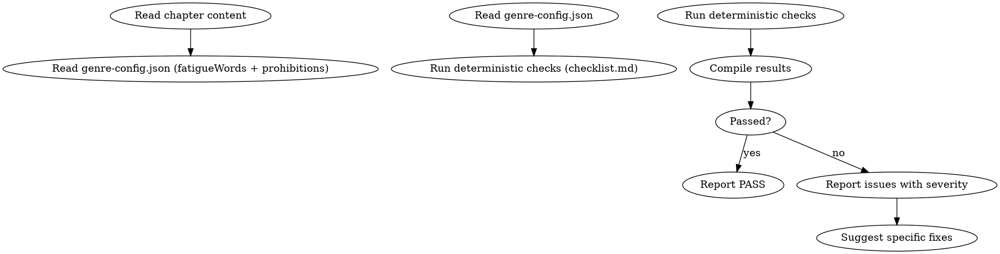

<!-- AUTO-CHECK-START -->

## auto-check (generated -- do not edit)

<!-- AUTO-CHECK-END -->

<!-- AUTO-GENERATED from frontmatter — do not edit -->

## 数据契约

- **Reads:** chapters/chapter-N.md, genre-config.json
- **Writes:** audits/chapter-N-anti-ai.md
- **Updates:** none

<!-- END AUTO-GENERATED -->

# Anti-AI 审计

这是默认激活的审计技能（每章必查）。

> 与 `shenbi-review-texture` 区别：段长由两者都触及——本审计审"段长**等长/规律性**（CV 过低 = AI 生成特征）"；texture 审"段长**极端**（>500/<20 字）与**呼吸感**（可读性）。本审计判可检测性，texture 判写作质量。

## 流程



## 铁律

1. **独立评分** — 本 skill 产出评分/审核判断，必须在 context-cleaned 独立 subagent 执行；drafting/planning agent 不得执行本 skill（spec §8.1）
2. **不信任"看起来还行"** — 每条检查必须逐一执行，不允许跳步
3. **先确定性后判断** — 确定性检查（零 LLM 成本）先跑，发现问题就不需要继续
4. **error 级别 = 必须修复** — error 级别问题不通过修订不能放过
5. **warning 级别 = 建议修复** — 3+ warning 也需要修订

## 检查执行

完整检查清单在 `checklist.md`。执行顺序：

1. 段落等长检测 (CV)
2. "不是…而是…"句式
3. 破折号
4. 转折词密度
5. AI 标记词
6. 疲劳词（从 genre-config）
7. 元叙事/编剧旁白
8. 分析报告术语
9. 集体反应套话
10. 禁忌词（从 genre-config）

## 输出格式

```markdown
## Anti-AI 审计报告

**章节**: 第N章
**字数**: XXXX
**结果**: 通过 / 有瑕疵 / 不通过

### 检查结果

| # | 检查项 | 结果 | 详情 |
|---|--------|------|------|
| 1 | 段落等长 | PASS | CV=0.32 |
| 2 | 不是…而是… | PASS | 未检测到 |
| 3 | 破折号 | ERROR | 第3段含"——" |
| ... | | | |

### 评分: X/10 通过

### 建议修复
- [ERROR] 第3段破折号：将"他深吸一口气——这不可能" → "他深吸一口气。这不可能。"
```

## Anti-Rationalization

| Excuse | Reality |
|--------|---------|
| "AI味读者看不出来" | 平台 AIGC 检测算法看得很清楚，降权直接影响收入 |
| "只有1个error，可以放过" | 1个error = 1个平台检测标记点 |
| "检查太多太慢了" | 确定性检查10秒完成，修30章500个error要3天 |

## 缺陷证据格式

每条缺陷/发现报告必须遵循四要素格式：

1. **位置** — `文件路径` L行号-行号（如 `chapters/chapter-5.md` L23-27）
2. **原文引述** — 用 `>` 标记引述原文，≥20 字上下文
3. **违反规则** — 引用 SKILL.md 中的精确规则名（逐字匹配）
4. **严重度** — BLOCKING | CRITICAL | MINOR

缺少任一要素的缺陷报告视为不合格。
