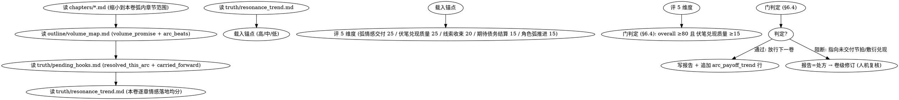

<!-- AUTO-CHECK-START -->

## auto-check (generated -- do not edit)

<!-- AUTO-CHECK-END -->

<!-- AUTO-GENERATED from frontmatter — do not edit -->

## 数据契约

- **Reads:** chapters/*.md, outline/volume_map.md, truth/pending_hooks.md, truth/resonance_trend.md
- **Writes:** audits/volume-N-payoff.md
- **Updates:** truth/audit_drift.md, truth/arc_payoff_trend.md

<!-- END AUTO-GENERATED -->

# 弧级正向质量门（卷/弧边界门）

本技能是正向质量门的卷级交付物（spec §6，交付物 B）。它在卷/弧边界给**整卷**打「兑现轴」正向分——弧情感高潮是否落地、伏笔兑现是否挣来、线索是否收束、读者期待债务是否结算、角色弧是否推进。逐章 `review-resonance`（交付物 A）回答「每章读起来值不值」，`review-arc-payoff` 回答「整卷的承诺兑现了没」。

这是质量「U 形缺口」里逐章门照不见的另一半：负向门（anti-ai / pacing / continuity …）只回答「有没有犯错」，逐章 resonance 只回答「这章值不值」，arc-payoff 回答「整卷的弧交付到不到位」——逐章都过门，但整卷的伏笔敷衍兑现、弧情感高潮塌掉、线索遗忘、读者期待只建不还，这些是**卷级缺陷**，只有弧级门看得见。

分数优于门：门只在踩地板时响，看不见跨卷下滑；本技能把**每卷的分数序列**写入 `truth/arc_payoff_trend.md`，供 `drift-guidance` 做跨卷漂移检测（spec §8.3，连续 2 卷 overall 下降即触发）。

## 硬门（HARD-GATE）

- **前置：弧内章节全部 resonance 通过。** 评分前确认本卷弧内逐章 `truth/resonance_trend.md` 均已通过（无 `pending` / 阻断未闭环的章）。弧内尚有未通过 resonance 的章 → 不打分，报告标 `arc_payoff_pending` 并说明阻塞章，**严禁**对「逐章还没过门的半成品弧」打卷级分（spec §9）。
- **没有本卷正文 + 卷图不评分。** 必须读到弧内 `chapters/*.md`（正文）与 `outline/volume_map.md`（含 `volume_promise` + `arc_beats`）。缺任一 → 不打分，报告标 `arc_payoff_pending` 并入待评队列，**严禁**主 agent 补评（spec §9）。
- **不在生成上下文里评分。** `requires_independent_agent: true`（spec §8.1）：dispatcher 必须清空生成上下文，只传入 reads 路径 + 本技能 + 锚点。provenance 标记非独立 → 评分作废，重 dispatch。

## 铁律

1. **独立评分** — 本技能产出评分/审核判断，必须在 context-cleaned 独立 subagent 执行；drafting / volume-consolidation / planning agent 不得给自己的弧打分（spec §8.1）。
2. **锚点先行（anchor-first）** — 打分前先对照本技能的弧级锚点集（每维度高/中/低三档，spec §8.2；锚点文件路径由 dispatch 时传入，见 scenario 锚点映射）。被评弧的定位必须相对锚点可解释：高于锚点 X / 介于 X 与 Y / 低于 Y。锚点缺失 → 降置信度 + flag，**不得跳过维度**（spec §9）。
3. **先确定性** — 评分员的 LLM 判断只产出 5 维度分数 + 自报置信度。**门阈值（overall ≥80、伏笔兑现质量 ≥15 子地板）是固定值，逐字套用，不得手算「调」**：overall 与子地板的达标判定没有任何可「凭感觉」松动空间，照 §6.4 二元裁决。
4. **show-not-tell 证据** — 每个维度分数必须落到「原文/锚点文件行号 + 引述」，证兑现是挣来的还是敷衍，**禁止**用「伏笔兑现得很好」「弧线推进有力」这类无锚点的评价话术。
5. **置信度必报** — 每个维度报 high/mid/low，overall 报 high/mid/low。**裸置信度不可信**：自报 high 但锚点命中率 < 0.8 → 校准降级为 mid（spec §8.2），降级后的置信度才用于报告置信带。

## 流程



## 评分维度（/100，门 ≥80）

| 维度 | 权重 | 评什么（兑现轴，读者被承诺「兑现了没」的信号） | 子地板 |
|------|------|------|--------|
| 弧情感交付 | 25 | 本卷承诺的情感高潮落地了吗（对照 `outline/volume_map.md` 的 `volume_promise` 与 `arc_beats`） | — |
| 伏笔兑现质量 | 25 | `resolved_this_arc` 的 hook 是惊喜/挣来的，还是敷衍（补 foreshadowing-track「追踪≠爽」缺口） | **15** |
| 线索收束 | 20 | 弧内线索闭合 or 有意携带（对照 `carried_forward`，区分「有意带下卷」vs「遗忘」） | — |
| 期待债务结算 | 15 | **Chase Power 落地点**：本卷创建的读者期待（新 hook、新悬念）vs 偿还的期待（兑现、答疑）的净债务 | — |
| 角色弧推进 | 15 | 角色有意义变化（非原地踏步；卷初→卷末状态可指认） | — |

> **期待债务结算（Chase Power 逻辑）**：本维度吸收中优先级「读者期待债务模型」（借鉴 WiiNovel Chase Power），不单造 skill。判定——本卷**创建**的读者期待（种下新 hook、抛出新悬念、抬高新筹码）vs **偿还**的期待（兑现旧 hook、答疑、给读者满足）的**净额**。长期只创建不偿还 = 期待债务堆积 → 扣分；本卷净偿还（旧债兑现、新债克制）→ 高分。
>
> **`resonance_trend` 的用途**：B 读 `truth/resonance_trend.md` 用于「弧情感交付」维度——本卷逐章情感落地均分作为弧情感一致性的**客观佐证**（逐章高 → 弧交付可信；逐章大幅波动 → 扣弧情感交付分，说明高潮是「孤峰」而非弧线推上去的）。

> overall = 5 维度之和（满分 100）。不设全维度子地板，**唯一维度子地板**是伏笔兑现质量 ≥15——因为敷衍兑现是卷级最隐蔽的缺陷（追踪门看着「兑现了」，读者却觉得「没爽到」），子地板强制它不能被 overall 高分掩盖。

## 门逻辑（§6.4）

二元裁决，无模糊带：

| 条件 | 判定 |
|------|------|
| overall ≥80 **且** 伏笔兑现质量 ≥15 | **放行**下一卷 |
| overall <80，**或** 伏笔兑现质量 <15 | **阻断** + 处方 |

> **阻断处方**必须指向**具体**未交付的弧节拍或敷衍兑现（「`arc_beats[3]` 兑现高潮在 L 段塌掉，伏笔 hook-007 兑现成旁白交代而非场景」），不得泛泛「弧线不够有力」。阻断走人机复核 → 确认后进入**卷级修订**（回卷修订，非逐章）。

**为何二元、无边界带**：卷级修订成本远高于逐章修订，必须高确定性。不像逐章 resonance 留「边界/不确定走人因」分流的噪声容错，arc-payoff 的阻断一律经人机复核把关后再修订——人因是阻断的必经环节，不是兜底，因此门本身只做二元裁决。

## 输出格式

```markdown
## 弧级正向质量门报告

**卷号**: 第N卷 | **弧范围**: 第N-M章 | **结果**: 放行 (82/100) / 阻断 (XX/100)

### 评分明细
| 维度 | 得分 | 满分 | 置信度 | 证据 | 裁判理由 |
|------|------|------|--------|------|----------|
| 弧情感交付 | 20 | 25 | high | `chapters/chapter-12.md` L45-60 > … | 高潮落地，对照 arc_beats[3] |
| 伏笔兑现质量 | 18 | 25 | high | `chapters/chapter-11.md` L30-38 > … | hook-007 场景兑现，挣来的 |
| 线索收束 | 16 | 20 | mid | `truth/pending_hooks.md` resolved/carried > … | 2 条有意 carried，1 条遗忘扣分 |
| 期待债务结算 | 12 | 15 | mid | `truth/pending_hooks.md` net debt > … | 本卷净偿还 2 笔旧债 |
| 角色弧推进 | 13 | 15 | high | `chapters/chapter-10.md` L5 > … | 卷初→卷末动机可指认 |

> 证据列必须含「行号 + 原文引述」（如 `chapters/chapter-12.md` L45-60 > …）；列名保持裸 `证据` 以匹配 G4 门头校验。

### 门判定
- overall 79 ≥ 80 ✗（差 1 分）
- 伏笔兑现质量 18 ≥ 子地板 15 ✓
- 判定: 阻断

### 处方（阻断时必填，指向具体未交付项）
- [arc_beats[X] / hook-ID] [未交付/敷衍的描述] → 卷级修订方向

### 跨卷短板（写入 audit_drift）
> 仅 append 本维度短板条目，不覆盖已有内容；最终权威版本由 `shenbi-drift-guidance` 合并重写（见该 skill 单一写者声明）。
- [维度] [卷级短板] → 下卷 outline 防范建议

### 趋势（写入 arc_payoff_trend）
- 第 N 卷 overall 79 | 近 2 卷均值 83 | 趋势: 连续 2 卷降（触发漂移）
```

**`truth/arc_payoff_trend.md` 追加行**（机器可解析，drift CLI 的契约）——一行一卷：

```
| volume | 弧情感交付 | 伏笔兑现质量 | 线索收束 | 期待债务结算 | 角色弧推进 | overall | confidence | human_overridden |
| N | 20 | 18 | 16 | 12 | 13 | 79 | high |  |
```

> 记录语义（spec §8.3）：记录**最终采纳分**（阻断→卷级修订→重评后放行的分），被拒绝的修订前低分不入库；人因覆盖放行的弱卷低分照记并附 `human_overridden: true`，跨卷漂移检测（连续 2 卷 overall 降）据此排除其触发统计。

## 与现有门的边界（避免重复，spec §5.6）

遵守「暴露冲突别平均化」——不在多个门重复评同一关注点：

- arc-payoff 只管**卷级兑现轴**（弧情感交付 / 伏笔兑现质量 / 线索收束 / 期待债务 / 角色弧推进）。
- 逐章**体验**（情绪/临场/文笔/回报）归 `shenbi-review-resonance`；arc-payoff 只把逐章情感落地序列当**弧情感交付的佐证**读，不重打逐章分。
- 伏笔**追踪**（PLANTED/RELEVANT/RESOLVED 状态机完整性）归 `shenbi-review-foreshadowing`；arc-payoff 评的是 resolved 的**兑现质量**（爽不爽、挣没挣来），不重核状态机。
- 节奏**缺陷**归 `shenbi-review-pacing`；arc-payoff 的「期待债务结算」评的是卷级期待 create-vs-pay 净额，不重复评单章节奏。

## Anti-Rationalization

| Excuse | Reality |
|--------|---------|
| 「逐章 resonance 都过了，卷级肯定没问题」 | 逐章过门 ≠ 弧兑现到位；伏笔敷衍、高潮孤峰、线索遗忘都是「逐章合格但卷级缺陷」，必须逐维度评 |
| 「伏笔追踪门显示 RESOLVED，兑现质量就高」 | 追踪门只核「有没有兑现」，arc-payoff 评「兑现得爽不爽/挣没挣来」；旁白交代式兑现 = RESOLVED 但伏笔兑现质量低分 |
| 「这卷留了很多悬念，读者期待拉满了，高分」 | 期待债务结算看 create-vs-pay **净额**；只创建新悬念不偿还旧债 = 债务堆积，扣分 |
| 「整体感觉弧线很完整就给高分」 | 必须逐维度 + 锚点 + 行号证据，无锚点的「完整感」= 主观噪声 |
| 「门阈值 80 可以根据卷的重要性调一调」 | 门阈值是固定二元裁决（§6.4），无「凭感觉松动」空间；要变阈值改 spec，不在评分时调 |
| 「评不过就让作者多改几遍」 | 阻断走人机复核 → 卷级修订（非逐章），人因是阻断必经环节不是兜底 |
| 「锚点对不上，我就按经验评」 | 锚点缺失 → 降置信度 + flag，不得静默跳过维度（spec §9） |

## 缺陷证据格式

每条缺陷/处方报告必须遵循四要素格式：

1. **位置** — `文件路径` L行号-行号（如 `chapters/chapter-12.md` L45-60）
2. **原文引述** — 用 `>` 标记引述原文，≥20 字上下文
3. **违反规则** — 引用 SKILL.md 中的精确规则名（逐字匹配，如「伏笔兑现质量 子地板 15」）
4. **严重度** — BLOCKING | CRITICAL | MINOR

缺少任一要素的缺陷报告视为不合格。
