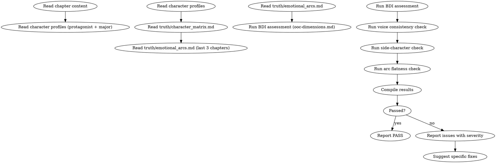

<!-- AUTO-CHECK-START -->

## auto-check (generated -- do not edit)

<!-- AUTO-CHECK-END -->

<!-- AUTO-GENERATED from frontmatter — do not edit -->

## 数据契约

- **Reads:** chapters/chapter-N.md, characters/protagonist.md, characters/major/*.md, truth/character_matrix.md, truth/emotional_arcs.md
- **Writes:** audits/chapter-N-character.md
- **Updates:** none

<!-- END AUTO-GENERATED -->

# 角色一致性审计

这是默认激活的审计技能（每章必查）。OOC (Out of Character) 检测、声音一致性、配角降智/工具人化检测、弧线平坦检测。

## 流程



## 铁律

1. **独立评分** — 本 skill 产出评分/审核判断，必须在 context-cleaned 独立 subagent 执行；drafting/planning agent 不得执行本 skill（spec §8.1）
2. **OOC = blocking error** — 角色行为违反已建立的性格/动机/声音，视为最高严重级别
3. **一人一卡** — 每个角色的行为只能与其自身角色档案对比，不能交叉污染
4. **配角降智是致命毒点** — 为推进剧情让反派/配角降智 = 必须修订
5. **声音指纹是读者的识别锚** — 角色说话方式突变会让读者感到陌生

## 检查执行

完整检测维度见 `ooc-dimensions.md`。执行顺序：

1. BDI 可信度评估（信念/欲望/意图三元组）
2. 声音一致性检查（口头禅、句式、措辞偏好）
3. 配角降智检测
4. 配角工具人化检测
5. 弧线平坦检测
6. 关系动态检查

## 缺陷证据格式

每条缺陷报告必须遵循  定义的四要素格式：
1. **位置**: 文件路径 + 行号范围
2. **原文引述**: ≥20 字上下文，用 `>` 标记
3. **违反规则**: SKILL.md 规则名（精确匹配）
4. **严重度**: BLOCKING / CRITICAL / MINOR

缺失任一要素 = 不合格。

## 输出格式

```markdown
## 角色一致性审计报告

**章节**: 第N章
**结果**: 通过 / 有瑕疵 / 不通过

### BDI 评估

| 角色 | 信念 | 欲望 | 意图 | 一致性 |
|------|------|------|------|--------|
| 林轩 | OK | OK | OK | PASS |
| 苏晴 | ? | OK | ISSUE | WARNING |

### OOC 检测

| 角色 | 维度 | 违规行为 | 预期行为 | 严重度 |
|------|------|---------|---------|--------|
| ... | ... | ... | ... | error/warning |

### 配角检查

| 配角 | 降智? | 工具人? | 独立动机? |
|------|-------|---------|----------|
| ... | ... | ... | ... |

### 声音一致性
[口头禅匹配 / 句式复杂度 / 措辞偏好]

### 弧线
[近3章情感变化曲线]

### 评分: X/10 通过

### 建议修复
- [ERROR] [具体段落] [问题描述]：[修复方案]
```

## Anti-Rationalization

| Excuse | Reality |
|--------|---------|
| "这个角色不需要这么复杂" | 配角降智是网文最大毒点之一，读者会直接弃书 |
| "为了推动剧情，角色稍微变一下可以" | 角色是故事的灵魂。情节为角色服务，不是反过来 |
| "声音差异不大，读者听不出" | 角色声音是读者识别角色的锚，相似声音 = 角色模糊 |
| "这一章没出现多少配角" | 只要出现了就必须确保不降智、不工具人化 |
