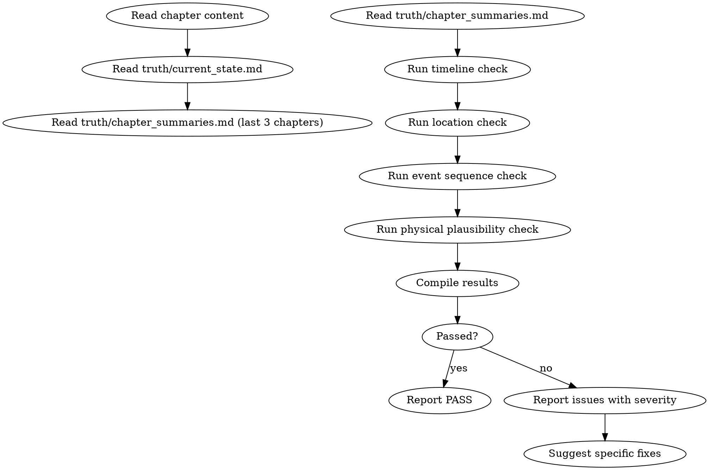

<!-- AUTO-GENERATED from frontmatter — do not edit -->

## 数据契约

- **Reads:** chapters/chapter-N.md, truth/current_state.md, truth/chapter_summaries.md, world/rules.md
- **Writes:** audits/chapter-N-continuity.md
- **Updates:** none

<!-- END AUTO-GENERATED -->

# 连续性审计

这是默认激活的审计技能（每章必查）。检查时间线一致性、地点矛盾、事件时序、物理空间合理性。

## 流程



## 铁律

1. **独立评分** — 本 skill 产出评分/审核判断，必须在 context-cleaned 独立 subagent 执行；drafting/planning agent 不得执行本 skill（spec §8.1）
2. **时间线是单向不可逆的** — 不能出现"太阳落山后又出现正午场景"类矛盾
3. **地点跳跃需要过渡** — 角色不能从A地瞬移到B地除非有明确能力支撑
4. **事件因果链必须完整** — 每个事件必须有前因后果，不能凭空出现
5. **物理规则一致** — 本章的物理规则必须与前章一致（除非有明确的世界规则变更）

## 检查执行

### 1. 时间线检查
- 提取本章所有时间标记（"第二天"、"三天后"、"入夜"等）
- 与 `truth/current_state.md` 和近3章摘要对比
- 检查是否有时间倒流或不合理跳跃

### 2. 地点检查
- 提取本章所有地点提及
- 与角色当前位置对比（来自 `truth/current_state.md`）
- 地点之间如果跳跃，检查是否有过渡段落或能力支撑
- 检查地点间在时间上的先后、并行、包含关系

### 3. 事件时序
- 提取本章事件链，按文本顺序编号
- 检查事件间逻辑先后关系是否合理
- 检测并行事件的时间对齐

### 4. 物理空间合理性
- 检查场景的空间描述是否一致（同一场景内距离、物体位置）
- 如果本章涉及战斗/移动，检查空间逻辑

## 缺陷证据格式

每条缺陷报告必须遵循  定义的四要素格式：
1. **位置**: 文件路径 + 行号范围
2. **原文引述**: ≥20 字上下文，用 `>` 标记
3. **违反规则**: SKILL.md 规则名（精确匹配）
4. **严重度**: BLOCKING / CRITICAL / MINOR

缺失任一要素 = 不合格。

## 输出格式

```markdown
## 连续性审计报告

**章节**: 第N章
**结果**: 通过 / 有瑕疵 / 不通过

### 时间线
| 标记 | 位置 | 推断时间 | 上一章末尾时间 | 状态 |
|------|------|---------|-------------|------|
| ... | ... | ... | ... | OK/MISMATCH |

### 地点
[地点流转记录，标注跳跃和过渡情况]

### 事件时序
[事件链编号与逻辑审查]

### 物理空间
[空间矛盾标注]

### 评分: X/10 通过

### 建议修复
- [ERROR] [具体段落] [问题描述]：[修复方案]
```

## Anti-Rationalization

| Excuse | Reality |
|--------|---------|
| "读者记不住三天前的事件" | 网文读者逐章追更，时间线矛盾是最容易被发现的bug |
| "地点跳跃加一句过渡就行" | 过渡不仅是文字，要符合角色能力和时间约束 |
| "物理合理性不重要，这是玄幻" | 即便玄幻世界，内部物理规则也必须自洽 |
| "时间线差不多就行了" | 精确的时间线是长篇叙事连续性的骨架 |
