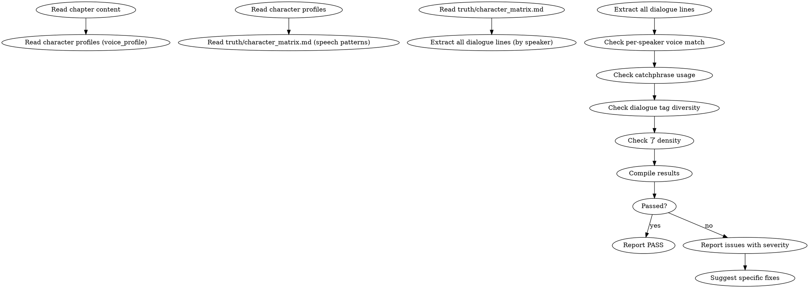

<!-- AUTO-GENERATED from frontmatter — do not edit -->

## 数据契约

- **Reads:** chapters/chapter-N.md, characters/protagonist.md, characters/major/*.md, truth/character_matrix.md
- **Writes:** audits/chapter-N-dialogue.md
- **Updates:** none

<!-- END AUTO-GENERATED -->

# 对白审计

这是条件激活的审计技能。检查角色说话风格一致性、对话标签多样性、了字密度、口头禅匹配。

> 激活条件：由 `genre-config.json` 的 `auditDimensions` 包含维度 16 时激活。

> 与 `shenbi-review-character` 区别：角色一致性审计检查"角色行为 BDI 整体一致性"，本审计专攻"说话方式"细节。

## 流程



## 铁律

1. **声音指纹 = 角色身份证** — 角色说话方式与 `voice_profile` 严重不符 = error
2. **口头禅必须出现或显式缺席** — 标志口头禅每 5-8 章至少出现 1 次，长时间消失 = warning
3. **对话标签单调 = 写作偷懒** — 连续 5 段以上使用同一种对话标签（"说道""说"）= warning
4. **了字密度需符合角色** — 文言角色 了 字密度应低于白话角色，违反 = warning

## 检查执行

### 1. 对白提取与说话人归属
- 提取所有对白行（含引号内容）
- 通过上下文判定说话人
- 标注每句对白的说话人

### 2. 逐角色声音匹配
- 读取每个主要角色的 `voice_profile`（含句长偏好、词汇偏好、句式偏好）
- 抽样该角色本章对白（最少 5 句，否则全部）
- 比对：
  - 句长分布（偏好短句角色出现长复合句 = warning）
  - 词汇偏好（偏好粗犷词汇角色使用文雅词 = warning）
  - 句式（偏好反问角色全用陈述句 = warning）
- 严重偏差（多维度同时违反）= error

### 3. 口头禅匹配
- 读取角色档案中的 `catchphrases` 列表
- 在本章该角色对白中检索
- 完全未出现且非"显式缺席"场景 = warning
- 显式缺席场景（如角色重伤昏迷）允许 = pass

### 4. 对话标签多样性
- 统计本章所有对话标签（"说""道""问""答"等）
- 同一标签连续 > 5 段 = warning
- 鼓励多样化（沉默/动作/省略/视点切换代替标签）

### 5. 了字密度（仅中文）
- 统计每个角色对白中"了"字出现次数 / 总字数
- 与该角色基线密度对比（文白差异、性别差异、年龄差异）
- 偏离基线 ±50% = warning

## 缺陷证据格式

每条缺陷报告必须遵循  定义的四要素格式：
1. **位置**: 文件路径 + 行号范围
2. **原文引述**: ≥20 字上下文，用 `>` 标记
3. **违反规则**: SKILL.md 规则名（精确匹配）
4. **严重度**: BLOCKING / CRITICAL / MINOR

缺失任一要素 = 不合格。

## 输出格式

```markdown
## 对白审计报告

**章节**: 第N章
**结果**: 通过 / 有瑕疵 / 不通过

### 声音匹配
| 角色 | 句长偏差 | 词汇偏差 | 句式偏差 | 综合 | 严重度 |
|------|---------|---------|---------|------|--------|
| 林轩 | OK | OK | OK | PASS | — |
| 苏晴 | 长句↑ | OK | OK | WARNING | warning |

### 口头禅
| 角色 | 口头禅 | 本章出现 | 距上次 | 状态 |
|------|-------|---------|-------|------|
| 林轩 | "无妨" | 0 | 12 章前 | warning |

### 对话标签分布
| 标签 | 出现次数 | 最长连续 |
|------|---------|---------|
| 说 | 14 | 7 |
| 道 | 3 | 1 |

### 了字密度
| 角色 | 密度 | 基线 | 偏差 | 严重度 |
|------|-----|-----|------|--------|
| 林轩 | 0.018 | 0.020 | -10% | OK |
| 苏晴 | 0.045 | 0.020 | +125% | warning |

### 评分: X/10 通过

### 建议修复
- [ERROR] [段落] [角色] [声音偏差]：[修复方案]
- [WARNING] [段落] [问题描述]：[修复方案]
```

## Anti-Rationalization

| Excuse | Reality |
|--------|---------|
| "对话标签用'说'最清楚" | 多样化标签（动作/沉默/视点切换）= 沉浸感。'说'是默认但不应是唯一 |
| "口头禅偶尔不出现没关系" | 口头禅是角色识别锚。读者通过口头禅辨认角色，消失 = 角色模糊 |
| "所有角色用同一种说话方式" | 角色无差异 = 读者无法区分谁在说话。声音区分是基本功 |
| "文言/白话区别不重要" | 文字密度差异是声音指纹的一部分。混用 = 角色错位 |
