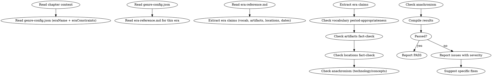

<!-- AUTO-CHECK-START -->

## auto-check (generated -- do not edit)

<!-- AUTO-CHECK-END -->

<!-- AUTO-GENERATED from frontmatter — do not edit -->

## 数据契约

- **Reads:** chapters/chapter-N.md, genre-config.json, era-reference.md
- **Writes:** audits/chapter-N-era.md
- **Updates:** none

<!-- END AUTO-GENERATED -->

# 时代准确性审计

这是条件激活的审计技能。检查历史时代准确性、时期恰当词汇、器物/地点事实。

> 激活条件：`genre-config.json` 的 `eraResearch` 为 truthy，或 `eraConstraints` 存在且非空（可为约束列表或对象）时激活。

> 与 `shenbi-review-world-rules` 区别：世界规则审计检查"作品内自洽性"，本审计检查"与历史/时代事实的一致性"。

## 流程



## 铁律

1. **独立评分** — 本 skill 产出评分/审核判断，必须在 context-cleaned 独立 subagent 执行；drafting/planning agent 不得执行本 skill（spec §8.1）
2. **时代错位 = blocking** — 任何时代错位的器物/概念/制度出现在正文中 = error
3. **语汇与时代对齐** — 任何时代错位的词汇（"咖啡"出现在宋朝）= error
4. **架空世界不豁免** — 架空时代仍需自洽的"时代逻辑"，混用元素 = warning
5. **作者标记的"免检"才豁免** — 若 `eraConstraints` 为对象，其 `exempt` 列表中的元素不计入审计；若为列表，则列表中的约束即为允许项，超出约束的元素才计入审计

## 检查执行

### 1. 时代设定读取
- 读取 `genre-config.json` 的 `eraName`（如"宋朝"/"架空玄朝"）
- 读取 `eraConstraints`（允许/禁止的器物/词汇/制度列表）
- 加载对应时代的 `era-reference.md`

### 2. 词汇时代适配性
- 提取本章所有名词/动词
- 与时代参考词汇表对比
- 时代错位（宋词出现"咖啡"）= error
- 架空时代混用 = warning

完整方法与各时代参考词表见 `era-reference.md`。

### 3. 器物事实核查
- 提取本章所有具体器物（武器/服饰/家具/工具）
- 核对该器物是否在该时代存在/可能存在
- 不存在 / 时代错位 = error
- 例：宋朝出现"机关枪"

### 4. 地点事实核查
- 提取本章所有具体地点
- 真实历史地点核对该时代是否归属该政权/状态
- 例：宋朝提到"紫禁城"（明朝才有）= error
- 架空地点不计入此检查

### 5. 时代错位综合
- 概念/制度错位（如宋朝出现"内阁"）= error
- 技术错位（时代未发明的工具/工艺）= error
- 科学知识错位（仅对真实历史背景适用）= error

## 输出格式

```markdown
## 时代准确性审计报告

**章节**: 第N章
**时代设定**: 宋朝（仁宗朝）
**结果**: 通过 / 有瑕疵 / 不通过

### 词汇时代适配
| 段落 | 词汇 | 时代 | 判定 | 严重度 |
|------|-----|------|------|--------|
| P5 | 咖啡 | 宋朝无 | 错位 | error |

### 器物核查
| 段落 | 器物 | 时代存在? | 严重度 |
|------|------|----------|--------|
| P12 | 机关枪 | 否 | error |

### 地点核查
| 段落 | 地点 | 时代归属 | 严重度 |
|------|------|---------|--------|
| P18 | 紫禁城 | 明朝 | error |

### 时代错位综合
| 段落 | 错位类型 | 内容 | 严重度 |
|------|---------|------|--------|
| P22 | 制度 | 内阁 | error |

### 评分: X/10 通过

### 建议修复
- [ERROR] [段落] [错位类型] [元素]：[修复方案]
- [WARNING] [段落] [问题描述]：[修复方案]
```

## Anti-Rationalization

| Excuse | Reality |
|--------|---------|
| "架空时代不需管历史" | 架空仍需"时代逻辑"自洽。混用元素 = 读者失信 |
| "小细节无所谓" | 时代细节 = 沉浸感。读者中历史爱好者多，细节崩塌 = 弃书 |
| "器物可以艺术加工" | 加工 = 在时代约束内的合理化。凭空制造 = 错位 |
| "地点虚构即可避免错位" | 真实地点出现需核查，虚构地点的设定也需自洽 |

## 缺陷证据格式

每条缺陷/发现报告必须遵循四要素格式：

1. **位置** — `文件路径` L行号-行号（如 `chapters/chapter-5.md` L23-27）
2. **原文引述** — 用 `>` 标记引述原文，≥20 字上下文
3. **违反规则** — 引用 SKILL.md 中的精确规则名（逐字匹配）
4. **严重度** — BLOCKING | CRITICAL | MINOR

缺少任一要素的缺陷报告视为不合格。
