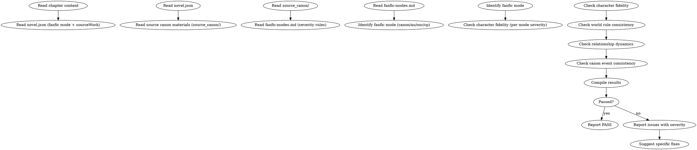

<!-- AUTO-GENERATED from frontmatter — do not edit -->

## 数据契约

- **Reads:** chapters/chapter-N.md, novel.json, source_canon/*
- **Writes:** audits/chapter-N-fanfic.md
- **Updates:** none

<!-- END AUTO-GENERATED -->

# 同人创作审计

这是条件激活的审计技能。检查角色还原度、世界规则一致性、关系动态、原作事件一致性。支持 4 种同人模式（canon/au/ooc/cp），每种模式严格度不同。

> 激活条件：`novel.json.mode` = `"fanfic"` 时激活。

> 与 `shenbi-review-character` 区别：角色一致性审计检查"作品内自洽"，本审计检查"与原作的对齐"。

## 流程



## 铁律

1. **独立评分** — 本 skill 产出评分/审核判断，必须在 context-cleaned 独立 subagent 执行；drafting/planning agent 不得执行本 skill（spec §8.1）
2. **同人模式决定严格度** — 4 种模式（canon/au/ooc/cp）的允许范围与严格度完全不同，见 `fanfic-modes.md`
3. **原作人物 = 公共契约** — 角色基本属性（性格/能力/关系）= 读者共识，重大偏离需在文前声明
4. **世界规则沿用原作** — 任何与原作规则冲突需在 AU 设定中显式声明
5. **cp 模式的关系不破坏原作** — 配对不能扭曲原作其他关系（除非 AU 模式明示）

## 检查执行

完整模式严格度对照见 `fanfic-modes.md`。执行顺序：

### 1. 同人模式识别
- 读取 `novel.json.fanfic.mode`（canon/au/ooc/cp）
- 加载对应模式的严格度参数

### 2. 角色还原度（按模式严格度）
- 列出本章所有登场角色
- 对每个角色检查：
  - 性格匹配度（canon 最严，ooc 最松）
  - 能力匹配度（canon 严格，au 允许衍生）
  - 关系匹配度（与原作关系网对齐）
  - 标志性特征保留
- 模式严格度对照见 `fanfic-modes.md`

### 3. 世界规则一致性
- 提取本章涉及的世界规则（能力体系/物理/社会）
- 与原作世界规则对齐
- AU 模式需在 `novel.json` 或 `world/rules.md` 中声明偏差
- 偏差未声明 = error

### 4. 关系动态
- 提取本章所有角色间互动
- 检验关系是否符合原作阶段 / 发展曲线
- CP 模式：检验配对合理性（不能凭空拉郎）
- 关系突变（无铺垫）= warning（canon/ooc 严格）

### 5. 原作事件一致性
- 若本章涉及原作事件：核对该事件在原作中的版本
- canon 模式：完全沿用
- au 模式：偏差需声明
- ooc 模式：仅参考
- cp 模式：事件作为背景存在，关系演绎为主

## 输出格式

```markdown
## 同人创作审计报告

**章节**: 第N章
**同人模式**: canon
**原作**: [原作名]
**结果**: 通过 / 有瑕疵 / 不通过

### 角色还原度
| 角色 | 性格 | 能力 | 关系 | 模式严格度 | 严重度 |
|------|------|------|------|----------|--------|
| A | ✓ | ✓ | ✓ | 严 (canon) | — |
| B | 偏差 | ✓ | ✓ | 严 | error |

### 世界规则一致性
| 段落 | 规则 | 原作版本 | 本章版本 | 严重度 |
|------|------|---------|---------|--------|
| P12 | 灵力上限 | 100 | 200 | error (canon) |

### 关系动态
| 关系 | 互动 | 原作阶段 | 一致性 |
|------|------|---------|--------|
| A-B | 对峙 | 友好期 | warning |

### 原作事件一致性
| 段落 | 事件 | 原作版本 | 偏差声明 | 严重度 |
|------|------|---------|---------|--------|
| P20 | X 死亡 | 第 5 卷 | 偏差已声明 | PASS |
| P25 | Y 复活 | 原作无 | 偏差未声明 | error |

### 评分: X/10 通过

### 建议修复
- [ERROR] [段落] [模式严格度] [问题描述]：[修复方案]
- [WARNING] [段落] [问题描述]：[修复方案]
```

## Anti-Rationalization

| Excuse | Reality |
|--------|---------|
| "同人不需要严格遵循原作" | 严格度由模式决定。canon 模式 = 公共契约；不声明就偏离 = 读者失信 |
| "OOC 是同人特色" | OOC 是显式声明的创作选择，不是借口。必须让读者知道 |
| "AU 设定可以随意" | AU 设定偏差必须显式声明。声明过的偏差 = pass，未声明 = error |
| "CP 模式 = 恋爱至上" | CP 模式仍需原作角色与关系的逻辑自洽。拉郎需有铺垫 |

## 缺陷证据格式

每条缺陷/发现报告必须遵循四要素格式：

1. **位置** — `文件路径` L行号-行号（如 `chapters/chapter-5.md` L23-27）
2. **原文引述** — 用 `>` 标记引述原文，≥20 字上下文
3. **违反规则** — 引用 SKILL.md 中的精确规则名（逐字匹配）
4. **严重度** — BLOCKING | CRITICAL | MINOR

缺少任一要素的缺陷报告视为不合格。
