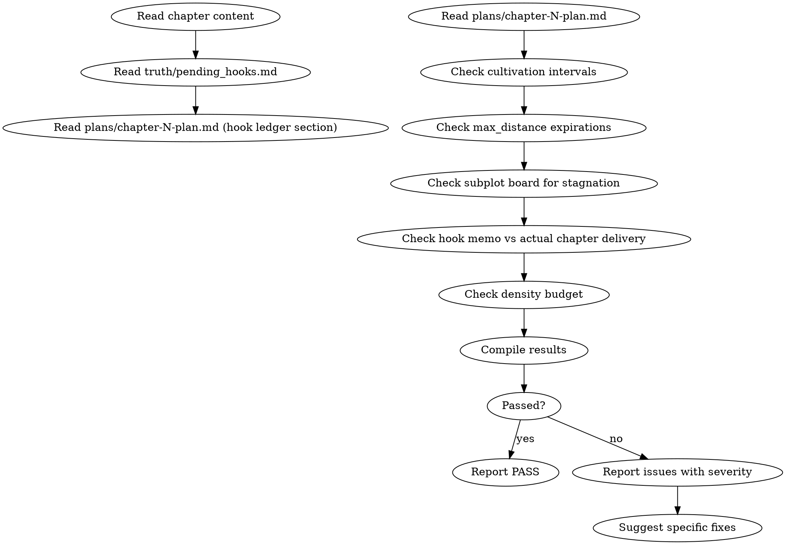

<!-- AUTO-GENERATED from frontmatter — do not edit -->

## 数据契约

- **Reads:** chapters/chapter-N.md, truth/pending_hooks.md, plans/chapter-N-plan.md, truth/subplot_board.md
- **Writes:** audits/chapter-N-foreshadowing.md
- **Updates:** none

<!-- END AUTO-GENERATED -->

# 伏笔审计

这是条件激活的审计技能。检查伏笔账本兑现、培育间隔合规、距离上限约束、密度预算、支线活跃度。

> 激活条件：由 `genre-config.json` 的 `auditDimensions` 包含维度 6 或 24 时激活。

> If `truth/pending_hooks.md` is empty or missing, report explicitly that no hook ledger data was found — do NOT auto-PASS. Direct the human partner to populate it via `shenbi-foreshadowing-plant` (Phase 3).

## 流程



## 铁律

1. **独立评分** — 本 skill 产出评分/审核判断，必须在 context-cleaned 独立 subagent 执行；drafting/planning agent 不得执行本 skill（spec §8.1）
2. **过期伏笔必须标记为 error** — 超过 `max_distance` 未兑现的伏笔禁止沉默
3. **支线停滞 > 5 章必须标记为 warning** — 支线推进的活跃度是追读信号
4. **备忘 hook 账必须与正文一致** — memo 中标注的兑现动作禁止在正文中缺失
5. **密度预算禁止超 8 操作/章** — 含种植、强化、触发、兑现

## 检查执行

参见 `hook-lifecycle.md`。执行顺序：

1. 培育间隔检查（距上次强化是否超过 `cultivation_interval`）
2. 距离上限检查（距种植是否超过 `max_distance`）
3. 支线停滞检测（从 `subplot_board.md` 检查各支线最后更新章节）
4. 备忘 hook 账验证（memo 中的 open/advance/resolve/defer 与正文匹配）
5. 密度检查（本操作数是否超 8）

## 输出格式

```markdown
## 伏笔审计报告

**章节**: 第N章
**结果**: 通过 / 有瑕疵 / 不通过

### 培育间隔
| Hook ID | 上次强化 | 本章 | 间隔 | 阈值 | 状态 |
|---------|---------|------|------|------|------|
| ... | ... | ... | ... | ... | OK/OVERDUE |

### 距离上限
| Hook ID | 种植章 | 本章 | max_distance | 状态 |
|---------|--------|------|-------------|------|
| ... | ... | ... | ... | OK/EXPIRED |

### 支线停滞
| 支线 | 最后更新章 | 距今 | 状态 |
|------|----------|------|------|
| ... | ... | ... | OK/STAGNANT |

### 备忘验证
| 备忘操作 | 实际兑现 | 状态 |
|---------|---------|------|
| open hook-003 | ✓ | MATCH |
| advance hook-002 | ✓ | MATCH |
| resolve none | — | OK |

### 密度: N/8 操作

### 评分: X/10 通过

### 建议修复
- [ERROR] [具体 Hook ID / 段落] [问题描述]：[修复方案]
- [WARNING] [具体 Hook ID / 段落] [问题描述]：[修复方案]
```

## 大规模伏笔召回（spec §11.9）

当 current_chapter > 50，调用 shenbi-foreshadowing-recall 获取 recall_overdue_hooks 结果，替代全量读取 pending_hooks.md。阈值以下仍用扁平读取。

## Anti-Rationalization

| Excuse | Reality |
|--------|---------|
| "这条伏笔太久了，算了放弃" | 放弃伏笔 = 违背读者信任，Chase Power 债务暴增 |
| "伏笔不重要，故事推进就行" | 伏笔是长篇叙事的骨架，没有伏笔 = 没有期待 = 没有追读 |
| "8条操作预算太少了" | 每章8条操作 × 2000章 = 16000次伏笔操作，足够 |
| "备忘和正文差一点没关系" | 备忘与正文脱节 = 伏笔账本失效，读者无法追踪承诺 |
| "支线暂停几章是为了给主线让路" | 支线停滞 > 5 章 = 追读信号熄灭，恢复成本极高 |

## 缺陷证据格式

每条缺陷/发现报告必须遵循四要素格式：

1. **位置** — `文件路径` L行号-行号（如 `chapters/chapter-5.md` L23-27）
2. **原文引述** — 用 `>` 标记引述原文，≥20 字上下文
3. **违反规则** — 引用 SKILL.md 中的精确规则名（逐字匹配）
4. **严重度** — BLOCKING | CRITICAL | MINOR

缺少任一要素的缺陷报告视为不合格。
