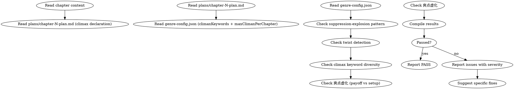

<!-- AUTO-CHECK-START -->

## auto-check (generated -- do not edit)

<!-- AUTO-CHECK-END -->

<!-- AUTO-GENERATED from frontmatter — do not edit -->

## 数据契约

- **Reads:** chapters/chapter-N.md, plans/chapter-N-plan.md, genre-config.json
- **Writes:** audits/chapter-N-highpoint.md
- **Updates:** none

<!-- END AUTO-GENERATED -->

# 高潮与爽点审计

这是条件激活的审计技能。检查蓄压-爆发模式、反转检测、爽点关键词多样性、爽点虚化（payoff < 期待）。

> 激活条件：由 `genre-config.json` 的 `auditDimensions` 包含维度 15 时激活。

> 与 `shenbi-review-pacing` 区别：节奏审计检查"章类型序列"，本审计深入"单章内的爽点密度与质量"。

## 流程



## 铁律

1. **独立评分** — 本 skill 产出评分/审核判断，必须在 context-cleaned 独立 subagent 执行；drafting/planning agent 不得执行本 skill（spec §8.1）
2. **高潮必须有蓄压** — 高潮章/段前必须有 500+ 字蓄压（压迫/危机/期待），无蓄压 = error
3. **反转必须有三段式** — 铺垫（误导读者）→ 反转点 → 解释/确认，三段缺一 = error
4. **爽点关键词 = 写作红线** — 命中 `genre-config.json` 禁忌关键词 = error
5. **爽点虚化 = 最大毒点** — 蓄压远大于释放 = 读者期待落空 = error

## 检查执行

### 1. 蓄压-爆发模式检测
- 定位本章高潮段（最大冲突/最高情绪/最关键决策）
- 检验高潮前 500 字是否构成有效蓄压：
  - 压力递增（外部压力 / 内部冲突 / 时间限制）
  - 期待建立（"这一刻终于到了" / 蓄势动作）
  - 障碍叠加（不能一次解决）
- 无蓄压 = error（"无压释放" = 平淡爆发）
- 蓄压不足 = warning

### 2. 反转检测
- 识别章中反转（读者预期被颠覆）
- 验证三段式：
  - 铺垫：前文是否建立了预期
  - 反转点：是否有明确打破
  - 解释：是否在反转后给出原因/确认
- 三段齐全 = pass
- 缺一段 = warning；缺两段 = error

### 3. 爽点关键词检测
- 读取 `genre-config.json` 的 `climaxKeywords`（推荐使用词）与 `prohibitedClimaxKeywords`（禁用词）
- 禁用词命中 = error
- 推荐词使用率 < 20%（如本章应为爽点章）= warning

### 4. 爽点虚化检测
- 对比蓄压与释放的强度：
  - 蓄压等级（1-5 主观评级：危机大小 + 持续时间 + 情绪积累）
  - 释放等级（1-5 主观评级：解决力度 + 满足程度 + 余韵长度）
- 释放 < 蓄压 = 虚化
- 虚化 ≥ 2 级 = error
- 虚化 1 级 = warning

### 5. 节奏类型验证
- 若本章声明为 FIRE 章，验证实际高潮段数量 ≥ 1
- 若本章为 QUEST 章，验证无孤立高潮（高潮必须为后续蓄压服务）

## 输出格式

```markdown
## 高潮与爽点审计报告

**章节**: 第N章
**本章类型**: FIRE
**结果**: 通过 / 有瑕疵 / 不通过

### 蓄压-爆发
| 蓄压位置 | 蓄压内容 | 等级 | 高潮位置 | 释放等级 | 虚化度 |
|---------|---------|------|---------|---------|--------|
| P1-P8 | 围困 + 嘲讽 | 4 | P9 | 3 | 1 (warning) |

### 反转检测
| 反转位置 | 铺垫 | 反转点 | 解释 | 状态 |
|---------|------|-------|------|------|
| P15 | P5-P10 误导 | P15 揭露 | P16 解释 | PASS |
| P22 | 无 | 有 | 无 | error |

### 关键词使用
| 类型 | 关键词 | 命中 |
|------|-------|------|
| 推荐 | "干脆利落" | 1 |
| 禁用 | "全场震惊" | 0 (PASS) |

### 评分: X/10 通过

### 建议修复
- [ERROR] [段落] [高潮问题]：[修复方案]
- [WARNING] [段落] [虚化/反转不完整]：[补足方案]
```

## Anti-Rationalization

| Excuse | Reality |
|--------|---------|
| "高潮可以突然出现" | 突然的高潮 = 突兀 = 读者无感。所有爆发都需要蓄压作为对比 |
| "反转不需要解释" | 无解释的反转 = 读者困惑 = 弃书。反转是奖励，解释是确认 |
| "爽点虚化是文学含蓄" | 虚化 = 期待落空。网文读者要的是 payoff，不是含蓄 |
| "禁用词可以用同义替换" | 禁用词 = 平台/作品禁忌。替换也是禁用。改写思路不是换词 |

## 缺陷证据格式

每条缺陷/发现报告必须遵循四要素格式：

1. **位置** — `文件路径` L行号-行号（如 `chapters/chapter-5.md` L23-27）
2. **原文引述** — 用 `>` 标记引述原文，≥20 字上下文
3. **违反规则** — 引用 SKILL.md 中的精确规则名（逐字匹配）
4. **严重度** — BLOCKING | CRITICAL | MINOR

缺少任一要素的缺陷报告视为不合格。
