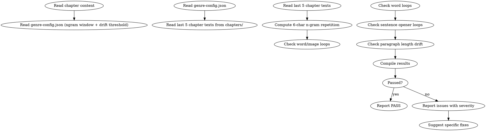

<!-- AUTO-CHECK-START -->

## auto-check (generated -- do not edit)

<!-- AUTO-CHECK-END -->

<!-- AUTO-GENERATED from frontmatter — do not edit -->

## 数据契约

- **Reads:** chapters/chapter-N.md, chapters/*.md, genre-config.json
- **Writes:** audits/chapter-N-long-span.md
- **Updates:** none

<!-- END AUTO-GENERATED -->

# 跨章模式审计

这是条件激活的审计技能。检查跨章词汇/意象/句式重复、6 字 n-gram 重复率、段落长度漂移。

> 激活条件：必须同时满足
> 1. `genre-config.json` 的 `auditDimensions` 包含维度 10
> 2. `current_chapter ≥ 3`（短文本统计不可靠）

> 与 `shenbi-review-anti-ai` 区别：anti-ai 检查 AI 味，本审计检查"作者个人漂移模式"——即使非 AI 写作，作者自身也会随字数增加进入表达惯性。

## 流程



## 铁律

1. **独立评分** — 本 skill 产出评分/审核判断，必须在 context-cleaned 独立 subagent 执行；drafting/planning agent 不得执行本 skill（spec §8.1）
2. **6 字 n-gram 重复率 = 写作指纹稳定性的红线** — 超出 `genre-config.json` 的 `maxNgramRepetition` = error
3. **核心意象不可过度复现** — 同章内同一意象 > 4 次 = warning，跨 3 章 > 8 次 = warning
4. **段长漂移 = 节奏失控** — 段落平均字数连续 3 章单向漂移（增/减 > 20%）= warning
5. **句式开端需多样** — 同一句子开端模式（"X 看着" / "忽然"）在章内 > 5 次 = warning

## 检查执行

完整方法见 `ngram-methodology.md`。执行顺序：

### 1. 6 字 n-gram 重复率
- 滑动窗口提取本章所有 6 字连续串
- 与近 5 章 n-gram 表对比
- 计算重复率 = 重复 n-gram 数 / 本章总 n-gram 数
- 超过 `maxNgramRepetition`（默认 0.15）= error
- 算法与公式见 `ngram-methodology.md`

### 2. 词汇/意象循环
- 提取本章所有"意象词"（`genre-config.json` 的 `coreImages` 列表）
- 统计本章出现次数
- 统计近 3 章累计出现次数
- 章内 > 4 次 或 跨章累计 > 8 次 = warning

### 3. 句式开端检测
- 提取本章前 6 字作"句式开端"
- 统计高频开端（出现 > 3 次）
- 单一开端 > 5 次 = warning
- 前 3 高频开端占比 > 40% = warning

### 4. 段落长度漂移
- 计算本章平均段长（字）
- 与近 3 章平均段长对比
- 连续 3 章单向漂移（每次变化 > 20%）= warning
- 漂移公式见 `ngram-methodology.md`

## 缺陷证据格式

每条缺陷报告必须遵循  定义的四要素格式：
1. **位置**: 文件路径 + 行号范围
2. **原文引述**: ≥20 字上下文，用 `>` 标记
3. **违反规则**: SKILL.md 规则名（精确匹配）
4. **严重度**: BLOCKING / CRITICAL / MINOR

缺失任一要素 = 不合格。

## 输出格式

```markdown
## 跨章模式审计报告

**章节**: 第N章
**对照窗口**: Ch N-1 至 Ch N-5
**结果**: 通过 / 有瑕疵 / 不通过

### 6 字 n-gram 重复
| 指标 | 值 | 阈值 | 状态 |
|------|-----|------|------|
| 重复率 | 0.18 | 0.15 | error |
| 最高频 n-gram | "林轩看着他" | — | — |
| 高频 n-gram 数 | 4 | >3 | error |

### 词汇/意象循环
| 意象 | 本章 | 跨章累计 | 阈值 | 状态 |
|------|-----|---------|------|------|
| 剑 | 6 | 14 | 8/累计 | warning |

### 句式开端
| 开端 | 次数 | 占比 |
|------|-----|------|
| "林轩看着" | 6 | 18% |
| "忽然" | 4 | 12% |

### 段落长度漂移
| 章节 | 平均段长 | 变化率 |
|------|---------|--------|
| N-3 | 145 字 | — |
| N-2 | 168 字 | +15.9% |
| N-1 | 195 字 | +16.1% |
| N | 230 字 | +17.9% (warning) |

### 评分: X/10 通过

### 建议修复
- [ERROR] [段落] [重复 n-gram]：[改写建议]
- [WARNING] [位置] [意象/句式/漂移]：[修复方案]
```

## Anti-Rationalization

| Excuse | Reality |
|--------|---------|
| "n-gram 太严格了" | n-gram 重复 = 读者"是不是抄自己"的怀疑 = 弃书 |
| "意象循环是强调" | 强调是 1-2 次的刻意。3+ 次是表达贫乏 |
| "段长变化是节奏需要" | 单章变化是节奏，连续 3 章漂移是失控 |
| "句式开端多样化太挑剔" | 读者潜意识里期待变化。开端单一 = 阅读疲劳 |
