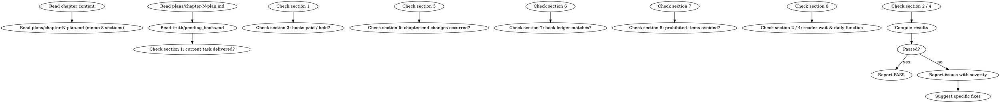

<!-- AUTO-GENERATED from frontmatter — do not edit -->

## 数据契约

- **Reads:** chapters/chapter-N.md, plans/chapter-N-plan.md, truth/pending_hooks.md
- **Writes:** audits/chapter-N-memo-compliance.md
- **Updates:** none

<!-- END AUTO-GENERATED -->

# 章节备忘合规审计

这是条件激活的审计技能。检查正文是否兑现章节备忘 8 段式中的承诺、章尾改变是否发生、禁止事项是否被遵守。

> 激活条件：由 `genre-config.json` 的 `auditDimensions` 包含维度 33 时激活。

> 与 `shenbi-chapter-planning` 配合：备忘由规划阶段生成，本审计只检查"是否兑现"，不修改备忘本身。

## 流程



## 铁律

1. **独立评分** — 本 skill 产出评分/审核判断，必须在 context-cleaned 独立 subagent 执行；drafting/planning agent 不得执行本 skill（spec §8.1）
2. **备忘是承诺，必须兑现** — 备忘第 1 段"当前任务"未在正文中出现 = error
3. **章尾改变 = 必现** — 备忘第 6 段列出的 1-3 条改变必须发生，少一条 = error
4. **禁止事项 = 必避** — 备忘第 8 段列出的事项一旦在正文中出现 = error
5. **Hook 账本必须与正文一致** — 备忘第 7 段声明的 open/advance/resolve/defer 操作必须能在正文中找到对应动作

## 检查执行

### 1. 当前任务交付检查（第 1 段）
- 读取备忘第 1 段"当前任务"
- 在正文中检索该任务的关键动作词
- 完全未出现 = error；出现但未完成 = warning；完成 = pass

### 2. Hook 兑现/压住检查（第 3 段）
- 读取备忘第 3 段"该兑现的 / 暂不掀的"
- 兑现项在正文中是否出现
- 压住项在正文中是否被意外掀出（= error）

### 3. 章尾改变检查（第 6 段）
- 读取备忘第 6 段列出的 1-3 条改变
- 必须在章尾段落可验证（信息/关系/物理/权力四个维度之一）
- 改变缺失 = error

### 4. Hook 账本匹配（第 7 段）
- 读取备忘第 7 段声明的 hook 操作
- 核对 `truth/pending_hooks.md` 是否同步更新
- 操作声明与正文不符 = error

### 5. 禁止事项检查（第 8 段）
- 读取备忘第 8 段"不要做"
- 逐条在正文中检索
- 命中 = error（不论"程度"或"目的"）

### 6. 读者等待 / 日常功能（第 2、4 段）
- 第 2 段"读者此刻在等什么"在正文中是否有对应回应
- 第 4 段"日常承担什么功能"中标注的过渡段落是否承担了指定功能
- 两者任一缺失 = warning

## 输出格式

```markdown
## 章节备忘合规审计报告

**章节**: 第N章
**结果**: 通过 / 有瑕疵 / 不通过

### 备忘兑现度
| 备忘段 | 承诺 | 兑现状态 | 严重度 |
|--------|------|---------|--------|
| 第1段 当前任务 | ... | OK/MISSING | error/warning |
| 第3段 兑现 | hook-007 | OK | — |
| 第3段 兑现 | hook-012 | MISSING | error |
| 第6段 章尾改变 | 关系 X 升级 | OK | — |
| 第7段 Hook 账 | open hook-020 | OK | — |
| 第8段 禁止 | 不得解释反派动机 | VIOLATED | error |

### 读者等待 / 日常功能
[第 2 段与第 4 段的核对结果]

### 评分: X/10 通过

### 建议修复
- [ERROR] [段落位置] [备忘段引用] [问题描述]：[修复方案]
- [WARNING] [段落位置] [备忘段引用] [问题描述]：[修复方案]
```

## Anti-Rationalization

| Excuse | Reality |
|--------|---------|
| "备忘是计划，可以灵活调整" | 灵活调整 = 推翻承诺 = 读者信任崩塌。改备忘前先回规划阶段 |
| "章尾改变太小读者不会注意" | 章节必须推进状态，小改变也是改变；缺席 = 静止章 = 弃书信号 |
| "禁止事项偶尔碰一下没事" | 禁止事项是写作者主动设立的护栏，碰护栏 = 偏离自己定的边界 |
| "Hook 账本可以下次再同步" | 账本与正文脱节 = 伏笔系统失效，Phase 3 后所有伏笔技能都会报错 |

## 缺陷证据格式

每条缺陷/发现报告必须遵循四要素格式：

1. **位置** — `文件路径` L行号-行号（如 `chapters/chapter-5.md` L23-27）
2. **原文引述** — 用 `>` 标记引述原文，≥20 字上下文
3. **违反规则** — 引用 SKILL.md 中的精确规则名（逐字匹配）
4. **严重度** — BLOCKING | CRITICAL | MINOR

缺少任一要素的缺陷报告视为不合格。
