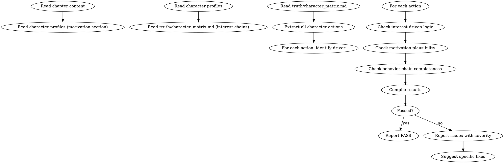

<!-- AUTO-GENERATED from frontmatter — do not edit -->

## 数据契约

- **Reads:** chapters/chapter-N.md, characters/protagonist.md, characters/major/*.md, truth/character_matrix.md
- **Writes:** audits/chapter-N-motivation.md
- **Updates:** none

<!-- END AUTO-GENERATED -->

# 动机与行为链审计

这是条件激活的审计技能。检查角色行为是否利益驱动、动机是否可信、行为链是否完整。

> 激活条件：由 `genre-config.json` 的 `auditDimensions` 包含维度 11 时激活。

> 与 `shenbi-review-character` 区别：角色一致性审计检查"角色 BDI 与档案的偏离"，本审计检查"角色行为在利益/逻辑层面的合理性"。

## 流程



## 铁律

1. **独立评分** — 本 skill 产出评分/审核判断，必须在 context-cleaned 独立 subagent 执行；drafting/planning agent 不得执行本 skill（spec §8.1）
2. **无利益驱动 = 无缘无故** — 角色行为若无自身利益 / 恐惧 / 欲望 / 信念支撑 = error
3. **动机必须可推导** — 读者能从已建立信息中推导出角色当下的动机，不能 = error
4. **行为链 = 因果链** — 角色行为 A → 后果 B → 应对 C，链中任一环节缺失 = warning
5. **不得为推进剧情制造动机** — 角色动机必须源于已有欲望/恐惧，不能因"剧情需要"临时生成

## 检查执行

### 1. 角色行为抽取
- 列出本章所有角色的主动行为（非被动反应）
- 每个行为标注：行为描述、触发情境、行为人

### 2. 利益驱动检查
- 对每个行为回答：角色"为什么"这么做？
- 答案必须落到以下之一：
  - 自身利益（保命/晋级/复仇/获利）
  - 自身恐惧（死亡/失败/失去）
  - 自身欲望（与角色欲望档案一致）
  - 自身信念（与角色信念档案一致）
- 落到"剧情需要" / "作者安排" / "角色应该这么做" = error

### 3. 动机可信度
- 检验动机是否可从读者已知信息中推导：
  - 该角色的欲望/恐惧在前章是否已建立？
  - 触发情境是否能与该欲望/恐惧共振？
  - 是否有更符合该角色的替代行为？
- 不可推导 = error
- 可推导但选择次优行为 = warning（除非有清晰的角色缺陷/习惯解释）

### 4. 行为链完整性
- 追踪每个主动行为的因果链：
  - 触发事件 → 角色判断 → 行为选择 → 后果
  - 链中任一环节缺失（无判断段/无后果回响）= warning
- 长行为链（跨多场景）需有中间节点支撑

### 5. 反派与配角动机
- 反派行为需有"自身合理利益"（不能仅为主角对立而存在）
- 配角行为需有独立欲望（不是工具人）— 与 `review-character` 协作
- 反派降智 = error（动机变得不可信）

## 输出格式

```markdown
## 动机与行为链审计报告

**章节**: 第N章
**结果**: 通过 / 有瑕疵 / 不通过

### 利益驱动
| 角色 | 行为 | 驱动类型 | 档案匹配 | 严重度 |
|------|------|---------|---------|--------|
| 林轩 | 攻击张三 | 利益（晋级机会）| ✓ | PASS |
| 王五 | 放过林轩 | 不可推导 | — | error |

### 动机可信度
| 角色 | 行为 | 可推导性 | 严重度 |
|------|------|---------|--------|
| 苏晴 | 拒绝李四 | 已知与李四有旧怨 | PASS |
| 张三 | 主动暴露身份 | 无 | error |

### 行为链完整性
| 角色 | 行为 | 因果链 | 缺失环节 | 严重度 |
|------|------|-------|---------|--------|
| 林轩 | 挑战大师 | 触发(被打)→判断(复仇)→行为(挑战)→后果(胜) | 无 | PASS |
| 李四 | 中途离开 | 触发(?)→判断(?)→行为(离开)→后果(无) | 全链缺失 | error |

### 评分: X/10 通过

### 建议修复
- [ERROR] [段落] [角色] [动机缺失/不可信]：[具体补足方案]
- [WARNING] [段落] [行为链缺失]：[补足哪个环节]
```

## Anti-Rationalization

| Excuse | Reality |
|--------|---------|
| "角色为剧情牺牲是合理的" | 角色是故事主人，剧情为角色服务。角色为剧情牺牲 = 工具人化 |
| "动机后文会揭示" | 本章动机不可推导 = 本章读者困惑。困惑过 3 章 = 弃书 |
| "反派不需要合理动机" | 反派降智 = 主角胜之不武 = 主角线也塌方 |
| "行为链完整太繁琐" | 行为链是叙事的因果。读者靠因果理解故事，因果缺失 = 阅读断裂 |

## 缺陷证据格式

每条缺陷/发现报告必须遵循四要素格式：

1. **位置** — `文件路径` L行号-行号（如 `chapters/chapter-5.md` L23-27）
2. **原文引述** — 用 `>` 标记引述原文，≥20 字上下文
3. **违反规则** — 引用 SKILL.md 中的精确规则名（逐字匹配）
4. **严重度** — BLOCKING | CRITICAL | MINOR

缺少任一要素的缺陷报告视为不合格。
