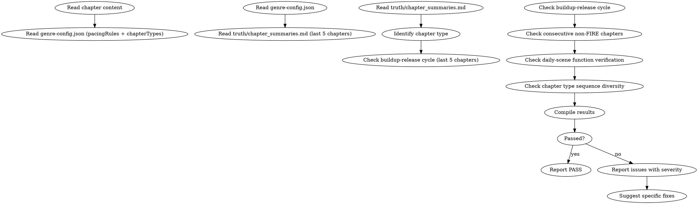

# 节奏审计

这是条件激活的审计技能。检查蓄压-爆发周期完整性、连续无爆发检测、日常段落功能验证、章节类型序列多样性。

> 激活条件：由 `genre-config.json` 的 `auditDimensions` 包含维度 7 或 26 时激活。

## 流程



## 数据契约

- **Reads:** `chapters/chapter-N.md`, `genre-config.json`, `truth/chapter_summaries.md`
- **Writes:** report only
- **Updates:** none

## 铁律

1. **蓄压必须有释放** — 连续超过 `genre-config.json` 的 `maxConsecutiveQuest` 章 QUEST 无 FIRE → 必须报告为 warning
2. **爆发后必须有缓冲** — FIRE 章后不能直接进入下一个 FIRE，必须有缓冲章
3. **日常段落必须有功能** — CONSTELLATION 段落不能只是"日常描写"，必须承载信息/关系/伏笔中的至少一种

## 检查执行

### 1. 蓄压-爆发周期
- 统计近5章章节类型（QUEST/FIRE/CONSTELLATION）
- 检查 `maxConsecutiveQuest` 和 `maxGapQuest` 规则是否违反

### 2. 本章节奏分析
- 识别本章类型（与章节备忘的 `chapter_type` 对比）
- 检查类型是否与节奏原则一致

### 3. 日常段落功能验证
- 如果是 CONSTELLATION 章/段，检查其承担的功能（关系推进/信息传递/伏笔铺垫）
- 无功能日常 = 流水账警告

### 4. 序列多样性
- 检查近10章类型分布是否过偏（单一类型 > 50% 警告）

## 输出格式

```markdown
## 节奏审计报告

**章节**: 第N章
**本章类型**: QUEST
**结果**: 通过 / 有瑕疵 / 不通过

### 近5章类型序列
| 章节 | 类型 | 蓄压/爆发状态 |
|------|------|-------------|
| N-4 | QUEST | 蓄压 |
| ... | ... | ... |

### 规则检查
- maxConsecutiveQuest: 3/5 OK
- maxGapFIRE: 1/3 OK
- 序列多样性: QUEST 60% OK

### 评分: X/10 通过

### 建议修复
- [WARNING] [具体章节] [问题描述]：[修复方案]
```

## Anti-Rationalization

| Excuse | Reality |
|--------|---------|
| "连续几章蓄压没问题，读者有耐心" | 现代网文3章无爆点读者开始流失 |
| "日常章节写写无所谓" | 无功能日常 = 读者跳读窗口 = 弃书风险 |
| "爆发章后直接接下一个高潮" | 没有缓冲的连续爆发 = 读者麻木 |
