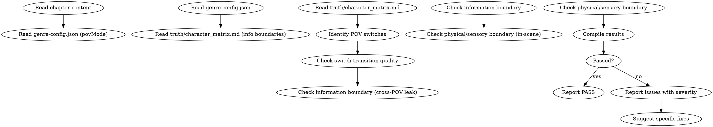

<!-- AUTO-GENERATED from frontmatter — do not edit -->

## 数据契约

- **Reads:** chapters/chapter-N.md, genre-config.json, truth/character_matrix.md, truth/current_state.md
- **Writes:** audits/chapter-N-pov.md
- **Updates:** none

<!-- END AUTO-GENERATED -->

# 视点与信息边界审计

这是条件激活的审计技能。检查 POV（视点角色）切换过渡、角色是否引用了不应知道的信息。

> 激活条件：由 `genre-config.json` 的 `auditDimensions` 包含维度 9 或 19 时激活。

> 与 `shenbi-review-character` 区别：角色一致性审计检查"角色 BDI"，本审计检查"叙事视角的边界"。

## 流程



## 铁律

1. **独立评分** — 本 skill 产出评分/审核判断，必须在 context-cleaned 独立 subagent 执行；drafting/planning agent 不得执行本 skill（spec §8.1）
2. **POV 切换必须有分隔** — 视点角色转换无空行/分隔符/章节断 = error
3. **信息边界 = 物理定律** — 角色引用未在自己 POV 范围内获取的信息 = error
4. **感官边界不可逾越** — 视点角色描述自己不在场/未目睹/未听见的事件 = error
5. **心理边界 = 密室** — 视点角色展示他人内心独白 = error（全知模式除外）

## 检查执行

### 1. POV 模式识别
- 读取 `genre-config.json` 的 `povMode` 字段：
  - `first-person` — 主角第一人称，全程单视点
  - `third-limited` — 单一视点角色（每章可能换）
  - `third-omniscient` — 全知视点，限制放宽
  - `third-shifting` — 视点可在章内切换，需过渡

### 2. 视点切换识别
- 提取每段的视点角色
- 标注每次切换位置
- `third-shifting` 模式下，章内切换次数 > 3 = warning（碎片化）

### 3. 切换过渡质量
- 每次 POV 切换前是否有过渡（空行/小标题/视觉锚点）
- 突然切换 = error
- 平滑切换 = pass
- `third-omniscient` 模式仍需过渡（场景锚点 / 空行），但允许更宽松的过渡形式

### 4. 信息边界（跨 POV 泄漏）
- 提取本章所有"X 知道 Y"类陈述
- 验证 X 获取 Y 的渠道：
  - X 亲眼目睹？✓
  - X 亲耳听到？✓
  - 有人告知 X？✓
  - 合理的推导（基于 X 已掌握信息）？✓
  - 其他 = error
- 跨视点信息泄漏 = error（`third-omniscient` 模式除外）

### 5. 感官边界（在场检查）
- 视点角色描述的事件是否在该角色在场时空中
- 视点角色描述他人想法/感受是否基于该角色可观察的行为
- 凭空描述不在场事件 = error

## 输出格式

```markdown
## 视点与信息边界审计报告

**章节**: 第N章
**POV 模式**: third-limited (本章视点角色：林轩)
**结果**: 通过 / 有瑕疵 / 不通过

### POV 切换
| 位置 | 从 → 到 | 过渡方式 | 严重度 |
|------|--------|---------|--------|
| P15 | 林轩 → 苏晴 | 空行 + 时间提示 | PASS |

### 信息边界
| 段落 | 角色 | 引用信息 | 获取渠道 | 严重度 |
|------|------|---------|---------|--------|
| P8 | 林轩 | "张三在密室" | 当时林轩在广场 | error |

### 感官边界
| 段落 | 角色 | 描述 | 是否在场 | 严重度 |
|------|------|------|---------|--------|
| P22 | 林轩 | "密室中的对话" | 否 | error |

### 评分: X/10 通过

### 建议修复
- [ERROR] [段落] [POV/信息/感官] [问题描述]：[修复方案]
- [WARNING] [段落] [问题描述]：[修复方案]
```

## Anti-Rationalization

| Excuse | Reality |
|--------|---------|
| "全知视角不需要边界" | 即使全知视角，切换时仍需过渡。无过渡 = 读者迷失 |
| "信息泄漏只是叙事便利" | 信息泄漏 = 角色知道不该知道的事 = 后续剧情可信度归零 |
| "POV 切换可以加快节奏" | 切换本身不加快节奏。无过渡的切换 = 节奏断裂。过渡不是减速 |
| "心理描写有助于读者理解" | 心理描写只在视点角色身上允许。展示他人心理 = 越界 |

## 缺陷证据格式

每条缺陷/发现报告必须遵循四要素格式：

1. **位置** — `文件路径` L行号-行号（如 `chapters/chapter-5.md` L23-27）
2. **原文引述** — 用 `>` 标记引述原文，≥20 字上下文
3. **违反规则** — 引用 SKILL.md 中的精确规则名（逐字匹配）
4. **严重度** — BLOCKING | CRITICAL | MINOR

缺少任一要素的缺陷报告视为不合格。
