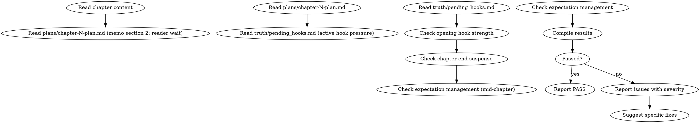

# 读者牵引力审计

这是条件激活的审计技能。检查章节开头钩子强度、章尾悬念、读者期待管理。

> 激活条件：由 `genre-config.json` 的 `auditDimensions` 包含维度 32 时激活。

> 与 `shenbi-review-foreshadowing` 区别：伏笔审计检查"伏笔池中伏笔的兑现与培育"，本审计检查"读者追读冲动的即时刺激"。

## 流程



## 数据契约

- **Reads:** `chapters/chapter-N.md`, `plans/chapter-N-plan.md`, `truth/pending_hooks.md`
- **Writes:** report only
- **Updates:** none

## 铁律

1. **章头 200 字 = 生死线** — 章节开头无钩子 / 拖沓 / 信息密度低 = error（除非本章承接上章紧急事件）
2. **章尾必须留悬念** — 章尾无悬念 / 无信息落差 / 无改变 = error
3. **期待必须被回应或被管理** — 备忘第 2 段"读者此刻在等什么"在正文中必须有明确回应（兑现/延迟/转方向），缺失 = error
4. **中段必须有牵引点** — 章中每 800-1200 字需有牵引点（冲突/揭示/转折），否则 = warning

## 检查执行

### 1. 开头钩子强度
- 读取章节前 200 字
- 检测钩子类型：
  - 紧急情境（"刀已架在颈上"类）
  - 信息落差（读者已知 + 角色未知 / 反之）
  - 直接冲突（章首即打/即争）
  - 反常情境（违反预期的开场）
  - 回忆/梦境/异常感官（强气氛）
- 钩子强度 = 强（3 项以上）/ 中（1-2 项）/ 弱（0 项）
- 弱钩子 + 非紧急承接 = error

### 2. 章尾悬念
- 读取章节最后 300 字
- 检测悬念类型：
  - 揭示未完（"X 突然发现..."+ 章断）
  - 决策未决（角色面对重大选择 + 章断）
  - 威胁升级（新敌人/危机出现）
  - 信息缺口（关键信息被揭示一半）
  - 反转钩（章末颠覆读者预期）
- 悬念强度 = 强/中/弱
- 弱悬念 = error

### 3. 期待管理
- 读取备忘第 2 段"读者此刻在等什么"
- 在正文中追踪该期待的处理：
  - 兑现：找到对应情节
  - 延迟：找到延后处理的合理段
  - 转方向：期待被引向新焦点
- 完全忽略 = error

### 4. 中段牵引点
- 将章分为段落块（每 800-1200 字一块）
- 每块需有至少一个牵引点：
  - 冲突推进
  - 信息揭示
  - 角色关系变化
  - 伏笔操作（open/advance）
  - 反转或转折
- 连续 2 块无牵引点 = warning

### 5. 钩子池压力平衡
- 读取 `pending_hooks.md` 当前活跃伏笔
- 本章对钩子池的"施加压力 vs 释放压力"对比
- 钩子池持续只施加不释放 > 5 章 = warning（读者疲惫）

## 输出格式

```markdown
## 读者牵引力审计报告

**章节**: 第N章
**结果**: 通过 / 有瑕疵 / 不通过

### 开头钩子
- 钩子类型: 紧急情境 + 信息落差
- 强度: 强
- 判定: PASS

### 章尾悬念
- 悬念类型: 揭示未完
- 强度: 强
- 判定: PASS

### 期待管理
| 备忘承诺 | 实际处理 | 状态 |
|---------|---------|------|
| 读者等林轩表态 | P18 明确表态 | MATCH |
| 读者等神秘人身份 | 仍未揭示 | HELD（合理）|

### 中段牵引点
| 段落块 | 牵引类型 | 状态 |
|--------|---------|------|
| 0-1000 | 冲突 | OK |
| 1000-2000 | 信息揭示 | OK |
| 2000-3000 | 无 | warning |

### 钩子池压力
- 施加 (open/advance): 3
- 释放 (resolve): 1
- 净压力: +2
- 累计: 第 5 章连续 +

### 评分: X/10 通过

### 建议修复
- [ERROR] [位置] [钩子/悬念/期待问题]：[修复方案]
- [WARNING] [段落块] [牵引点缺失]：[补足方案]
```

## Anti-Rationalization

| Excuse | Reality |
|--------|---------|
| "开篇可以从背景讲起" | 背景 = 读者跳读窗口。网文读者给每章 30 秒判断去留 |
| "章尾可以平静收束" | 平静章尾 = 没有下一章理由。读者合上书 = 弃书 |
| "中段不需要每段都有钩子" | 没有钩子的中段 = 读者跳读。跳读惯性 = 弃书 |
| "期待可以下章再回应" | 期待延后必须在本章有"延后信号"，无信号 = 期待丢失 |
