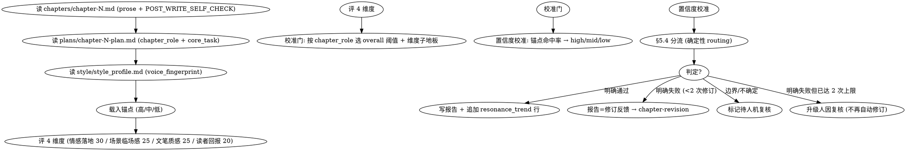

<!-- AUTO-GENERATED from frontmatter — do not edit -->

## 数据契约

- **Reads:** chapters/chapter-N.md, plans/chapter-N-plan.md, style/style_profile.md
- **Writes:** audits/chapter-N-resonance.md
- **Updates:** truth/audit_drift.md, truth/resonance_trend.md

<!-- END AUTO-GENERATED -->

# 共鸣评分（逐章正向质量门）

本技能是正向质量门的核心交付物（spec §5，交付物 A）。它给**完成稿**打「体验轴」正向分——情绪是否落地、场景是否临场、文笔是否有质感、本章是否给了读者回报。这是质量「U 形缺口」里被负向门照不见的那一半：负向门（anti-ai / pacing / continuity …）只回答「有没有犯忌」，resonance 回答「读起来到底值不值得读」。

分数优于门：门只在踩地板时响，看不见逐章下滑；本技能把**每章的分数序列**写入 `truth/resonance_trend.md`，供 `drift-guidance` 做跨章/跨卷漂移检测（spec §8.3）。

## 硬门（HARD-GATE）

- **没有完成稿 + 计划不评分。** 必须读到 `chapters/chapter-N.md`（prose）与 `plans/chapter-N-plan.md`（含 `chapter_role`）。缺任一 → 不打分，报告标 `resonance_pending` 并入待评队列，**严禁**主 agent 补评（spec §9）。
- **不在生成上下文里评分。** `requires_independent_agent: true`（spec §8.1）：dispatcher 必须清空生成上下文，只传入 reads 路径 + 本技能 + 锚点。provenance 标记非独立 → 评分作废，重 dispatch。

## 铁律

1. **独立评分** — 本技能产出评分/审核判断，必须在 context-cleaned 独立 subagent 执行；drafting/planning agent 不得给自己的产出评分（spec §8.1）。
2. **锚点先行（anchor-first）** — 打分前先对照本技能的共鸣锚点集（每维度高/中/低三档，spec §8.2；锚点文件路径由 dispatch 时传入，见 scenario 锚点映射）。被评段的定位必须相对锚点可解释：高于锚点 X / 介于 X 与 Y / 低于 Y。锚点缺失 → 降置信度 + flag，**不得跳过维度**（spec §9）。
3. **先确定性** — 评分员的 LLM 判断只产出 4 维度分数 + 自报置信度。**校准门阈值、置信度降级、§5.4 分流、修订上限**全部由确定性 helper 计算，不得手算手判：
   - 分流：`python -m shenbi.skill_utils.review_resonance --overall <分> --threshold <校准阈值> --confidence <校准后置信度> --prior-revisions <次数> --floor <维度=分:子地板> ...`
   - 置信度降级：`python -m shenbi.skill_utils.calibration --reported <自报> --high-confidence <锚点命中率> --threshold 0.8`
4. **show-not-tell 证据** — 每个维度分数必须落到「原文行号 + 引述」，证情绪是 show 还是 tell，**禁止**用「写得很感人」「文笔流畅」这类无锚点的评价话术。
5. **置信度必报** — 每个维度报 high/mid/low，overall 报 high/mid/low。**裸置信度不可信**：自报 high 但锚点命中率 < 0.8 → 校准降级为 mid（spec §8.2），降级后的置信度才用于 §5.4 分流。

## 流程



## 评分维度（/100）

| 维度 | 权重 | 评什么（读者反应信号，非美学判断） | 子地板 |
|------|------|------|--------|
| 情感落地 | 30 | 核心情绪节拍是 show 还是 tell；**命名最强情绪 + 触发行** | —（阈值按角色校准，见校准门） |
| 场景临场感 | 25 | 感官具体性、是否「在场」而非概述 | — |
| 文笔质感 | 25 | 句子级工艺 vs `style/style_profile.md` 指纹（**正向**，补 anti-ai 的负向） | — |
| 读者回报 | 20 | 本章给了读者情绪/信息/推进的回报吗（「值不值得读」轴） | — |

> 不设绝对维度子地板——维度地板随 `chapter_role` 校准（见校准门），避免「过渡章被高潮标准误杀」或「高潮章情感落地极低仍通过」。overall = 4 维度之和（满分 100）。

## 校准门逻辑

阈值由 `plans/chapter-N-plan.md` 的 `chapter_role` 决定。先读 `chapter_role`，再按下表选 overall 阈值与维度子地板：

| chapter_role | overall 阈值 | 维度子地板 |
|--------------|-------------|-----------|
| 高潮 / 兑现 | ≥75 | 情感落地 ≥20 |
| 推进 / 转折 | ≥65 | — |
| 过渡 / 铺垫 | ≥50 | 读者回报 ≥12（过渡章也必须给回报） |
| 未声明 | ≥65（默认推进） | + flag human 补 role |

> **子地板 rationale**：高潮章强制「情感落地≥20」（情感交付是高潮章的核心交付物）；过渡章强制「读者回报≥12」（过渡章也必须给读者增量，否则=水章）。推进章不设维度子地板——其主交付维度随情节而变（信息/转折/关系），固定子地板不合理，由 overall≥65 兜底。`chapter_role` 未声明不得静默降级或跳过：按推进阈值评 + 报告 flag，**flag 聚合后批量处理，不逐章阻塞**（spec §5.1）。

**阻断规则**：overall 或任一子地板未达 → **阻断**，按 §5.4 三路径分流。

## 置信度守护与分流（§5.4）

每维度报置信度（high/mid/low）+ overall。阻断时分三条路径（用确定性 helper `route_block` 判定，消除「clear-fail 走哪」的歧义）：

| 情形 | 条件 | 路径 |
|------|------|------|
| 明确通过 | overall + 全子地板达标 | 放行 |
| 明确失败 | 高置信度 **且** overall 低于阈值 >5 | 自动进入 `chapter-revision`（评分报告 = 修订反馈） |
| 边界/不确定 | overall 置信度 = low，**或** 任一阻断维度分数在阈值 ±5 内 | **人机复核**：human 审阅 →「接受（覆盖阻断）」或「确认阻断 → `chapter-revision`」 |

> 设计意图：只有**边界/不确定**走人因（防主观噪声假阻断死循环）；**明确失败**直接修订（高置信度 + 大幅低于阈值 = 真实缺陷，无需人因把关）。人因只在噪声区介入，不作每章瓶颈。

**修订循环上限（防死循环）**：同一章 resonance 驱动的 revision 最多 **2** 次。第 3 次重评仍 clear-fail → **升级人因复核**（不再自动 revision）。「评不出来」的章必须人因介入，不得无限重试。

## 输出格式

```markdown
## 共鸣评分报告

**章节**: 第N章 | **计划角色**: 高潮 | **结果**: 通过 (82/100) / 阻断 (XX/100) / 待人机复核

### 评分明细
| 维度 | 得分 | 满分 | 置信度 | 证据 | 裁判理由 |
|------|------|------|--------|------|----------|
| 情感落地 | 22 | 30 | high | `chapter-N.md` L45-52 > … | show，触发行 L48 |
| 场景临场感 | 20 | 25 | mid | `chapter-N.md` L10-12 > … | 在场，嗅觉缺位 |
| 文笔质感 | 22 | 25 | high | `chapter-N.md` L48 > … | 贴合指纹 |
| 读者回报 | 18 | 20 | high | `chapter-N.md` L60-63 > … | 兑现预期 |

> 证据列必须含「行号 + 原文引述」（如 `chapter-N.md` L45-52 > …）；列名保持裸 `证据` 以匹配 G4 门头校验。

### 校准门判定
- overall 82 ≥ 高潮阈值 75 ✓
- 情感落地 22 ≥ 子地板 20 ✓
- 判定: 通过

### 共鸣短板（写入 audit_drift）
- [维度] [短板描述] → 下章 PRE_WRITE_CHECK 防范建议

### 趋势（写入 resonance_trend）
- 第 N 章 情感落地 22 | 近 3 章均值 24 | 趋势: 持平
```

**`truth/resonance_trend.md` 追加行**（机器可解析，drift CLI 的契约）——一行一章节：

```
| chapter | chapter_role | 情感落地 | 场景临场感 | 文笔质感 | 读者回报 | overall | confidence | human_overridden |
| N | 高潮 | 22 | 20 | 22 | 18 | 82 | high |  |
```

> 记录语义（spec §8.3）：记录**最终采纳分**（阻断→修订→重评后通过的分），被拒绝的修订前低分不入库；人因覆盖放行的弱章低分照记并附 `human_overridden: true`，漂移检测据此排除其触发统计。

## 与现有负向门的边界（避免重复，spec §5.6）

遵守「暴露冲突别平均化」——不在多个门重复评同一关注点：

- resonance 只管**体验轴**（情绪/临场/文笔/回报）。
- 节奏**缺陷**（拖/赶）仍归 `shenbi-review-pacing`；resonance 不单列张力维度（其正向面折进「读者回报」）。
- 伏笔**追踪**归 `shenbi-review-foreshadowing`；**兑现质量**归卷级 `shenbi-review-arc-payoff`（交付物 B）。
- 去味**负向**（AI 套话/疲劳词）归 `shenbi-review-anti-ai`；resonance 的「文笔质感」是**正向**补足——评的是否贴合 `style_profile` 指纹，不是抓 AI tell。

## Anti-Rationalization

| Excuse | Reality |
|--------|---------|
| 「整体感觉不错就给高分」 | 共鸣分必须逐维度 + 锚点 + 行号证据，无锚点的「感觉」= 主观噪声 |
| 「过渡章没高潮很正常，不该扣分」 | 过渡章不与高潮章比 overall（阈值按 `chapter_role` 校准），但仍必须给「读者回报≥12」，否则=水章 |
| 「情绪我说了就算」 | 情绪是 show 还是 tell 必须落到「最强情绪 + 触发行」；tell 化的情绪节拍= 情感落地失分 |
| 「置信度我自己报 high 就 high」 | LLM 评分员系统性自报偏高；锚点命中率 < 0.8 的 high 必须校准降级为 mid |
| 「评不过就多修几次总会过」 | 同章 resonance 驱动修订上限 2 次，第 3 次仍 clear-fail 必须人因介入，禁止无限重试 |
| 「锚点对不上，我就按经验评」 | 锚点缺失 → 降置信度 + flag，不得静默跳过维度（spec §9） |

## 缺陷证据格式

每条缺陷/短板报告必须遵循四要素格式：

1. **位置** — `文件路径` L行号-行号（如 `chapters/chapter-5.md` L23-27）
2. **原文引述** — 用 `>` 标记引述原文，≥20 字上下文
3. **违反规则** — 引用 SKILL.md 中的精确规则名（逐字匹配）
4. **严重度** — BLOCKING | CRITICAL | MINOR

缺少任一要素的缺陷报告视为不合格。
