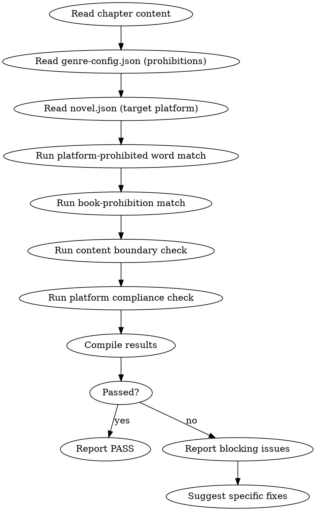

<!-- AUTO-GENERATED from frontmatter — do not edit -->

## 数据契约

- **Reads:** chapters/chapter-N.md, genre-config.json, novel.json
- **Writes:** audits/chapter-N-sensitivity.md
- **Updates:** none

<!-- END AUTO-GENERATED -->

# 敏感内容审计

这是默认激活的审计技能（每章必查）。检查平台禁忌词、本书禁忌词、内容边界、平台合规性。

## 流程



## 铁律

1. **敏感词 = blocking error** — 直接导致平台下架的问题没有 warning 余地，只分 error 和 pass
2. **依据目标平台规则** — 如果 novel.json 指定了目标平台，应用对应平台的审核规则
3. **本书禁忌词必须 0 出现** — genre-config.json 的 prohibitions 列表 = 每章必须为 0
4. **不与 creative expression 妥协** — 只标记客观违规，不对艺术表达做主观审查

## 检查执行

完整类别与检测方法见 `sensitive-words.md`。执行顺序：

1. 平台禁忌词匹配（按目标平台规则）
2. 本书禁忌词匹配（从 `genre-config.json` 的 `prohibitions` 读取）
3. 内容边界检测（暴力程度 / 未标记成人内容）
4. 平台合规性综合（输出通过 / 不通过）

## 缺陷证据格式

每条缺陷报告必须遵循  定义的四要素格式：
1. **位置**: 文件路径 + 行号范围
2. **原文引述**: ≥20 字上下文，用 `>` 标记
3. **违反规则**: SKILL.md 规则名（精确匹配）
4. **严重度**: BLOCKING / CRITICAL / MINOR

缺失任一要素 = 不合格。

## 输出格式

```markdown
## 敏感内容审计报告

**章节**: 第N章
**目标平台**: 起点中文网
**结果**: 通过 / 不通过

### 平台禁忌词
| 类型 | 检测项 | 结果 |
|------|--------|------|
| 政治 | ... | PASS |
| 色情 | ... | PASS |
| 暴力 | ... | PASS |

### 本书禁忌词
| 禁忌词 | 出现次数 | 状态 |
|--------|---------|------|
| "全场震惊" | 0 | PASS |
| "不由得倒吸一口凉气" | 0 | PASS |

### 评分: 通过/不通过

### 建议修复
- [ERROR] 第X段 [敏感词/违规类型]：[具体替换或删除方案]
```

## Anti-Rationalization

| Excuse | Reality |
|--------|---------|
| "敏感词检测太严格了" | 平台审核比你严格得多，下架 = 0 收入 |
| "这条禁忌词加进去也没事" | 禁忌词是为了安全，不是为了提高写作质量 |
| "这是文学创作，应该有空间" | 文学创作也得通过平台审核才能发布 |
| "AI 改写可以规避" | AI 改写 = 同一章重新发布，平台依然下架 |
