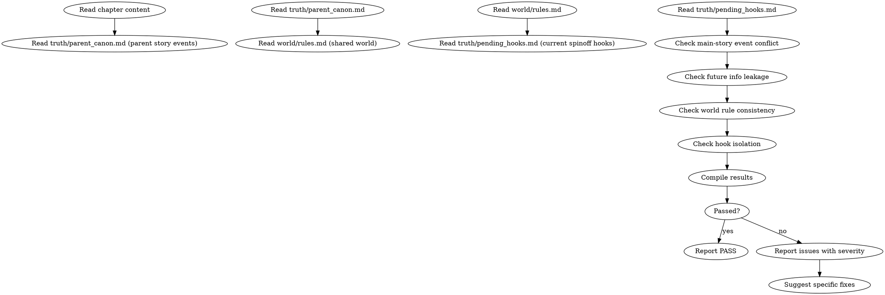

<!-- AUTO-CHECK-START -->

## auto-check (generated -- do not edit)

<!-- AUTO-CHECK-END -->

<!-- AUTO-GENERATED from frontmatter — do not edit -->

## 数据契约

- **Reads:** chapters/chapter-N.md, truth/parent_canon.md, world/rules.md, truth/pending_hooks.md
- **Writes:** audits/chapter-N-spinoff.md
- **Updates:** none

<!-- END AUTO-GENERATED -->

# 外传/衍生作品审计

这是条件激活的审计技能。检查与原作事件冲突、未来信息泄漏、世界规则一致性、伏笔隔离。

> 激活条件：`truth/parent_canon.md` 存在时激活（即本作品是某原作的衍生/外传）。

> 与 `shenbi-review-fanfic` 区别：同人审计检查"角色与原作的还原度"，本审计检查"衍生作品的内部逻辑不破坏原作"。

## 流程



## 铁律

1. **独立评分** — 本 skill 产出评分/审核判断，必须在 context-cleaned 独立 subagent 执行；drafting/planning agent 不得执行本 skill（spec §8.1）
2. **原作事件 = 不可篡改** — 与原作已发生事件矛盾的衍生情节 = error
3. **未来信息不得泄漏** — 衍生作品角色不得拥有"未到时点"的信息 = error
4. **共享世界规则必须一致** — 与原作共用世界的物理/能力/社会规则不能违反 = error
5. **衍生伏笔不得污染原作伏笔池** — 衍生作品的伏笔必须在 `pending_hooks.md` 中独立登记

## 检查执行

完整违规类别与判定方法见 `spinoff-violations.md`。执行顺序：

### 1. 原作事件对照
- 读取 `truth/parent_canon.md`（原作事件表）
- 提取本章所有具体事件
- 与原作事件表对比：
  - 事件矛盾（衍生说 A 发生，原作说 B 发生）= error
  - 时间矛盾（事件顺序错乱）= error
  - 角色状态矛盾（衍生中角色在原作同时期处于不同状态）= error

### 2. 未来信息泄漏检测
- 提取本章所有"角色知道 X"类陈述
- 检查 X 是否在原作时点之后才揭示
- 衍生角色在原作"已揭示信息"范围内 = pass
- 衍生角色拥有"未揭示信息"= 未来信息泄漏 = error

### 3. 共享世界规则一致性
- 提取本章涉及的世界规则使用
- 与 `world/rules.md` 和原作世界规则对比
- 规则违反 = error
- 例外：衍生作品有"独立规则"声明（在 `world/rules.md` 中标注 `spinoff-specific`）= pass

### 4. 伏笔隔离
- 衍生作品伏笔必须在 `truth/pending_hooks.md` 中标记 `scope: spinoff`
- 衍生作品不得激活/兑现原作伏笔（除非显式跨作品联动声明）
- 原作伏笔池与衍生伏笔池应分别追踪

## 输出格式

```markdown
## 外传/衍生作品审计报告

**章节**: 第N章
**原作**: [原作名]
**结果**: 通过 / 有瑕疵 / 不通过

### 原作事件对照
| 段落 | 衍生事件 | 原作事件 | 矛盾类型 | 严重度 |
|------|---------|---------|---------|--------|
| P12 | X 已死 | X 在原作中活着 | 状态矛盾 | error |

### 未来信息泄漏
| 段落 | 角色 | 信息 | 原作揭示时点 | 严重度 |
|------|------|------|------------|--------|
| P20 | A | Y 是叛徒 | 原作第 5 卷揭示 | error (本章在第 1 卷时点) |

### 世界规则一致性
| 段落 | 规则 | 共享规则 | 严重度 |
|------|------|---------|--------|
| P15 | 灵力上限 200 | 原作 100 | error |

### 伏笔隔离
| 伏笔 ID | scope | 状态 | 隔离正确? |
|---------|-------|------|----------|
| sh-h001 | spinoff | 活跃 | ✓ |
| sh-h002 | shared | 激活 | 跨作品联动未声明 = error |

### 评分: X/10 通过

### 建议修复
- [ERROR] [段落] [违规类型] [原作引用]：[修复方案]
- [WARNING] [段落] [问题描述]：[修复方案]
```

## Anti-Rationalization

| Excuse | Reality |
|--------|---------|
| "外传可以修改原作设定" | 外传可以扩展，不能修改原作已确立的事件/规则 |
| "角色知道未来信息是设定需要" | 信息时点 = 叙事契约。提前揭示 = 原作时点错乱 |
| "共享世界规则可以自由" | 共享世界 = 公共契约。改规则需独立声明 |
| "外传伏笔可以与原作联动" | 联动需显式声明。无声明的联动 = 伏笔系统混乱 |

## 缺陷证据格式

每条缺陷/发现报告必须遵循四要素格式：

1. **位置** — `文件路径` L行号-行号（如 `chapters/chapter-5.md` L23-27）
2. **原文引述** — 用 `>` 标记引述原文，≥20 字上下文
3. **违反规则** — 引用 SKILL.md 中的精确规则名（逐字匹配）
4. **严重度** — BLOCKING | CRITICAL | MINOR

缺少任一要素的缺陷报告视为不合格。
