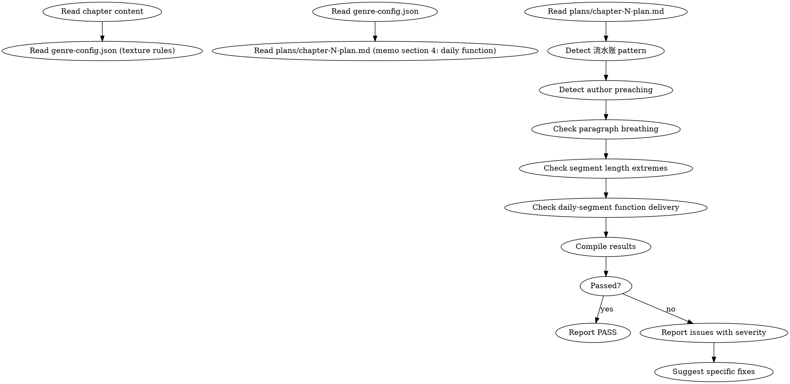

<!-- DEPRECATED: Superseded by shenbi-review-group-craft (2026-07-19). -->
<!-- This skill is retained for reference. Do not dispatch. -->

<!-- AUTO-CHECK-START -->

## auto-check (generated -- do not edit)

<!-- AUTO-CHECK-END -->

<!-- AUTO-GENERATED from frontmatter — do not edit -->

## 数据契约

- **Reads:** chapters/chapter-N.md, genre-config.json, plans/chapter-N-plan.md
- **Writes:** audits/chapter-N-texture.md
- **Updates:** none

<!-- END AUTO-GENERATED -->

# 写作质感审计

这是条件激活的审计技能。检查流水账、段长极端、段落呼吸感、作者说教渗透、日常段功能失效。

> 激活条件：由 `genre-config.json` 的 `auditDimensions` 包含维度 17 时激活。

> 与 `shenbi-review-pacing` 区别：节奏审计检查"章类型序列"与"蓄压-爆发周期"，本审计检查"段落级"质感。
> 与 `shenbi-review-anti-ai` 区别：段长由两者都触及——本审计审"段长**极端**（>500/<20 字）与**呼吸感**（长短交错的可读性）"；anti-ai 审"段长**等长/规律性**（CV 过低 = AI 生成特征）"。本审计判质量，anti-ai 判可检测性。

## 流程



## 铁律

1. **独立评分** — 本 skill 产出评分/审核判断，必须在 context-cleaned 独立 subagent 执行；drafting/planning agent 不得执行本 skill（spec §8.1）
2. **流水账 = 写作致命伤** — 单纯按时间罗列事件而无功能/冲突/变化的段落必须标记为 error
3. **作者说教 = 越界** — 叙事者跳出情节直接对读者输出观点/教训 = 沉浸感破坏 = error
4. **段长极端 = 节奏病** — 单段 > 500 字 或 < 20 字（无特殊修辞目的）= warning
5. **日常段必须有功能** — 备忘第 4 段标注的功能（关系/信息/伏笔）必须在对应段落实

## 检查执行

### 1. 流水账检测
- 扫描连续段落是否仅按时序罗列"X 做了 A, X 做了 B, X 做了 C"而无变化/冲突/选择
- 标志：
  - 段落开头为时间副词链（"然后""接着""之后"）超过 3 段连续
  - 连续段落无主语行为选择或情绪变化
  - 段落功能 = 单纯信息传递且无后续利用
- 流水账段 = error

### 2. 作者说教检测
- 检测叙事者直接发表观点/教训的句子
- 标志：
  - 包含"我们应该明白""人生就是这样""这告诉我们"等元评论
  - 出现"读者可能觉得""不禁让人反思"等跳出文本的引导
  - 段尾总结性抽象陈述（无具体情节支撑）
- 命中 = error

### 3. 段落呼吸检查
- 统计每段字数
- 长段（> 500 字）若为心理/议论独白且无对话或动作穿插 = warning
- 短段（< 20 字）若连续出现 3 段以上且无节奏修辞目的 = warning（碎片化）
- 理想段长分布应在 80-300 字之间

### 4. 段长极端检查
- 段落字数极差：单章最短段与最长段倍数 > 20x = warning（节奏不均）
- 单段超过 800 字且非战斗高潮/大规模转场 = error

### 5. 日常段功能验证
- 读取备忘第 4 段，识别作者声明的日常段功能
- 在正文中定位对应的非冲突段落
- 验证该段是否实际承担了声明的功能
- 功能未兑现 = warning

## 输出格式

```markdown
## 写作质感审计报告

**章节**: 第N章
**结果**: 通过 / 有瑕疵 / 不通过

### 流水账检测
| 段落范围 | 流水账特征 | 严重度 |
|---------|----------|--------|
| P3-P7 | 连续时间副词 + 无冲突 | error |
| P12 | 单段信息罗列 | warning |

### 作者说教
| 段落 | 触发词 / 模式 | 严重度 |
|------|--------------|--------|
| P5 | "不禁让人反思" | error |

### 段长分布
- 最短段: X 字 (P14)
- 最长段: Y 字 (P22)
- 平均段长: Z 字
- 极端段（>500 或 <20 字）: N 段

### 段长极端
| 段落 | 字数 | 判定 | 严重度 |
|------|-----|------|--------|
| P22 | 612 字 | 议论独白无穿插 | warning |

### 日常段功能
| 备忘声明 | 对应段落 | 是否兑现 |
|---------|---------|---------|
| 关系推进 | P10-P12 | ✓ |
| 信息传递 | P15-P16 | ✗（无后续利用）|

### 评分: X/10 通过

### 建议修复
- [ERROR] [段落] [流水账/说教]：[具体改写方向]
- [WARNING] [段落] [段长/功能]：[具体修改方案]
```

## Anti-Rationalization

| Excuse | Reality |
|--------|---------|
| "流水账是交代背景的必要手段" | 交代背景可以通过一个冲突场景或一个对话瞬间完成，流水账是懒惰写法 |
| "作者说教是点题需要" | 主题应该让情节自己说话，作者说教 = 替读者思考 = 侮辱读者智商 |
| "短段碎片化是网文节奏" | 网文节奏靠句式长短交替，不是单一段落极短；碎片化 = 视觉疲劳 |
| "长段心理是角色深度" | 角色深度靠动作和选择暴露，不靠作者脑内独白；心理段穿插动作/对话才有呼吸 |

## 缺陷证据格式

每条缺陷/发现报告必须遵循四要素格式：

1. **位置** — `文件路径` L行号-行号（如 `chapters/chapter-5.md` L23-27）
2. **原文引述** — 用 `>` 标记引述原文，≥20 字上下文
3. **违反规则** — 引用 SKILL.md 中的精确规则名（逐字匹配）
4. **严重度** — BLOCKING | CRITICAL | MINOR

缺少任一要素的缺陷报告视为不合格。
