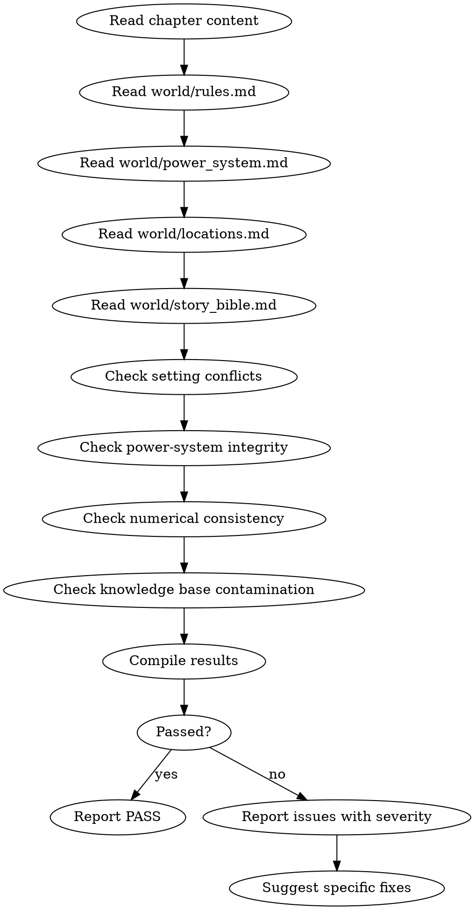

# 世界规则审计

这是条件激活的审计技能。检查设定冲突、战力体系崩坏、数值一致性、知识库污染。

> 激活条件：由 `genre-config.json` 的 `auditDimensions` 包含维度 3、4、5 或 18 时激活。

> 与 `shenbi-review-continuity` 区别：连续性审计检查"章内时空/事件逻辑"，本审计检查"章与世界观底层规则的一致性"。

## 流程



## 数据契约

- **Reads:** `chapters/chapter-N.md`, `world/rules.md`, `world/power_system.md`, `world/locations.md`, `world/story_bible.md`, `truth/chapter_summaries.md`, `truth/current_state.md`
- **Writes:** report only
- **Updates:** none

## 铁律

1. **战力体系 = 不可逾越的天花板** — 角色表现超出 `world/power_system.md` 定义的等级上限 = error
2. **世界规则 = 物理定律** — 违反 `world/rules.md` 中声明的规则（不可逆/不可兼得/代价等）= error
3. **数值一致性 = 不可调和** — 同一数值（年龄/年份/距离/数量）在不同章节矛盾 = error
4. **知识库污染零容忍** — 角色使用未建立的术语/概念/技术 = error

## 检查执行

### 1. 设定冲突检查
- 提取本章所有"能做/不能做"类陈述（如"X 族不能使用 Y"）
- 与 `world/rules.md` 对比
- 与 `world/story_bible.md` 第四段"暗流涌动"对比
- 冲突 = error

### 2. 战力体系完整性
- 提取本章所有战斗/能力使用
- 检查角色等级是否在 `power_system.md` 等级表中存在
- 检查能力使用是否超出等级天花板
- 检查能力代价是否被遵守
- 检查跨等级对决是否违反"低等级不能破防"等基础规则
- 崩坏 = error

### 3. 数值一致性
- 提取本章所有数值陈述（年龄、年份、距离、数量、时间跨度）
- 与近 5 章 `chapter_summaries.md` 对比
- 与 `truth/current_state.md` 对比
- 矛盾 = error

### 4. 知识库污染
- 识别本章新出现的术语/概念/技术
- 检查是否在 `world/` 目录下任一文件已建立
- 任何"凭空出现"的概念 = 知识库污染 = error
- 例外：与主角认知边界严格对齐的"陌生词" = pass（角色也不知道的概念是允许的）

## 输出格式

```markdown
## 世界规则审计报告

**章节**: 第N章
**结果**: 通过 / 有瑕疵 / 不通过

### 设定冲突
| 段落 | 本章陈述 | 世界规则 | 冲突类型 | 严重度 |
|------|---------|---------|---------|--------|
| P12 | "X 族能用 Y" | rules.md 3.2 禁 | 规则违反 | error |

### 战力体系
| 段落 | 角色 | 表现 | 等级上限 | 严重度 |
|------|------|------|---------|--------|
| P23 | 林轩 | 释放 9 级技能 | 5 级 | error |

### 数值一致性
| 数值 | 本章值 | 之前记录 | 矛盾章 | 严重度 |
|------|-------|---------|-------|--------|
| 苏晴年龄 | 19 | 22 (Ch 15) | Ch 15 | error |

### 知识库污染
| 段落 | 新术语 | 知识库状态 | 严重度 |
|------|-------|----------|--------|
| P5 | "凝魂珠" | 未建立 | error |

### 评分: X/10 通过

### 建议修复
- [ERROR] [段落] [冲突类型] [规则引用]：[修复方案]
- [WARNING] [段落] [问题描述]：[修复方案]
```

## Anti-Rationalization

| Excuse | Reality |
|--------|---------|
| "战力崩坏是为剧情服务" | 战力崩坏 = 体系失效 = 后续所有对决失去意义。剧情必须为体系服务 |
| "数值差一点没关系" | 数值差 = 长篇叙事的硬伤。读者会反复翻看，一旦发现即弃书 |
| "新术语可以后补设定" | 知识库污染 = 写作者对自己世界的失信。边写边补 = 设定漂移 |
| "等级天花板限制太多" | 没有天花板的战力 = 故事失去张力。天花板是叙事的骨架 |

## 缺陷证据格式

每条缺陷/发现报告必须遵循四要素格式：

1. **位置** — `文件路径` L行号-行号（如 `chapters/chapter-5.md` L23-27）
2. **原文引述** — 用 `>` 标记引述原文，≥20 字上下文
3. **违反规则** — 引用 SKILL.md 中的精确规则名（逐字匹配）
4. **严重度** — BLOCKING | CRITICAL | MINOR

缺少任一要素的缺陷报告视为不合格。

