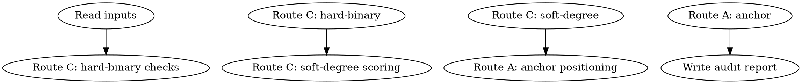

<!-- AUTO-CHECK-START -->

## auto-check (generated -- do not edit)

### constants

| name | value |
|------|-------|
| PASS_THRESHOLD | 90 |
| ROUTE_A_WEIGHT | 0.4 |
| ROUTE_C_SOFT_WEIGHT | 0.6 |
| TIER_ADVANCE_THRESHOLD | 94 |

### formula

```
# final_score = ROUTE_C_SOFT_WEIGHT * route_c_soft_score + ROUTE_A_WEIGHT * route_a_score
# passed requires final_score >= PASS_THRESHOLD AND hard_binary all pass
```

### computed fields

| name | type |
|------|------|
| hard_binary_gate_failed | bool |
| final_score | float |
| passed | bool |
| tier_advance_eligible | bool |

### invariants

- hard binary pass le total

<!-- AUTO-CHECK-END -->

<!-- AUTO-GENERATED from frontmatter — do not edit -->

## 数据契约

- **Reads:** truth/book_strata.md, truth/book_spine.md, benchmarks/anchors/
- **Writes:** audits/stratum-N-score.md
- **Updates:** truth/book_spine.md

<!-- END AUTO-GENERATED -->

# 大弧/书级健康评分

触发：每36章 + 滚动（每卷后增量复核）

## HARD-GATE: 独立评分，context-cleaned subagent

## 流程



## 铁律

1. **独立评分** — context-cleaned 独立 subagent
2. **硬二元驱动** — route C 硬二元项未达成 = 该检查项 0 分 + 标记 unmet_goal
3. **读上级目标** — 从 book_spine.md (L5) 读 themes/master hooks，不从同级读

## Route C：目标达成

**硬二元检查：**
- master hooks在max_distance内推进
- 主角弧指向声明终点

**软程度评分：**
- themes探索深度
- 跨数百章疲劳/套路复发诊断

## Route A：锚点校准

战役节奏/氛围质感维度对照 AC-004/AC-008

## 输出格式

```markdown
## 大弧/书级健康评分报告

**结果**: 通过 (XX/100) / 阻断

### Route C 目标达成
| 检查项 | 类型 | 结果 | 证据 |
|--------|------|------|------|

### Route A 锚点对照
| 维度 | 得分 | 对照锚点 | 相对位置 |
|------|------|---------|---------|
```

## Anti-Rationalization

| Excuse | Reality |
|--------|---------|
| "目标达成太严格" | 硬二元未达成 = 目标失败，必须重生 |
| "锚点对照太麻烦" | 无锚点的孤立打分 = 评分塌缩 |
