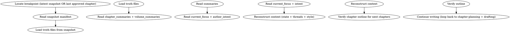

<!-- AUTO-CHECK-START -->

## auto-check (generated -- do not edit)

<!-- AUTO-CHECK-END -->

<!-- AUTO-GENERATED from frontmatter — do not edit -->

## 数据契约

- **Reads:** snapshots/chapter-NNN/*, truth/*.md, outline/volume_map.md, outline/thread_map.md
- **Writes:** chapters/chapter-N.md
- **Updates:** truth/*.md

<!-- END AUTO-GENERATED -->

# 续篇写作

为已暂停的小说恢复写作。负责寻找断点快照、重建上下文、续写后续章节。
**`truth/*.md` 写范围说明**：本 skill 的 `updates: truth/*.md` 仅指**从断点快照恢复**全部 truth 文件至快照状态（一次性恢复操作），**不**在正常逐章写作循环中运行。正常运行中各 truth 文件的字段所有权仍归原 skill（state-settling/foreshadowing-track/memory-distill 等）。

## 流程



## 铁律

1. **断点必为已审计章节** — 续写起点必须是已通过审计 + 已结算的章节快照
2. **上下文必重建** — 不可假设"我记得"；必须从 snapshot + truth 显式重建
3. **作者意图必先确认** — 续写前必问人类合作者：长期意图是否仍然有效
4. **无意识漂移检测** — 续写前 3 章必须做漂移检测（与原作风格/设定的偏差）
5. **不可重写历史** — 已发布章节绝不允许修改；只在续写时向前推进

## 续写前 4 步

### Step 1: 定位断点

候选断点（按优先级）：
1. 最近的 `snapshots/chapter-NNN/`（最完整）
2. 最后一章 `chapters/chapter-N.md`（若没有快照）
3. 最后一卷的 `truth/volume_summaries.md`（最粗粒度）

记录：断点章节号 + 创建时间 + 触发原因。

### Step 2: 重建上下文

必须重建的 6 类上下文：

| 类别 | 来源 |
|------|------|
| 世界状态 | truth/current_state.md |
| 角色关系 | truth/character_matrix.md |
| 情绪弧线 | truth/emotional_arcs.md |
| 活跃线索 | truth/pending_hooks.md + outline/thread_map.md |
| 风格指纹 | style/style_profile.md（若存在） |
| 当前关注 | truth/current_focus.md |

### Step 3: 确认作者意图

询问人类合作者：
- 长期意图是否变化？（reference `truth/author_intent.md`）
- 当前关注点是否变化？
- 是否需要修改 outline（volume_map / thread_map）？

若有变化，先调用 `shenbi-intent-management` 更新。

### Step 4: 漂移检测

对比断点章节与最近 N 章（建议 N=5）：
- 主角行为模式是否一致
- 声音指纹是否一致
- 风格是否一致
- 设定是否一致

如有漂移，先标注在 `truth/audit_drift.md` 并提醒人类。

## 续写策略

### 上下文注入

续写前 N 章（建议 N=3）必须显式注入：

1. **断点状态**: 主角位置/状态/最近事件
2. **活跃钩子**: 哪些伏笔待兑现
3. **当前关注点**: current_focus 的 P0/P1 项
4. **风格提醒**: 关键风格指纹

### 续写链路

1. 调用 `shenbi-chapter-planning` 生成下一章备忘
2. 调用 `shenbi-foreshadowing-plant`（若需要）
3. 调用 `shenbi-chapter-drafting` 起草
4. 调用 `shenbi-state-settling` 结算
5. 调用 `shenbi-snapshot-manage` 创建新快照

每章执行后回到 Step 1（重建上下文）以保持新鲜度。

## 输出格式

### 续写前报告

```markdown
## 续写准备报告

**断点**: 第N章 (YYYY-MM-DD 创建)
**当前意图**: [从 author_intent 摘要]
**当前关注**: [从 current_focus 摘要]

### 重建的状态

| 类别 | 状态 |
|------|------|
| 主角位置 | [地点] |
| 主要关系 | [3 条] |
| 活跃钩子 | [N 条] |
| 当前卷 | 第X卷 |
| 字数累计 | X |

### 风格指纹回顾

- 句长均值: N
- TTR: N
- 主导修辞: [X]

### 漂移检测

- 断点前 5 章 vs 断点前 1 章: 一致 / 轻度漂移 / 严重漂移
- 若有漂移：[具体位置 + 建议]

### 待人类确认

- [ ] 长期意图是否仍然有效？
- [ ] 当前关注点是否仍然有效？
- [ ] 是否需要调整 outline？
- [ ] 是否需要处理漂移？
```

### 续写后续写

新章节的产出与常规 `shenbi-chapter-drafting` 一致。

## 测试模式人工确认

在测试/自动化执行场景中，所有人类确认项必须使用**独立标记**，与真实人工确认明确区分：

- 确认项标记为 `[测试模式-模拟确认]`，而非 `[x]` 或"已确认"
- 每个模拟确认项后附注"生产环境使用前需真人确认"
- 严禁在测试模式中使用 `[x]`、"已确认"、`✓` 等真实确认标记

续写前报告的「待人类确认」部分在测试模式下必须额外包含一节，列出所有被模拟的确认项：

```markdown
### 模拟确认清单（测试模式）

以下确认项在测试模式中已模拟通过，**生产环境使用前必须由真人重新确认**：

- [测试模式-模拟确认] 长期意图是否仍然有效？
- [测试模式-模拟确认] 当前关注点是否仍然有效？
- [测试模式-模拟确认] 是否需要调整 outline？
- [测试模式-模拟确认] 是否需要处理漂移？
```

## 汇总

```markdown
## 续篇写作汇总

**断点**: 第N章
**续写时间**: YYYY-MM-DD
**续写范围**: 第N+1章 - 第M章

### 重建完成度

- [ ] 状态重建
- [ ] 关系重建
- [ ] 线索重建
- [ ] 风格重建
- [ ] 意图确认
- [ ] 漂移检测

### 续写章节

| 章节 | 字数 | 审计 | 状态 |
|------|------|------|------|
| N+1 | X | 通过 | ✓ |
| N+2 | X | 通过 | ✓ |
| ... | ... | ... | ... |

### 状态更新

- truth/current_state.md: 更新
- truth/character_matrix.md: 更新
- truth/pending_hooks.md: 更新

### 新增快照

- snapshots/chapter-(N+1)/, ..., chapter-(M)/

### 待人类确认

- [ ] 续写前 3 章的连贯性？
- [ ] 续写风格是否与原作一致？
- [ ] 意图漂移是否已处理？
```

## Anti-Rationalization

| Excuse | Reality |
|--------|---------|
| "我记得上下文，不用重建" | 5 章/卷后你记不住；重建 = 客观状态 |
| "作者意图没变" | 意图 = 跨 session 必须显式确认；不确认 = 漂移源头 |
| "风格不会变" | 跨 session 风格必然漂移；不检测 = 后期失真 |
| "续写直接动手" | 直接写 = 矛盾源头；先规划 = 一次到位 |
| "修改之前的章节" | 续写 = 向前；修改历史 = 引入矛盾（除非全书回滚） |
