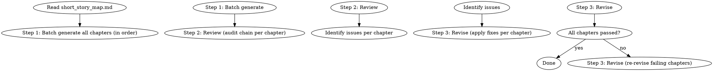

<!-- AUTO-CHECK-START -->

## auto-check (generated -- do not edit)

<!-- AUTO-CHECK-END -->

<!-- AUTO-GENERATED from frontmatter — do not edit -->

## 数据契约

- **Reads:** outline/short_story_map.md, truth/author_intent.md, genre-config.json, style/style_profile.md
- **Writes:** chapters/chapter-N.md, short/short-N-decisions.json
- **Updates:** none

<!-- END AUTO-GENERATED -->

# 短篇批量起草

批量生成短篇全部章节。生成 → 复核 → 修订三步。

## 流程



## 铁律

1. **批量生成必须按顺序** — 第1章先于第2章，禁止并行生成（依赖前一章状态）
2. **每章独立审计** — 起草后逐章过审计链路（memo-compliance / anti-ai / character / motivation）
3. **修订不超过 3 轮** — 单章修订超过 3 轮仍未通过 = 回退到最佳版本
4. **跨章一致性必查** — 修订后必须重读相邻 2 章确认一致性
5. **整书风格统一** — 短篇篇幅小，风格波动读者更敏感

## 批量生成策略

### 顺序生成的理由

- 第N章依赖第1-(N-1)章的状态
- 并行生成 = 状态假设不一致 = 角色 OOC
- 顺序生成 = 每章都有"前一章的实际输出"作为锚点

### 生成窗口

- 单次 LLM 调用 = 1 章
- N 章 = N 次 LLM 调用
- 上下文窗口 = 短期记忆（最近 2-3 章摘要）+ 长期记忆（story_bible + character_cards）

## 复核链路

每章必须通过的审计（与长篇相同）：

| 审计 | 关注点 |
|------|-------|
| memo-compliance | 章节是否执行了 short_story_map 中的任务 |
| anti-ai | AI 味检测 |
| character | 角色 OOC 检测 |
| motivation | 主角行为动机检测 |
| pacing | 节奏检测 |
| continuity | 跨章连续性 |

每章的所有 blocking / critical / AI 痕迹 = 0 才能算通过。

## 修订规则

| 问题数 | 处理 |
|--------|------|
| 0 | 通过 |
| 1-2 个 minor | spot-fix（PATCHES） |
| 3+ 个或 1 个 critical | rewrite（整章重写） |
| 修订 3 轮未通过 | 回退到最佳版本（参考 `shenbi-chapter-revision`） |

## 跨章一致性

修订后必须验证：

| 维度 | 检查方法 |
|------|---------|
| 角色位置 | 与上章末位置是否一致 |
| 时间线 | 与上章末时间是否衔接 |
| 信息状态 | 主角已知信息是否一致 |
| 关系状态 | 与上章末关系是否一致 |
| 风格 | 与前 3 章风格指纹偏差 |

## 输出格式

### 每章输出

```markdown
# 章节标题

[章节正文]
```

### 每章审计清单（EXACT 模板）

每章起草后必须生成此清单。只写 PASS/FAIL 而不写实际计数 = 不合格。

```markdown
## 第N章审计清单

**文件**: `chapters/chapter-N.md`
**字数**: XXXX（目标最低: YYYY 字）

| 审计维度 | 结果 | 详情 |
|---------|------|------|
| memo-compliance | PASS/FAIL | [实际任务完成数/计划任务数] |
| anti-ai | PASS/FAIL | [AI 痕迹计数: X / 阈值: 0] |
| character | PASS/FAIL | [OOC 标记数: X / 阈值: 0] |
| motivation | PASS/FAIL | [动机断裂数: X / 阈值: 0] |
| pacing | PASS/FAIL | [节奏违规数: X / 阈值: 0] |
| continuity | PASS/FAIL | [连续性断裂数: X / 阈值: 0] |

**判定**: [全部 PASS / 部分 FAIL — 列出 FAIL 项]
**修订轮次**: X / 3
```

**字数最低要求**：从 `novel.json` 的 `target_word_count` 除以章节数计算每章最低字数。实际字数 < 最低字数 = FAIL。

**审计必须发现具体问题**：初次审计（修订轮次=0）时，每章必须至少记录 1 个具体发现。发现可以是任何维度的问题（即使是"第47段句子过长建议拆分"级别）。初次审计 6/6 PASS 且 0 修订轮次 = 审计执行不合格（审计未真正进行）。必须进行至少 1 轮修订后才可能出现 6/6 PASS。

### 批量汇总表（EXACT 列名）

全部章节完成后输出。列名不匹配 = 不合格。

| 章 | 字数 | 审计结果 (6 dim) | 修订轮次 | 状态 |
|----|------|-----------------|---------|------|
| 1 | XXXX | 6/6 PASS | 0 | 通过 |
| 2 | XXXX | 5/6 PASS (motivation FAIL) | 1 | 通过（修订后） |
| 3 | XXXX | 4/6 PASS (anti-ai, pacing FAIL) | 3 | 回退至最佳版本 |

**审计结果列格式**：`PASS数/6 <FAIL维度英文名> <结果>`。只写"通过"而不逐维度列出 = 不合格。

### 可自动检查的计数规则

| 检查项 | 规则 | 不合格条件 |
|--------|------|----------|
| 每章审计清单 | 6 维度各有实际计数 | 仅写 PASS/FAIL |
| 每章字数 | ≥ floor（target_word_count / 章节数） | < floor |
| 批量汇总表列名 | 章/字数/审计结果(6 dim)/修订轮次/状态 | 列名不匹配 |
| 批量汇总审计列 | 格式 `X/6 <dim> <结果>` | 只写"通过" |
| 修订轮次 | ≤ 3 | > 3（应触发回退） |
| 跨章一致性 | 全部 5 维检查 | 缺失任意维度

## 汇总

```markdown
## 短篇批量起草汇总

**总章节数**: N
**生成时间**: YYYY-MM-DD
**三步流程**: 生成 ✓ → 复核 ✓ → 修订 ✓

### 各章状态（EXACT 列名）

| 章 | 字数 | 审计结果 (6 dim) | 修订轮次 | 状态 |
|----|------|-----------------|---------|------|
| 1 | N | 6/6 PASS | 0 | ✓ |
| 2 | N | 5/6 PASS (anti-ai FAIL) | 1 | ✓ |
| 3 | N | 4/6 PASS (anti-ai, pacing FAIL) | 3 | 回退 |
| ... | ... | ... | ... | ... |
| N | N | 6/6 PASS | 0 | ✓ |

**审计结果列格式**：`PASS数/6 <FAIL维度英文名> <结果>`。只写"通过" = 不合格。每章字数必须 ≥ floor（floor = target_word_count / 章节数）。

### 整体统计

- 总字数: X
- 平均章节字数: Y
- 一次通过章节数: A
- 修订 1 轮章节数: B
- 修订 2 轮章节数: C
- 修订 3 轮章节数: D
- 回退章节数: 0（理想）

### 跨章一致性检查

- [ ] 角色位置链连贯
- [ ] 时间线无断裂
- [ ] 信息状态同步
- [ ] 关系状态无跳变
- [ ] 风格指纹统一

### 待人类确认

- [ ] 整体阅读体验是否流畅？
- [ ] 风格波动是否在可接受范围？
- [ ] 是否有需要润色/反检测改写的章节？
```

## Anti-Rationalization

| Excuse | Reality |
|--------|---------|
| "批量生成 = 一次 LLM 调用写完" | 一次调用 = 状态不可控 = 必然 OOC |
| "审计太慢，跳过" | 跳过审计 = 30 章隐患积累 = 整书返工 |
| "修订 3 轮不够就 5 轮" | 3 轮未通过 = 当前方向有结构问题，应回退 |
| "短篇风格不用管" | 短篇篇幅小，风格波动 1 章就能让读者弃书 |
