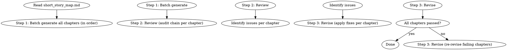

# 短篇批量起草

批量生成短篇全部章节。生成 → 复核 → 修订三步。

## 流程



## 数据契约

- **Reads:** `outline/short_story_map.md`, `truth/author_intent.md`, `genre-config.json`, `style/style_profile.md` (if exists)
- **Writes:** `chapters/chapter-N.md`（批量）
- **Updates:** 无

## 铁律

1. **批量生成必须按顺序** — 第1章先于第2章，禁止并行生成（依赖前一章状态）
2. **每章独立审计** — 起草后逐章过审计链路（memo-compliance / anti-ai / character / motivation）
3. **修订不超过 3 轮** — 单章修订超过 3 轮仍未通过 = 回退到最佳版本
4. **跨章一致性必查** — 修订后必须重读相邻 2 章确认一致性
5. **整书风格统一** — 短篇篇幅小，风格波动读者更敏感

## 批量生成策略

### 顺序生成的理由

- 第N章依赖第1-(N-1)章的状态
- 并行生成 = 状态假设不一致 = 角色 OOC
- 顺序生成 = 每章都有"前一章的实际输出"作为锚点

### 生成窗口

- 单次 LLM 调用 = 1 章
- N 章 = N 次 LLM 调用
- 上下文窗口 = 短期记忆（最近 2-3 章摘要）+ 长期记忆（story_bible + character_cards）

## 复核链路

每章必须通过的审计（与长篇相同）：

| 审计 | 关注点 |
|------|-------|
| memo-compliance | 章节是否执行了 short_story_map 中的任务 |
| anti-ai | AI 味检测 |
| character | 角色 OOC 检测 |
| motivation | 主角行为动机检测 |
| pacing | 节奏检测 |
| continuity | 跨章连续性 |

每章的所有 blocking / critical / AI 痕迹 = 0 才能算通过。

## 修订规则

| 问题数 | 处理 |
|--------|------|
| 0 | 通过 |
| 1-2 个 minor | spot-fix（PATCHES） |
| 3+ 个或 1 个 critical | rewrite（整章重写） |
| 修订 3 轮未通过 | 回退到最佳版本（参考 `shenbi-chapter-revision`） |

## 跨章一致性

修订后必须验证：

| 维度 | 检查方法 |
|------|---------|
| 角色位置 | 与上章末位置是否一致 |
| 时间线 | 与上章末时间是否衔接 |
| 信息状态 | 主角已知信息是否一致 |
| 关系状态 | 与上章末关系是否一致 |
| 风格 | 与前 3 章风格指纹偏差 |

## 输出格式

每章单独输出（与 `shenbi-chapter-drafting` 相同）：

```markdown
# 章节标题

[章节正文]
```

## 汇总

```markdown
## 短篇批量起草汇总

**总章节数**: N
**生成时间**: YYYY-MM-DD
**三步流程**: 生成 ✓ → 复核 ✓ → 修订 ✓

### 各章状态

| 章节 | 字数 | 审计 | 修订轮数 | 状态 |
|------|------|------|---------|------|
| 1 | N | 通过 | 0 | ✓ |
| 2 | N | 通过 | 1 | ✓ |
| ... | ... | ... | ... | ... |
| N | N | 通过 | 0 | ✓ |

### 整体统计

- 总字数: X
- 平均章节字数: Y
- 一次通过章节数: A
- 修订 1 轮章节数: B
- 修订 2 轮章节数: C
- 修订 3 轮章节数: D
- 回退章节数: 0（理想）

### 跨章一致性检查

- [ ] 角色位置链连贯
- [ ] 时间线无断裂
- [ ] 信息状态同步
- [ ] 关系状态无跳变
- [ ] 风格指纹统一

### 待人类确认

- [ ] 整体阅读体验是否流畅？
- [ ] 风格波动是否在可接受范围？
- [ ] 是否有需要润色/反检测改写的章节？
```

## Anti-Rationalization

| Excuse | Reality |
|--------|---------|
| "批量生成 = 一次 LLM 调用写完" | 一次调用 = 状态不可控 = 必然 OOC |
| "审计太慢，跳过" | 跳过审计 = 30 章隐患积累 = 整书返工 |
| "修订 3 轮不够就 5 轮" | 3 轮未通过 = 当前方向有结构问题，应回退 |
| "短篇风格不用管" | 短篇篇幅小，风格波动 1 章就能让读者弃书 |
