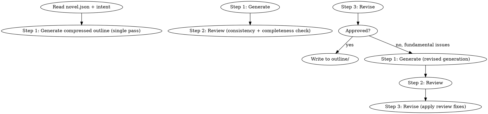

<!-- AUTO-CHECK-START -->

## auto-check (generated -- do not edit)

<!-- AUTO-CHECK-END -->

<!-- AUTO-GENERATED from frontmatter — do not edit -->

## 数据契约

- **Reads:** novel.json, truth/author_intent.md, outline/story_frame.md
- **Writes:** outline/short_story_map.md
- **Updates:** none

<!-- END AUTO-GENERATED -->

# 短篇大纲

为短篇小说（< 30 章）生成压缩大纲。生成 → 复核 → 修订三步。

## 流程



## 铁律

1. **三步流程不可跳** — 生成 → 复核 → 修订，缺一步 = 质量不稳
2. **章节数 ≤ 30** — 本技能专为短篇设计，长篇请用 `shenbi-volume-outlining`
3. **三主线压缩** — 主线 + 1 条副线 + 1 条情感线 = 3 条线索全卷
4. **每章有任务** — 短篇的每章都必须推进至少 1 条线索，禁止"过渡章"
5. **故事弧清晰** — 起承转合必须在 30 章内完成

## 短篇特征

| 维度 | 短篇（< 30章） | 长篇 |
|------|---------------|------|
| 章节数 | ≤ 30 | > 30 |
| 副线数 | 0-1 | 2-5 |
| 角色数 | ≤ 8 主要角色 | 任意 |
| 世界观复杂度 | 中等 | 任意 |
| 三步流程 | 必须 | 长流程 |
| 跨卷 | 通常无 | 必有 |

## 三步流程

### Step 1: 生成（一次成型）

单次生成完整压缩大纲，包含：
- 故事弧（一句话概括）
- 三幕结构（开端/对抗/收官）
- 章节级任务清单（每章 1 个核心任务）
- 关键转折点（≤ 5 个）
- 结局方向

### Step 2: 复核（自动检查）

按以下 6 项逐一检查：

1. 故事弧是否清晰
2. 三幕结构是否完整
3. 章节任务是否每章都有
4. 转折点是否分布合理
5. 结局与开端是否呼应
6. 章节数是否 ≤ 30

输出"通过/不通过 + 具体问题列表"。

### Step 3: 修订

按复核问题修订大纲：
- 修补缺口
- 重排顺序
- 调整节奏
- 强化呼应

修订后必须重跑 Step 2，直到通过。

## 三幕结构

| 幕 | 占比 | 章节范围（30章总长） | 任务 |
|----|------|-------------------|------|
| 开端 | 20% | 第1-6章 | 立人物 + 建情境 + 提问题 |
| 对抗 | 60% | 第7-24章 | 升级冲突 + 副线推进 + 转折 |
| 收官 | 20% | 第25-30章 | 决战 + 沉淀 + 收束 |

## 输出格式

```markdown
# 短篇大纲

**总章节数**: N
**故事弧**: [一句话]
**创建时间**: YYYY-MM-DD
**流程步骤**: 生成 ✓ → 复核 ✓ → 修订 ✓

---

## 三幕结构

### 第一幕：开端（第1-6章）

- 核心任务: [立人物 + 建情境 + 提问题]
- 关键节点: [第X章触发问题]

### 第二幕：对抗（第7-24章）

- 核心任务: [升级冲突 + 副线 + 转折]
- 转折点: [第A章/第B章/第C章]
- 副线: [1 条]

### 第三幕：收官（第25-30章）

- 核心任务: [决战 + 沉淀 + 收束]
- 结局方向: [方向描述]

## 章节任务清单

| 章节 | 核心任务 | 推进线索 | 备注 |
|------|---------|---------|------|
| 1 | [任务] | [主线] | 开篇 |
| 2 | [任务] | [主线] | 日常 |
| ... | ... | ... | ... |
| 30 | [任务] | [主线+情感] | 收官 |

## 关键转折点

1. 第A章: [转折描述]
2. 第B章: [转折描述]
3. 第C章: [转折描述]

## 结局

[结局方向描述]
```

## 汇总

```markdown
## 短篇大纲汇总

**写入文件**: `outline/short_story_map.md`
**总章节数**: N
**三幕比例**: 开端 20% / 对抗 60% / 收官 20%

### 三步流程记录

- Step 1 (生成): YYYY-MM-DD HH:MM — 完成
- Step 2 (复核): YYYY-MM-DD HH:MM — 通过/不通过
- Step 3 (修订): YYYY-MM-DD HH:MM — 完成 (N 轮修订)

### 复核结果

- [ ] 故事弧清晰
- [ ] 三幕完整
- [ ] 章节任务全覆盖
- [ ] 转折点合理
- [ ] 结局呼应
- [ ] 章节数 ≤ 30

### 关键统计

- 主线索: 1 条
- 副线索: M 条
- 情感线: 1 条
- 转折点数: K

### 下游任务

- [ ] 调用 `shenbi-short-drafting` 基于本大纲批量起草
- [ ] 起草后调用审计链路
```

## Anti-Rationalization

| Excuse | Reality |
|--------|---------|
| "短篇不用大纲" | 30 章不长不短，大纲保证不漂移 |
| "一次写完不需复核" | 复核 = 5 分钟，省 = 50 章返工 |
| "三幕结构太老套" | 三幕不是老套，是人类认知的舒适区 |
| "过渡章没关系" | 短篇不允许过渡章；每章必须有任务 |
