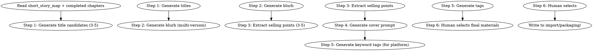

# 短篇包装

为短篇生成销售包装。负责书名、简介、卖点、封面 prompt。

## 流程



## 数据契约

- **Reads:** `outline/short_story_map.md`, `chapters/*.md`, `world/story_bible.md`, `truth/author_intent.md`
- **Writes:** `import/packaging/` 下的包装文件
- **Updates:** 无

## 铁律

1. **多版本不单选** — 书名/简介/卖点都给 3-5 个版本供人类选择
2. **简介不剧透** — 简介只钩不剧，核心反转不出现在简介
3. **卖点可证** — 每个卖点都能在正文中找到证据
4. **封面 prompt 视觉化** — 描述具体可生成的画面（人物/场景/构图/色彩）
5. **关键词与平台匹配** — 关键词按发布平台的标签体系选择

## 6 步流程

### Step 1: 书名候选

- 数量：3-5 个
- 类型：直白型 / 隐喻型 / 钩子型 / 系列型
- 长度：2-6 字（中文）/ 2-8 词（英文）

### Step 2: 简介候选

- 数量：2-3 个版本
- 长度：100-300 字（短篇简介）
- 结构：钩子句 + 主角设定 + 核心冲突 + 不剧透的反转暗示
- 调性：与题材匹配（仙侠/都市/历史各有调性）

### Step 3: 卖点提取

- 数量：3-5 个
- 维度：题材/主角/冲突/世界观/情感/创新点
- 每点 ≤ 30 字
- 必带证据

### Step 4: 封面 prompt

- 元素：主角 / 场景 / 关键物品 / 氛围
- 风格：写实 / 仙侠 / 二次元 / 极简
- 构图：中心 / 三分 / 对称
- 色彩：主色 + 辅色
- 输出：可直接给图像生成模型的 prompt

### Step 5: 关键词标签

- 数量：5-10 个
- 分类：题材 / 主角人设 / 情感类型 / 故事元素 / 卖点
- 平台导向：番茄 / 起点 / 晋江 / 出版 各自有标签体系

### Step 6: 人工选定

人类合作者从候选中选择最终版本。

## 输出格式

写入 `import/packaging/`：

```markdown
# 短篇包装：书名候选

**生成时间**: YYYY-MM-DD

## 候选

| 编号 | 标题 | 类型 | 长度 | 调性 | 推荐理由 |
|------|------|------|------|------|---------|
| 1 | [标题] | 直白 | N 字 | [...] | [理由] |
| 2 | [标题] | 隐喻 | N 字 | [...] | [理由] |
| 3 | [标题] | 钩子 | N 字 | [...] | [理由] |
| 4 | [标题] | 系列 | N 字 | [...] | [理由] |
| 5 | [标题] | 情绪 | N 字 | [...] | [理由] |

## 选定

[由人类合作者填写]
```

```markdown
# 短篇包装：简介候选

**生成时间**: YYYY-MM-DD

## 版本 1（直白型）

[100-300 字]

## 版本 2（钩子型）

[100-300 字]

## 版本 3（情感型）

[100-300 字]

## 选定

[由人类合作者填写]
```

```markdown
# 短篇包装：卖点

**生成时间**: YYYY-MM-DD

## 卖点列表

1. **[卖点]**: [证据：第X章 / 故事元素] [适用平台]
2. **[卖点]**: ...
3. ...

## 平台匹配

| 平台 | 重点卖点 |
|------|---------|
| 起点 | [卖点 X] |
| 番茄 | [卖点 Y] |
| 晋江 | [卖点 Z]（如适用） |

## 选定

[由人类合作者填写]
```

```markdown
# 短篇包装：封面 prompt

**生成时间**: YYYY-MM-DD

## 主 prompt

```
[完整的图像生成 prompt，包含：主体、场景、构图、色彩、风格、细节]
```

## 中文翻译（仅供参考）

[prompt 的中文描述]

## 变体（如需要）

### 变体 1: 主角特写

[聚焦主角的 prompt]

### 变体 2: 场景全景

[聚焦场景的 prompt]

### 变体 3: 关键物品

[聚焦物品的 prompt]

## 选定

[由人类合作者填写]
```

```markdown
# 短篇包装：关键词

**生成时间**: YYYY-MM-DD

## 通用关键词

1. [关键词 1]
2. [关键词 2]
...

## 平台标签

### 起点

[按起点分类：玄幻-东方-热血-...]

### 番茄

[按番茄分类：...]

### 晋江

[按晋江分类：...]

## 选定

[由人类合作者填写]
```

## 汇总

```markdown
## 短篇包装汇总

**生成时间**: YYYY-MM-DD
**写入目录**: `import/packaging/`

### 候选数量

- 书名: X
- 简介: Y
- 卖点: Z
- 封面 prompt: W（含变体）
- 关键词: V

### 平台准备度

| 平台 | 书名 | 简介 | 卖点 | 关键词 | 状态 |
|------|------|------|------|--------|------|
| 起点 | ✓ | ✓ | ✓ | ✓ | 待选定 |
| 番茄 | ✓ | ✓ | ✓ | ✓ | 待选定 |
| 晋江 | ✓ | ✓ | ✓ | ✓ | 待选定 |

### 待人类确认

- [ ] 书名选定
- [ ] 简介选定
- [ ] 卖点优先级
- [ ] 封面 prompt 选定
- [ ] 平台关键词选定
```

## Anti-Rationalization

| Excuse | Reality |
|--------|---------|
| "随便起个名" | 短篇名字决定打开率；好名字 = 80% 的销售 |
| "简介直接抄大纲" | 大纲 = 给作者看；简介 = 给读者看，必须钩子化 |
| "卖点 = 题材关键词" | 卖点 = 与同类作品的差异点，不是分类标签 |
| "封面 prompt 简写" | 简写 = 生成图无重点；详细 prompt = 一次到位 |
