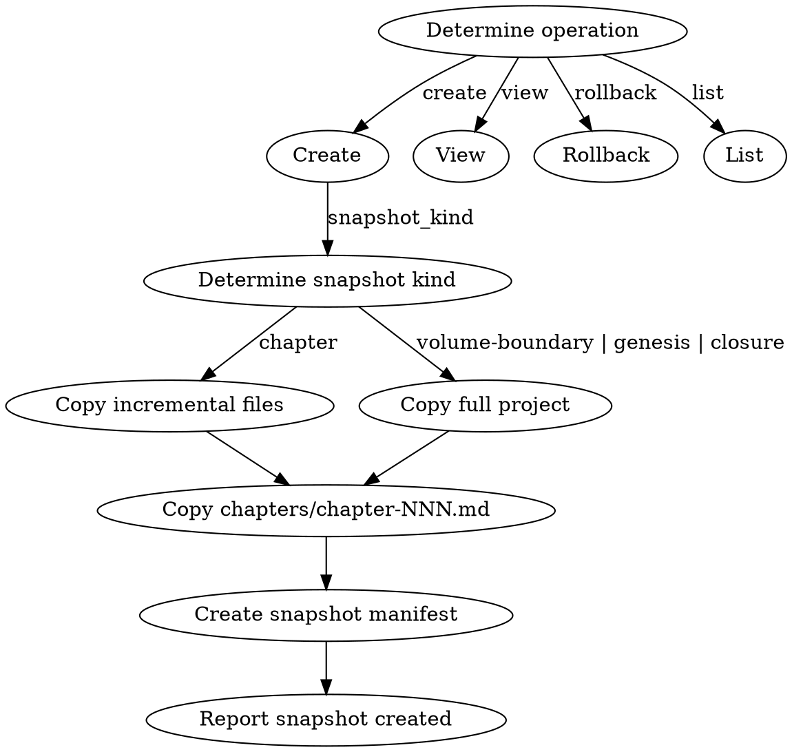

<!-- AUTO-CHECK-START -->

## auto-check (generated -- do not edit)

<!-- AUTO-CHECK-END -->

<!-- AUTO-GENERATED from frontmatter — do not edit -->

## 数据契约

- **Reads:** truth/*.md, characters/**/*.md, world/*.md, outline/*.md, plans/chapter-N-plan.md, style/style_profile.md, chapters/chapter-N.md
- **Writes:** snapshots/chapter-NNN/*
- **Updates:** none

<!-- END AUTO-GENERATED -->

# 状态快照管理

管理每章完成后的状态快照：创建、查看、回滚、状态恢复。

支持两种快照模式（spec §10.1）：
- **章节快照**（增量）：每章审计通过后创建，仅含 truth files + 当前章正文 + 备忘
- **全量快照**（全量项目状态）：卷边界 + genesis + closure 时创建

## 流程



> **Note:** The DOT above shows the primary (create) flow with both snapshot kinds. Other operations (view, rollback, list) are described procedurally below.

## 铁律

1. **每章完成后必须创建快照** — 不创建快照视为流程未完成
2. **快照是完整副本** — 章节快照含 truth/*.md (via glob，包括 foreshadowing_recall_result.md) + 本章正文 + 本章备忘 + style；全量快照含完整项目状态（见下方快照清单）
3. **回滚需人类确认** — 回滚是破坏性操作，必须有人类合作者批准
4. **快照不可修改** — 一旦创建，快照是只读的
5. **回滚后续处理** — 回滚后 N+1 到当前章节的正文保留但标记为 UNVERIFIED，需要从回滚点重新运行 state-settling + audits 或手动验证一致性，**且必须运行 truth-sync**
6. **全量快照仅在卷边界** — 不为每章创建全量快照（大小随章节数增长，仅在卷边界创建 ~20-50 个）

## 操作

### 创建快照
- 触发：
  - 章节快照：每章审计通过后
  - 全量快照：卷边界 / genesis checkpoint / closure
- 输出：`snapshots/chapter-NNN/` 目录，包含对应快照清单的文件副本 + manifest
- 步骤：
  1. 确定快照类型（`snapshot_kind`：章节增量 or 全量项目）
  2. 按对应清单复制文件到 `snapshots/chapter-NNN/`
  3. 写入 manifest（含 `snapshot_kind` 字段 + checksums）
  4. 报告快照已创建

### 查看快照
- 输入：章节号 NNN（或 latest）
- 输出：该快照的摘要（章节摘要 + 关键状态变更 + 活跃伏笔）
- 步骤：
  1. 定位 `snapshots/chapter-NNN/` 目录
  2. 读取 `chapter_summaries.md` 对应条目
  3. 读取 `current_state.md` 提取位置/资源/关系状态
  4. 读取 `pending_hooks.md` 统计 PLANTED + RELEVANT 数量
  5. 渲染摘要

### 回滚
- 输入：章节号 NNN
- HARD-GATE: 需要人类确认
- 操作：用 `snapshots/chapter-NNN/` 覆盖项目文件（truth/ + chapters/ + 按快照类型的其他文件）
- 警告：回滚后所有 NNN 之后的章节存在一致性风险，**必须运行 truth-sync**

### 列出快照
- 输出：所有已创建快照的章节号列表（标注快照类型）
- 步骤：
  1. 扫描 `snapshots/` 目录
  2. 提取所有 `chapter-NNN/` 子目录名
  3. 按章节号排序
  4. 标记缺失章节（如果 outline 知道总章节数）

## 快照清单（全量项目快照）

### 章节快照（每章，增量）

每次审计通过后创建。包含:

- truth/*.md (全部 truth 文件，via glob，含 foreshadowing_recall_result.md)
- chapters/chapter-NNN.md (仅当前章)
- plans/chapter-NNN-plan.md (仅当前章备忘)
- style/style_profile.md
- characters/*.md (仅当本章有角色变更时)

### 全量快照（仅卷边界 + genesis + closure）

- truth/*.md (全部)
- characters/*.md (全部)
- world/*.md (全部: locations, factions, rules, story_bible, power_system)
- outline/*.md (全部: story_frame, volume_map, thread_map, rhythm_principles)
- plans/ (全部)
- style/ (全部)
- chapters/ (全部到当前章)

## Manifest 模板

```markdown
---
type: snapshot
chapter: NNN
snapshot_kind: chapter | volume-boundary | genesis | closure | pre-revision
created: YYYY-MM-DD HH:MM
files:
  truth: "truth/*.md"
  characters: "characters/**/*.md"
  world: "world/*.md"
  outline: "outline/*.md"
  current_chapter: "chapters/chapter-NNN.md"
  current_plan: "plans/chapter-NNN-plan.md"
  style: "style/style_profile.md"
checksums:
  truth/current_state.md: sha256:...
  truth/pending_hooks.md: sha256:...
  chapters/chapter-NNN.md: sha256:...
  # ... all files in snapshot
---
```

## Checksum 计算方法

每个文件的 checksum 必须由以下命令计算，**不得由 LLM 自行生成**：

```bash
python3 -c "import hashlib; print(hashlib.sha256(open('FILE_PATH','rb').read()).hexdigest())"
```

将 `FILE_PATH` 替换为实际文件路径后执行。所有文件的 checksum 收集完毕后，**必须随机选取一个文件重新计算一次**，确认结果与首次计算一致。若不一致，说明文件在 snapshotting 过程中被修改，应立即报告差异。

## 保留策略

`config.snapshot_retention_chapters`（默认 50）。超过此数量的旧章节快照可清理，但全量快照始终保留。

## 输出格式

### 创建快照

```markdown
## 快照创建 — 第N章

**时间**: YYYY-MM-DD HH:MM
**快照类型**: chapter | volume-boundary | genesis | closure | pre-revision
**快照内容**:
- truth/*.md ✓ (N files via glob)
- characters/*.md ✓
- world/*.md ✓ (仅全量快照)
- outline/*.md ✓ (仅全量快照)
- plans/chapter-NNN-plan.md ✓
- style/style_profile.md ✓
- chapters/chapter-NNN.md ✓

**快照目录**: snapshots/chapter-NNN/
```

### 查看快照

```markdown
## 快照查看 — 第N章

**时间**: YYYY-MM-DD HH:MM
**快照类型**: chapter | volume-boundary | genesis | closure | pre-revision
**章节摘要**: <chapter_summaries.md 对应条目第一行>
**关键状态变更**: <current_state.md 中角色位置/活跃冲突摘要>
**活跃伏笔**: PLANTED = X 个, RELEVANT = Y 个
**包含文件**: truth/*.md + chapters/chapter-NNN.md (+ 全量快照含 world/outline/plans/style)
```

### 回滚

```markdown
## 快照回滚确认请求

**目标快照**: 第N章 (created YYYY-MM-DD HH:MM, snapshot_kind: ...)
**将覆盖**:
- truth/*.md
- chapters/chapter-N.md
- (全量快照: world/ + outline/ + plans/ + style/)
**风险**: 回滚后 N+1 到当前章节标记 UNVERIFIED
**HARD-GATE**: 请人类合作者明确确认 "确认回滚到第N章" 后继续
**后续**: 必须运行 truth-sync 恢复一致性
```

### 列出快照

```markdown
## 快照清单

**总数**: X 个快照
**已创建**: chapter-001 (chapter), chapter-002 (chapter), ..., chapter-NNN (volume-boundary)
**最新**: chapter-NNN (YYYY-MM-DD HH:MM)
```

## Anti-Rationalization

| Excuse | Reality |
|--------|---------|
| "这章没问题，不用创建快照" | 不创建快照 = 将来无法回滚 = 连锁错误无法恢复 |
| "快照占空间，少存几个" | 一章增量快照 ~ 50-100KB，全量快照仅在卷边界；2000章 = ~100MB，完全可控 |
| "全量快照每章都做更安全" | 全量快照随章节数增长，仅在卷边界（~20-50个）即可覆盖回滚需求 |
