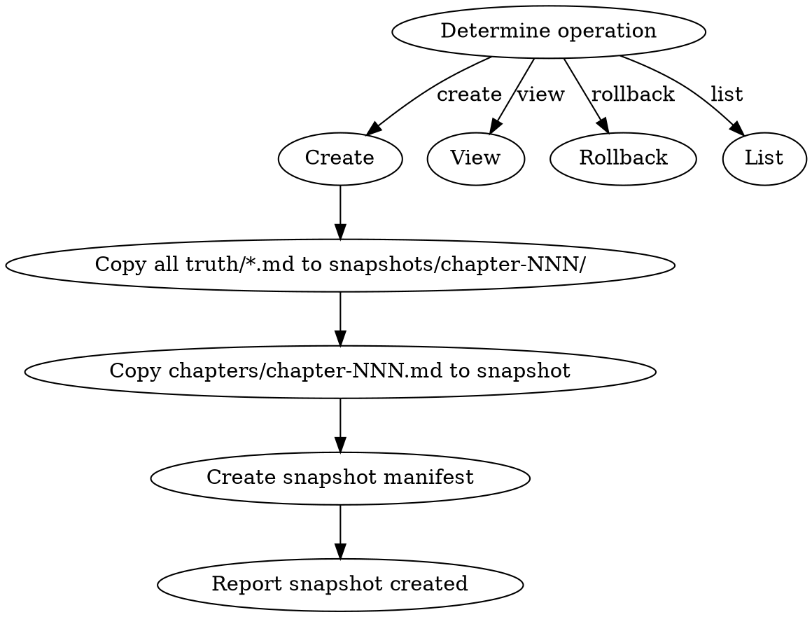

# 状态快照管理

管理每章完成后的状态快照：创建、查看、回滚、状态恢复。

## 流程



> **Note:** The DOT above shows the primary (create) flow. Other operations (view, rollback, list) are described procedurally below.

## 数据契约

- **Reads:** `truth/*.md`, `chapters/chapter-N.md`, `characters/**/*.md`
- **Writes:** `snapshots/chapter-NNN/` (11 truth 文件副本 + 1 章节正文 + 1 manifest)
- **Updates:** none (snapshots are append-only)

## 铁律

1. **每章完成后必须创建快照** — 不创建快照视为流程未完成
2. **快照是完整副本** — 包括所有 11 个 truth/ 文件 + 本章正文（见下方完整清单）
3. **回滚需人类确认** — 回滚是破坏性操作，必须有人类合作者批准
4. **快照不可修改** — 一旦创建，快照是只读的
5. **回滚后续处理** — 回滚后 N+1 到当前章节的正文保留但标记为 UNVERIFIED，需要从回滚点重新运行 state-settling + audits 或手动验证一致性

## 操作

### 创建快照
- 触发：每章审计通过后
- 输出：`snapshots/chapter-NNN/` 目录，包含所有 truth/ 文件的副本 + 章节正文 + manifest
- 步骤：
  1. 复制所有 truth/ 文件（见下方 11 文件清单）到 `snapshots/chapter-NNN/`
  2. 复制 `chapters/chapter-NNN.md` 到 `snapshots/chapter-NNN/chapter-NNN.md`
  3. 写入 manifest（见下方 manifest 模板）
  4. 报告快照已创建

### 查看快照
- 输入：章节号 NNN（或 latest）
- 输出：该快照的摘要（章节摘要 + 关键状态变更 + 活跃伏笔）
- 步骤：
  1. 定位 `snapshots/chapter-NNN/` 目录
  2. 读取 `chapter_summaries.md` 对应条目
  3. 读取 `current_state.md` 提取位置/资源/关系状态
  4. 读取 `pending_hooks.md` 统计 PLANTED + RELEVANT 数量
  5. 渲染摘要

### 回滚
- 输入：章节号 NNN
- HARD-GATE: 需要人类确认
- 操作：用 `snapshots/chapter-NNN/` 覆盖 `truth/` + 回滚 `chapters/chapter-NNN.md`
- 警告：回滚后所有 NNN 之后的章节存在一致性风险

### 列出快照
- 输出：所有已创建快照的章节号列表
- 步骤：
  1. 扫描 `snapshots/` 目录
  2. 提取所有 `chapter-NNN/` 子目录名
  3. 按章节号排序
  4. 标记缺失章节（如果 outline 知道总章节数）

## 快照清单（11 个 truth 文件）

1. `truth/current_state.md`
2. `truth/pending_hooks.md`
3. `truth/chapter_summaries.md`
4. `truth/character_matrix.md`
5. `truth/emotional_arcs.md`
6. `truth/particle_ledger.md`
7. `truth/subplot_board.md`
8. `truth/author_intent.md`
9. `truth/current_focus.md`
10. `truth/audit_drift.md`
11. `truth/volume_summaries.md` (if exists)

## Manifest 模板

```markdown
---
type: snapshot
chapter: NNN
created: YYYY-MM-DD HH:MM
trigger: chapter_completion | manual | pre_rollback
files:
  - current_state.md
  - pending_hooks.md
  - chapter_summaries.md
  - character_matrix.md
  - emotional_arcs.md
  - particle_ledger.md
  - subplot_board.md
  - author_intent.md
  - current_focus.md
  - audit_drift.md
  - volume_summaries.md
  - chapter-NNN.md
---
```

## 输出格式

### 创建快照

```markdown
## 快照创建 — 第N章

**时间**: YYYY-MM-DD HH:MM
**快照内容**:
- truth/current_state.md ✓
- truth/pending_hooks.md ✓
- truth/chapter_summaries.md ✓
- truth/character_matrix.md ✓
- truth/emotional_arcs.md ✓
- truth/particle_ledger.md ✓
- truth/subplot_board.md ✓
- truth/author_intent.md ✓
- truth/current_focus.md ✓
- truth/audit_drift.md ✓
- truth/volume_summaries.md ✓
- chapters/chapter-NNN.md ✓

**快照清单**: snapshots/chapter-001/, ..., chapter-NNN/
```

### 查看快照

```markdown
## 快照查看 — 第N章

**时间**: YYYY-MM-DD HH:MM
**章节摘要**: <chapter_summaries.md 对应条目第一行>
**关键状态变更**: <current_state.md 中角色位置/活跃冲突摘要>
**活跃伏笔**: PLANTED = X 个, RELEVANT = Y 个
**包含文件**: 11 truth files + 1 chapter
```

### 回滚

```markdown
## 快照回滚确认请求

**目标快照**: 第N章 (created YYYY-MM-DD HH:MM)
**将覆盖**:
- truth/ (11 files)
- chapters/chapter-N.md
**风险**: 回滚后 N+1 到当前章节标记 UNVERIFIED
**HARD-GATE**: 请人类合作者明确确认 "确认回滚到第N章" 后继续
```

### 列出快照

```markdown
## 快照清单

**总数**: X 个快照
**已创建**: chapter-001, chapter-002, ..., chapter-NNN
**最新**: chapter-NNN (YYYY-MM-DD HH:MM)
```

## Anti-Rationalization

| Excuse | Reality |
|--------|---------|
| "这章没问题，不用创建快照" | 不创建快照 = 将来无法回滚 = 连锁错误无法恢复 |
| "快照占空间，少存几个" | 一章快照 ~ 50KB，2000章 = 100MB，完全可控 |
