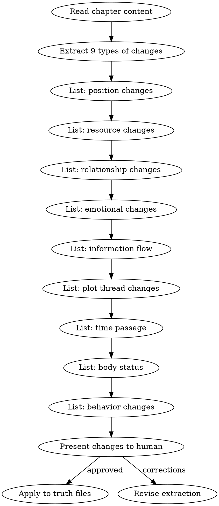

# 状态结算

在章节起草被人类合作者批准后，必须执行状态结算。

## 流程



## 铁律

1. **只记录正文明确描述的变化** — 不推论、不猜测、不补充
2. **区分直接描写和暗示** — 直接描写的变更立即记录，暗示性的标注为"可能变更"
3. **人类批准后才写入** — 结算结果呈交人类审阅，批准后才更新 truth files
4. **增量更新** — 追加变更，不重写整个文件

## 提取模板

对每章提取以下格式的变化清单：

```markdown
## 第N章状态变化

### 位置变化
- 林轩: 外门宿舍 → 内门演武场

### 资源变化
- 灵石: +20（考核奖励）

### 关系变化
- 师姐苏晴: 观望 → 认可

### 情绪变化
- 林轩: 紧张 → 自信

### 信息流动
- 林轩得知: 反派在寻找玉佩

### 剧情线索
- 内门考核线索: 完成

### 时间推进
- 距离考核: 0天（考核结束）

### 身体状态
- 无变化

### 行为变化
- 无变化
```

## 更新规则

| 变化类型 | 更新的文件 |
|---------|-----------|
| 位置 | `truth/current_state.md` |
| 资源 | `truth/particle_ledger.md` |
| 关系 | `truth/character_matrix.md` |
| 情绪 | `truth/emotional_arcs.md` |
| 信息 | `truth/character_matrix.md` (信息边界) |
| 线索 | `truth/subplot_board.md` [Phase 4] |
| 伏笔 | `truth/pending_hooks.md` |
| 摘要 | `truth/chapter_summaries.md` (追加) |

> **Phase 1 limitation:** 在 foreshadowing-track 实现前（Phase 3），state-settling 只更新 `last_reinforced` 和 `subtlety` 字段，不推进 hook 生命周期状态（PLANTED→RELEVANT 等）。生命周期转换需要完整的验证逻辑，留给 foreshadowing-track。

参考 `truth-files-reference.md` 获取完整的文件格式说明。

## Anti-Rationalization

| Excuse | Reality |
|--------|---------|
| "这章没什么大变化，不用结算" | 小变化不记录 = 3章后状态漂移 |
| "我记在脑子里就行" | 20章后你记不住，truth files 记得住 |
| "结算太费时间" | 结算5分钟 vs 回溯修30章30小时 |
