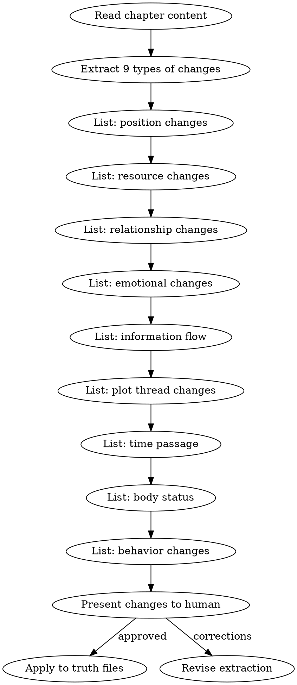

# 状态结算

在章节起草被人类合作者批准后，必须执行状态结算。

## 流程



## 数据契约

- **Reads:** `chapters/chapter-N.md`
- **Writes:** none
- **Updates:** `truth/current_state.md`, `truth/particle_ledger.md`, `truth/character_matrix.md`, `truth/emotional_arcs.md`, `truth/subplot_board.md`, `truth/pending_hooks.md`, `truth/chapter_summaries.md`

## 铁律

1. **只记录正文明确描述的变化** — 不推论、不猜测、不补充
2. **区分直接描写和暗示** — 直接描写的变更立即记录，暗示性的标注为"可能变更"
3. **人类批准后才写入** — 结算结果呈交人类审阅，批准后才更新 truth files
4. **增量更新** — 追加变更，不重写整个文件

## 提取模板

对每章提取以下格式的变化清单：

```markdown
## 第N章状态变化

### 位置变化
- 林轩: 外门宿舍 → 内门演武场

### 资源变化
- 灵石: +20（考核奖励）

### 关系变化
- 师姐苏晴: 观望 → 认可

### 情绪变化
- 林轩: 紧张 → 自信

### 信息流动
- 林轩得知: 反派在寻找玉佩

### 剧情线索
- 内门考核线索: 完成

### 时间推进
- 距离考核: 0天（考核结束）

### 身体状态
- 无变化

### 行为变化
- 无变化
```

## 更新规则

| 变化类型 | 更新的文件 |
|---------|-----------|
| 位置 | `truth/current_state.md` |
| 资源 | `truth/particle_ledger.md` |
| 关系 | `truth/character_matrix.md` |
| 情绪 | `truth/emotional_arcs.md` |
| 信息 | `truth/character_matrix.md` (信息边界) |
| 线索 | `truth/subplot_board.md` [Phase 4] |
| 伏笔 | `truth/pending_hooks.md` |
| 摘要 | `truth/chapter_summaries.md` (追加) |

> **Phase 1 limitation:** 在 foreshadowing-track 实现前（Phase 3），state-settling 只更新 `last_reinforced` 和 `subtlety` 字段，不推进 hook 生命周期状态（PLANTED→RELEVANT 等）。生命周期转换需要完整的验证逻辑，留给 foreshadowing-track。

参考 `truth-files-reference.md` 获取完整的文件格式说明。

## 输出格式

### 人工审批门禁

每次状态结算完成后，必须输出以下门禁文档供 human partner 逐项审批：

```markdown
## 人工审批门禁 — 第N章状态结算

**结算时间**: YYYY-MM-DD
**数据来源**: `chapters/chapter-N.md`
**变更条目数**: X 条

### 位置变化审核

- [ ] [角色名]: [原位置] → [新位置]  —— 依据: 第X段 "[原文引用]"
- [ ] [角色名]: [原位置] → [新位置]  —— 依据: 第Y段 "[原文引用]"

### 资源变化审核

- [ ] [资源名]: ±[数量]（[来源/用途]）  —— 依据: 第X段 "[原文引用]"

### 关系变化审核

- [ ] [角色A] ↔ [角色B]: [原关系] → [新关系]（[触发事件]） —— 依据: 第X段 "[原文引用]"

### 情绪变化审核

- [ ] [角色名]: [原情绪] → [新情绪]（[触发事件]） —— 依据: 第X段 "[原文引用]"

### 信息流动审核

- [ ] [角色A] 得知 [信息内容]（[来源角色/场景]） —— 依据: 第X段 "[原文引用]"

### 剧情线索审核

- [ ] [线索名]: [状态变化]  —— 依据: 第X段 "[原文引用]"

### 时间推进审核

- [ ] [时间标记]: 经过[时长]，当前距[关键节点]剩余[时长]  —— 依据: 第X段 "[原文引用]"

### 身体状态审核

- [ ] [角色名]: [变化描述]  —— 依据: 第X段 "[原文引用]"

### 行为变化审核

- [ ] [角色名]: [行为模式变化]  —— 依据: 第X段 "[原文引用]"

### 总审

- [ ] 以上所有变更均有原文依据，无推论/猜测/补充
- [ ] 暗示性变更已标注为"可能变更"并单独列出
- [ ] 无遗漏关键状态变化

**审批签名**（human partner）: ___________  日期: ___________
```

### 跨文件一致性验证

结算写入 truth files 后，必须输出跨文件交叉验证表：

```markdown
## 跨文件一致性验证

**验证时间**: YYYY-MM-DD
**结算章次**: 第N章

| 验证项 | 文件A | 字段A | 文件B | 字段B | 一致性 | 备注 |
|--------|-------|-------|-------|-------|--------|------|
| 主角位置 | truth/current_state.md | 角色当前位置 | truth/character_matrix.md | 主角.当前位置 | ✓/✗ | |
| 资源数值 | truth/current_state.md | 待解决的冲突 | truth/particle_ledger.md | 林烽.财务 | ✓/✗ | |
| 角色关系 | truth/current_state.md | 进行中的情节线 | truth/character_matrix.md | 角色关系图谱 | ✓/✗ | |
| 情绪状态 | truth/emotional_arcs.md | 章末情感状态 | truth/character_matrix.md | 主角.当前状态 | ✓/✗ | |
| 伏笔状态 | truth/current_state.md | 已揭示的伏笔 | truth/pending_hooks.md | hooks[].state | ✓/✗ | |
| 章节摘要 | truth/chapter_summaries.md | 核心事件 | truth/current_state.md | 进行中的情节线 | ✓/✗ | |

### 不通过项处理

| 文件 | 字段 | 冲突描述 | 解决方式 |
|------|------|---------|---------|
| [文件A] vs [文件B] | [字段] | [具体不一致内容] | [以哪个为准 / 需要人工判定] |
```

## Anti-Rationalization

| Excuse | Reality |
|--------|---------|
| "这章没什么大变化，不用结算" | 小变化不记录 = 3章后状态漂移 |
| "我记在脑子里就行" | 20章后你记不住，truth files 记得住 |
| "结算太费时间" | 结算5分钟 vs 回溯修30章30小时 |
| "审批门禁太繁琐，直接写 truth 就行" | 不经审批的结算 = 未经人类确认的状态变更 = 潜在漂移源 |
| "跨文件一致性等发现不一致再查" | 事后修复成本是事前检查的10倍以上 |
