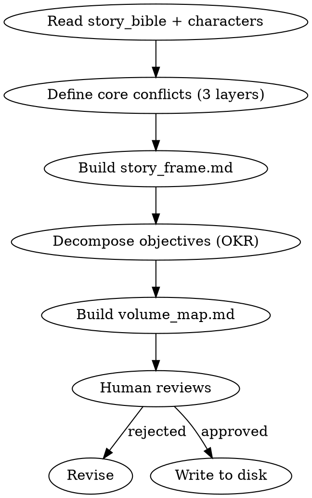

<!-- AUTO-CHECK-START -->

## auto-check (generated -- do not edit)

<!-- AUTO-CHECK-END -->

<!-- AUTO-GENERATED from frontmatter — do not edit -->

## 数据契约

- **Reads:** world/story_bible.md, characters/**/*.md
- **Writes:** outline/story_frame.md, outline/volume_map.md, outline/rhythm_principles.md
- **Updates:** none

<!-- END AUTO-GENERATED -->

# 故事架构

HARD-GATE: 故事框架必须在世界观和角色完成后才能开始。
**职责边界**：本 skill 创建 `outline/story_frame.md`、`outline/volume_map.md`、`outline/rhythm_principles.md` 的**骨架**（整体哲学 + 比例粗设 + 卷划分）。后续细化由专项 skill 负责——`outline/rhythm_principles.md` 详化为完整节奏规则见 `shenbi-pacing-design`；`outline/volume_map.md` 单卷细化见 `shenbi-volume-outlining`。

## 流程



## 铁律

1. **双线必写** — story_frame.md 必须包含前台故事（读者每章看到的表面冲突）和后台故事（贯穿全书的暗线）
2. **OKR 递归分解** — 全书 Objective → 每卷 Key Results → planner 据此分解章节任务
3. **核心冲突三层** — surface（表面矛盾）、personal（主角个人困境）、deep（主题层面的终极问题）
4. **散文骨架** — 输出散文段落，不是条目列表

## 核心冲突三层

| 层级 | 说明 | 示例（玄幻） |
|------|------|-------------|
| Surface | 推动情节的外部矛盾 | 门派选拔赛、资源争夺 |
| Personal | 主角内心的困境 | 身份认同、信任背叛 |
| Deep | 全书探讨的主题问题 | 力量与自由的代价 |

## 输出格式

| 文件 | 内容 |
|------|------|
| `outline/story_frame.md` | 散文骨架（4段），YAML frontmatter 含三层冲突定义 |
| `outline/volume_map.md` | 分卷地图，每卷含 objective + key results |
| `outline/rhythm_principles.md` | **节奏骨架**（仅含整体节奏哲学 + 章节类型比例粗设）。详细的张力曲线规则、连续章数限制、间隔控制由 `shenbi-pacing-design` skill 细化。story-architecture 创建骨架，pacing-design 负责细化。 |

### story_frame.md 结构

> genre/core_concept/themes 已在 `novel.json` 定义，此处不重复。story_frame.md 只存储 story-architecture 特有的冲突定义。

```markdown
---
surface_conflict: "外部矛盾"
personal_conflict: "主角困境"
deep_conflict: "主题问题"
---

# 故事框架

## 段1：前台故事
[读者从第1章开始看到的表面线索，以散文叙述]

## 段2：后台故事
[贯穿全书的暗线，不在第1章暴露，以散文叙述]

## 段3：主角旅程
[从起点到终点的弧线概述]

## 段4：暗流伏笔种子
[为后续伏笔系统提供的种子方向]
```

### volume_map.md 结构

```markdown
# 分卷地图

## 第一卷：卷名

**Objective**: 本卷核心目标

**Key Results**:
1. KR1（第1-5章完成）
   - 第1章节点: [本章在KR1中的具体定位——开篇、承接、转折或收官]
   - 第2章节点: ...
   - ...
2. KR2（第6-10章完成）
   - 第6章节点: ...
   - ...
3. KR3（第11-15章完成）
   - ...

**节奏原则**: 本卷的张力曲线描述

**跨卷衔接**: 本卷结尾如何过渡到下一卷
```

每个 KR 下的章节节点是 `chapter-planning` DOT 流程图中 "Locate outline node for this chapter" 的锚点。规划器据此推导单章目标。

## Anti-Rationalization

| Excuse | Reality |
|--------|---------|
| "先写第一章再说大纲" | 没有框架的第一章 = 写到10章必定偏航 |
| "网文不需要这么复杂的结构" | 读者看不出来 ≠ 读者感觉不到。好的结构是"不知不觉被吸引" |
| "大纲会限制 spontaneity" | 大纲是轨道，不是牢笼。轨道让速度有意义 |
| "卷纲太细了，后面会改的" | 改大纲的代价 << 改50章正文的代价 |
