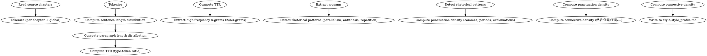

# 风格学习

从现有章节提取风格指纹。负责句长/段长统计、TTR、高频模式、修辞特征。

**纯统计，零 LLM。**

## 流程



## 数据契约

- **Reads:** `chapters/*.md`（或 `import/source/*.txt`）
- **Writes:** `style/style_profile.md`
- **Updates:** 无

## 铁律

1. **零 LLM 调用** — 所有指标都是统计结果，绝不调用语言模型进行"风格总结"
2. **统计而非评判** — 输出"是什么"，不输出"好不好"
3. **样本量要求** — 至少 10 章有效样本；不足 10 章时明确标注"样本不足"
4. **可重现** — 相同输入必须产生相同输出（无随机性）

## 统计指标

### 1. 句长分布

```
均值 / 中位数 / 标准差 / P25 / P50 / P75 / P95
变异系数 = std / mean
```

输出：直方图 + 关键统计量

### 2. 段长分布

按"句数/段"统计，与"字数/段"双口径。

### 3. TTR（Type-Token Ratio）

- 词表大小 / 总词数
- 按窗口滑动的局部 TTR
- 实词 TTR（去虚词）

### 4. 高频 n-gram

| 维度 | n | 阈值 |
|------|---|------|
| 词性二元 | 2 | 出现 ≥ 50 次 |
| 词性三元 | 3 | 出现 ≥ 20 次 |
| 词性四元 | 4 | 出现 ≥ 10 次 |

按词性标注过滤停用词。

### 5. 修辞模式

通过规则模式匹配检测：
- 对仗（A + B + A' + B' 结构）
- 排比（连续 3+ 句同结构）
- 反复（同一短语在邻近出现）
- 设问（"为何..."）
- 反问

### 6. 标点密度

每千字的：
- 句号数
- 逗号数
- 感叹号数
- 问号数
- 破折号 / 省略号数

### 7. 连接词密度

- 时间连接：然后 / 接着 / 之后 / 忽然
- 转折连接：但是 / 然而 / 不过 / 可是
- 因果连接：因为 / 所以 / 因此 / 既然
- 顺序连接：首先 / 其次 / 最后 / 终于

每千字出现次数。

## 输出格式

写入 `style/style_profile.md`：

```markdown
# 风格画像

**样本来源**: [路径]
**样本章节数**: N
**样本总字数**: X
**生成时间**: YYYY-MM-DD
**生成方式**: 纯统计（零 LLM）

---

## 1. 句长分布

| 统计量 | 值 |
|--------|-----|
| 均值 | N 字/句 |
| 中位数 | N 字/句 |
| 标准差 | N |
| P25 | N |
| P50 | N |
| P75 | N |
| P95 | N |
| 变异系数 | N |

直方图: ...

## 2. 段长分布

| 统计量 | 值 |
|--------|-----|
| 句/段（均值） | N |
| 字/段（均值） | N |
| 句/段（标准差） | N |

## 3. TTR

- 全局 TTR: N
- 实词 TTR: N
- 局部 TTR (滑动窗口 1000 词): N (均值) ± N (标准差)

## 4. 高频 n-gram

### 二元

| 模式 | 频次 |
|------|------|
| ... | N |

### 三元

| 模式 | 频次 |
|------|------|
| ... | N |

## 5. 修辞模式

| 模式 | 出现章节 | 频次 |
|------|---------|------|
| 排比 | ... | N |
| 对仗 | ... | N |
| 反复 | ... | N |
| 设问 | ... | N |

## 6. 标点密度（每千字）

| 标点 | 数量 |
|------|------|
| 句号 | N |
| 逗号 | N |
| 感叹号 | N |
| 问号 | N |
| 破折号 | N |
| 省略号 | N |

## 7. 连接词密度（每千字）

| 类型 | 连接词 | 数量 |
|------|--------|------|
| 时间 | 然后 | N |
| 时间 | 接着 | N |
| ... | ... | ... |

## 8. 综合画像

[1 段散文：基于上述统计的客观风格描述]

> 注意：这是统计画像，不是优劣判断。后续写作以此为参考，但不是必须严格复制。
```

## 汇总

```markdown
## 风格学习汇总

**写入文件**: `style/style_profile.md`
**样本章节数**: N
**总字数**: X
**生成时间**: YYYY-MM-DD

### 关键发现

- 句长: 平均 N 字，变异系数 N（高/中/低变异）
- 段长: 平均 N 句/段
- TTR: N（词表丰富度）
- 主导修辞: [排比/对话/...]

### 风格指纹摘要

[1 段简短描述，供下游 skill 快速参考]

### 局限性

- 样本 < 30 章时统计稳定性下降
- 修辞模式检测基于规则，可能漏检非典型修辞
- 不评估"质量"，只统计"是什么"
```

## Anti-Rationalization

| Excuse | Reality |
|--------|---------|
| "统计太麻烦，让 LLM 总结" | LLM 总结 = 不可重现 + 不可验证 = 无意义的"风格画像" |
| "样本 5 章就够了" | 5 章统计的均值/标准差都是噪声 |
| "画像就是给后续 skill 参考" | 参考 = 必须可验证；统计可验证，LLM 总结不可 |
| "字数不到 1 万不用画像" | 1 万字 = 5-7 章，足够产生有效 TTR |
