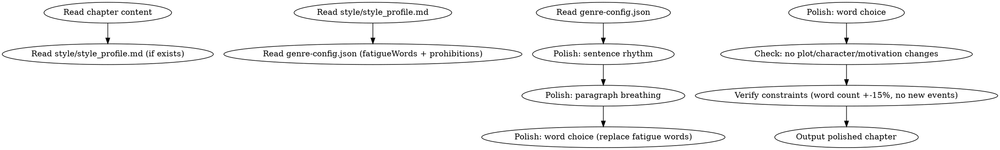

<!-- AUTO-GENERATED from frontmatter — do not edit -->

## 数据契约

- **Reads:** chapters/chapter-N.md, genre-config.json, style/style_profile.md
- **Writes:** none
- **Updates:** chapters/chapter-N.md

<!-- END AUTO-GENERATED -->

# 文字层润色

润色章节的文字表达、节奏和段落呼吸感。禁止增删情节、改变人设、调整主线。

## 流程



## 铁律

1. **只改表达，不动情节** — 不能增删事件、不能改变角色行为、不能调整情感基调
2. **只改善，不恶化** — 字数变化 ≤ ±15%，不能引入 AI 味
3. **发现结构问题只标记** — 如果发现需要结构调整的段落，用 `[polisher-note]` 标记，不自行修改
4. **保持风格指纹** — 如果 `style/style_profile.md` 存在，必须遵循风格指纹

## 润色维度

### 1. 句长控制
- 过长的句子（> 50字）考虑拆分为2-3句
- 过短的连续短句考虑合并以改善节奏
- 目标：句长变异系数 > 0.25

### 2. 段落呼吸
- 过长的段落（> 8句）考虑拆分
- 检查段落首句多样性
- 检查段落间过渡

### 3. 用词替换
- 替换疲劳词（从 `genre-config.json` 的 `fatigueWords` 读取）
- 替换重复高频词
- 避免连续段落使用相同句式

### 4. 修辞优化
- 标记不自然的比喻
- 标记重复的修辞模式
- 不做大的修辞重写

## 输出格式

```markdown
# 润色后的第N章

[完整的润色后章节正文]

---

## 润色说明

### 修改统计
- 句子拆分: N处
- 段落重组: N处
- 用词替换: N处
- 总字数变化: +N/-N (X%)

### [polisher-note] (如需)
- [段落位置] 描述: 注意到的结构问题
```

## Anti-Rationalization

| Excuse | Reality |
|--------|---------|
| "顺手把这段情节也改了吧" | plot/motivation 修改属于 revision，不属于 polishing |
| "改得越多越好" | 过度润色 = 抹去作者风格 = AI 味 |
| "这段表达有问题我重写一下" | 重写 = 改变叙事视角 = 超出润色范围 |
| "修辞统一一下更好看" | 修辞多样性是避免 AI 味的关键 |
