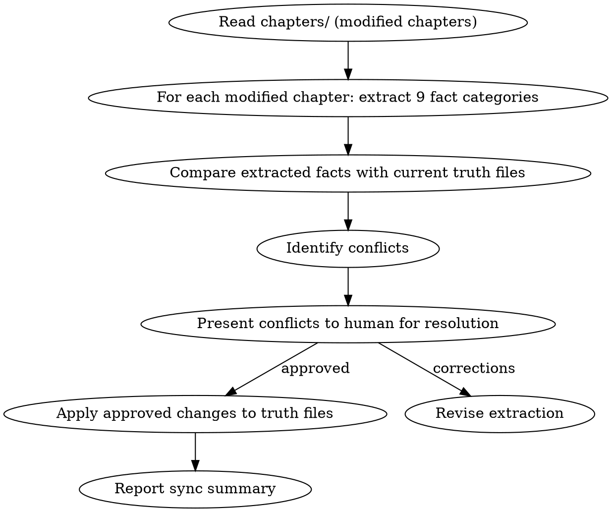

<!-- AUTO-CHECK-START -->

## auto-check (generated -- do not edit)

<!-- AUTO-CHECK-END -->

<!-- AUTO-GENERATED from frontmatter — do not edit -->

## 数据契约

- **Reads:** chapters/chapter-N.md, truth/*.md, world/*.md, characters/**/*.md
- **Writes:** none
- **Updates:** truth/*.md

<!-- END AUTO-GENERATED -->

# 真相文件同步

从编辑后的正文重新反推 truth files，校验一致性。当人类合作者手动修改了章节后，需要运行此技能确保 truth files 与正文同步。
**`truth/*.md` 写范围说明**：本 skill 的 `updates: truth/*.md` 仅指**从正文重新提取并经人工仲裁后同步**全部 truth 文件（离线对齐操作）。正常运行中各 truth 文件的字段所有权仍归原 skill；本 skill 仅在正文被手动编辑后运行，且每个冲突必须经人类仲裁（见铁律 2），不覆盖未经确认的内容。

## 流程



## 铁律

1. **正文是权威来源** — truth files 服务于正文，不能反过来"纠正"正文
2. **冲突必须人工仲裁** — 发现 truth files 与正文不一致时，列出冲突让人类选择保留哪个
3. **增量更新** — 只更新变化的部分，不重写整个文件
4. **保留历史** — 在报告中记录同步前/后的差异
5. **提取与推断分离** — 每条事实标注来源类型：直接提取（能在正文中找到逐字对应证据）vs 推断（从正文中间接推出，无逐字对应）。推断条目不得超过总提取条目的 20%。推断条目在 truth 文件中标注 `[inferred]`

## 9 类事实提取

与 `shenbi-state-settling` 相同的 9 类：
1. 位置变化
2. 资源变化
3. 关系变化
4. 情绪变化
5. 信息流动
6. 剧情线索
7. 时间推进
8. 身体状态
9. 行为变化

参考 `shenbi-state-settling` 的提取模板。sync 与 state-settling 的关键差异：sync 从成稿反推（必须与正文一致），state-settling 从初稿前瞻（可能有解读偏差）。

## 角色档案属性交叉校验

除了 9 类事实提取外，必须额外校验 `characters/**/*.md` 中的角色档案属性与正文的一致性：

- **外貌特征**: 正文中描述的角色外貌是否与角色档案一致
- **能力等级**: 正文中的能力表现是否与档案记录匹配
- **性格特质**: 角色行为是否符合档案中的性格标签
- **人际关系**: 正文中互动的人物关系是否与档案中记录一致
- **装备/物品**: 角色持有的物品是否与档案中的装备清单一致

发现不一致时，与 9 类提取的冲突合并处理，一并在冲突清单中呈现给人类仲裁。

## 输出格式

```markdown
## 真相文件同步报告

**同步范围**: 第N章 至 第M章
**触发原因**: 人类手动修改了第N章（替换了关键对话）
**操作**: 重新提取 → 比较 → 仲裁 → 增量更新

### 同步汇总

| 维度 | 数量 |
|------|------|
| 检查章节数 | N |
| 提取事实数 | X |
| 冲突总数 | Y |
| 已仲裁（保留正文） | A |
| 已仲裁（保留 truth） | B |
| 待人类决定 | C |
| 实际更新 truth 文件 | D |

### 冲突清单

| 文件 | 字段 | 正文值 | truth值 | 处理 |
|------|------|--------|---------|------|
| current_state.md | protagonist.location | "外门演武场" | "内门修炼室" | → 保留正文 |
| pending_hooks.md | hook-001.state | (未触发) | TRIGGERED | → 等待人类决定 |

### 变更汇总
- current_state.md: 2处更新
- pending_hooks.md: 1处待决定
- character_matrix.md: 无变化

### 同步前后对比（保留审计轨迹）
- current_state.md: protagonist.location: "内门修炼室" → "外门演武场"
- pending_hooks.md: hook-001.state: TRIGGERED → (待人类决定)
```

## Anti-Rationalization

| Excuse | Reality |
|--------|---------|
| "正文改了一处而已，不必同步" | 一处不同步 → 下一章 draft 基于错误信息 → 连锁矛盾 |
| "truth files 太久没更新，重写算了" | 重写丢失历史，增量更新保留审计轨迹 |
