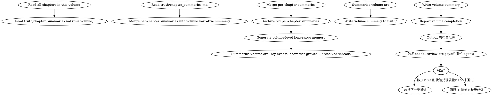

<!-- AUTO-CHECK-START -->

## auto-check (generated -- do not edit)

<!-- AUTO-CHECK-END -->

<!-- AUTO-GENERATED from frontmatter — do not edit -->

## 数据契约

- **Reads:** chapters/chapter-N.md, truth/chapter_summaries.md, truth/pending_hooks.md
- **Writes:** truth/volume_summaries.md
- **Updates:** truth/chapter_summaries.md

<!-- END AUTO-GENERATED -->

# 卷整合

卷完成后：合并逐章摘要为叙事摘要、归档旧摘要、生成卷级长程记忆。

> **术语缩写（CP）**：本 skill 输出中的 **CP** 指 **Chase Power（读者期望债务）**，即未兑现伏笔累积的读者期待压力（公式见 `shenbi-foreshadowing-resolve`）。不指同人创作中的角色配对 Couple/Pairing。

## 流程



## 铁律

1. **卷完成后必须整合** — 逐章摘要继续增长会导致 context-composing 上下文过长
2. **长程记忆是精炼的** — 每卷的卷级摘要必须控制在 500 字以内
3. **保留可回查性** — 归档的逐章摘要必须仍然可以手动查阅
4. **未兑现伏笔必须醒目** — 卷级摘要必须明确列出本卷种下但未兑现的伏笔。数据来源为 `truth/pending_hooks.md`，必须逐一核对状态字段
5. **弧门是下一卷的前置门** — 卷 consolidation 完成后，触发 `shenbi-review-arc-payoff`（独立 agent）。B 未通过（overall <80 **或** 伏笔兑现质量 <15）→ **阻断**下一卷推进，按处方修订后再放行；B 通过 → 才能推进下一卷（spec §6.1）

## 输出格式

### 卷级叙事摘要

追加到 `truth/volume_summaries.md`（如果不存在则创建）：

```markdown
# 卷级摘要

## 第一卷: 入门篇 (第1-15章)

### 叙事弧线

[200字：本卷的核心推进线——主角从外门到内门的成长弧]

### 关键事件

1. 第1-3章: 入门考核 → [为什么关键: 建立世界观基线 + 种植 hook-001]
2. 第4-7章: 考核中遭遇反派代理人 → [为什么关键: 冲突升级, 引入反派线]
3. 第8-12章: 内门修炼 → [为什么关键: 角色关系发展, 能力体系展开]
4. 第13-15章: 考核最终战 → [为什么关键: hook-002 部分兑现, 第一卷高潮]

### 角色成长

- 林轩: 从"想证明自己"到"为守护而战"（动机深化）
- 苏晴: 从观望到认可（关系弧完成）

### 未兑现伏笔（带入下卷）

- hook-001: 玉佩隐藏力量（PLANTED → 下卷核心）
- hook-003: 反派寻找玉佩的动机（RELEVANT）

### 卷入尾声状态

- 主角位置: 内门修炼室
- Chase Power 债务: 45 (GREEN)
```

## 执行步骤

1. 读取本卷所有章节正文（`chapters/chapter-N.md`）
2. 读取 `truth/chapter_summaries.md` 中本卷范围的逐章摘要
3. 读取 `truth/pending_hooks.md` 提取本卷种下但未兑现的伏笔
4. 合并逐章摘要为卷级叙事摘要（叙事弧线、关键事件含选择理由、角色成长、未兑现伏笔、尾声状态）
5. 把本卷的逐章摘要归档（移入 `truth/volume_summaries.md` 或单独归档目录，但保留可回查入口）
5. 生成卷级长程记忆（精炼 ≤ 500 字）
6. 追加到 `truth/volume_summaries.md`
7. 报告卷整合完成
8. 输出卷整合汇总
9. 卷 consolidation 完成后，触发 `shenbi-review-arc-payoff`（独立 agent）。未通过（overall <80 或 伏笔兑现质量 <15）→ 阻断下一卷推进，按处方修订；通过 → 放行下一卷（spec §6.1）

## 卷整合汇总

每次卷整合完成，必须给出汇总便于 human partner 快速评估长程记忆质量：

```markdown
## 卷整合汇总（第X卷 / 第N-M章）

**整合时间**: YYYY-MM-DD
**卷范围**: 第N章 - 第M章
**归档摘要数**: X 条

### 字数统计

| 项目 | 字数 | 限制 |
|------|------|------|
| 卷级叙事摘要 | X | ≤ 500 字 |
| 归档后 chapter_summaries.md | X | 不限 |

### 关键事件

- 关键事件数: X 条
- 涵盖章节: 第N章 - 第M章（无遗漏）

### 角色成长

- 完成弧线的角色: X 个
- 进行中弧线: X 个

### 未兑现伏笔

| Hook ID | 状态 | CP 贡献 | 转入下卷建议 |
|---------|------|---------|------------|
| hook-001 | PLANTED | 45 | 下卷核心 |
| hook-003 | RELEVANT | 30 | 继续培育 |

### 归档可回查性

- [ ] 归档摘要可通过 truth/volume_summaries.md#第X卷 查询
- [ ] 关键事件可追溯到原章节号

### 待人类确认

- [ ] 卷级叙事摘要是否符合本卷实际走向？
- [ ] 未兑现伏笔清单是否完整？
```

## 输出格式

### 卷级叙事摘要（精确输出模板）

追加到 `truth/volume_summaries.md`，必须严格遵循以下格式：

```markdown
# 卷级摘要

## 第X卷: [卷标题] (第N-M章)

### 叙事弧线

[≤200字：本卷的核心推进线，必须包含——起点状态 → 核心冲突展开 → 卷末状态]

### 关键事件

1. 第N-(N+2)章: [事件名] → [为什么关键: ≤25字理由]
2. 第(N+3)-(N+5)章: [事件名] → [为什么关键: ≤25字理由]
3. ...
   (N条事件，覆盖本卷全部章节，无遗漏)

### 角色成长

| 角色 | 卷初状态 | 卷末状态 | 弧线类型 | 完成度 |
|------|---------|---------|---------|--------|
| [主角] | [简述] | [简述] | GROWTH/FLAT/FALL | 完成/进行中 |
| [配角A] | [简述] | [简述] | ... | ... |

### 已兑现伏笔

| Hook ID | 兑现章 | 方式 | 剩余影响 |
|---------|--------|------|---------|
| hook-xxx | N | [如何兑现] | [对后续是否有持续影响] |

### 未兑现伏笔（带入下卷）

| Hook ID | 当前状态 | CP债务 | 预计兑现卷 | 带入下卷建议 |
|---------|---------|--------|----------|------------|
| hook-xxx | PLANTED/RELEVANT | NN | 第Y卷 | [处理策略] |

### 卷入尾声状态

| 维度 | 状态描述 |
|------|---------|
| 主角位置 | [具体位置] |
| 盟友状态 | [存活/伤亡/在场/离场] |
| 反派态势 | [推进/受挫/潜伏] |
| 世界变化 | [本卷引发的世界状态改变] |
| Chase Power 债务 | NN (GREEN/YELLOW/RED) |
```

### 字数统计验证

每次卷整合完成后输出字数核查：

```markdown
## 字数统计验证 — 第X卷

| 检查项 | 实际值 | 标准 | 判定 |
|--------|--------|------|------|
| 卷级叙事摘要字数 | XXX | ≤500字 | ✓/✗ |
| 卷级长程记忆字数 | XXX | ≤500字 | ✓/✗ |
| 卷范围章节数 | X | [N-M] | ✓/✗ |
| 章节覆盖率 | X/X (100%) | 100% | ✓/✗ |
| 关键事件数 | X | ≥1/章 | ✓/✗ |
| 角色成长条目数 | X | ≥1（至少主角） | ✓/✗ |
| 未兑现伏笔数 | X | 与 pending_hooks 一致 | ✓/✗ |

### 归档可回查性验证

| 验证项 | 状态 |
|--------|------|
| 逐章摘要归档路径可访问 | ✓/✗ |
| 卷级摘要可通过 truth/volume_summaries.md#第X卷 查询 | ✓/✗ |
| 关键事件可追溯到原章节号 | ✓/✗ |
| 未兑现伏笔与 truth/pending_hooks.md 状态一致 | ✓/✗ |
```

## Anti-Rationalization

| Excuse | Reality |
|--------|---------|
| "卷总结太费时间，跳过" | 30章后 context 爆炸，agent 无法处理 = 质量断崖 |
| "逐章摘要都留着就行" | 逐章摘要用于审计，卷级摘要用于上下文，职能不同 |
| "500字太短了，写不下" | 精炼 = 提取核心；冗长 = 失去长程记忆的价值 |
| "伏笔下卷再说，本卷不用列" | 未列 = 下卷漏兑现 = Chase Power 失控 |
| "字数验证没必要，感觉差不多就行" | 未验证的字数约束 = 不可靠的上下文窗口管理 |
