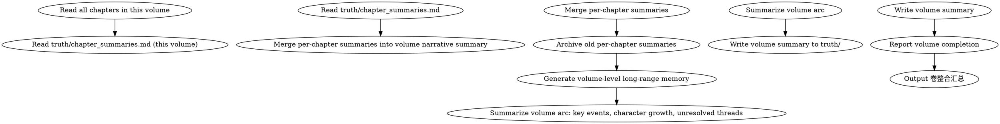

# 卷整合

卷完成后：合并逐章摘要为叙事摘要、归档旧摘要、生成卷级长程记忆。

## 流程



## 数据契约

- **Reads:** `chapters/chapter-N.md`, `truth/chapter_summaries.md`
- **Writes:** `truth/volume_summaries.md` (creates on first volume, appends for subsequent volumes)
- **Updates:** `truth/chapter_summaries.md` (preserves per-chapter entries; marks them as archived but does not delete)

## 铁律

1. **卷完成后必须整合** — 逐章摘要继续增长会导致 context-composing 上下文过长
2. **长程记忆是精炼的** — 每卷的卷级摘要必须控制在 500 字以内
3. **保留可回查性** — 归档的逐章摘要必须仍然可以手动查阅
4. **未兑现伏笔必须醒目** — 卷级摘要必须明确列出本卷种下但未兑现的伏笔

## 输出

### 卷级叙事摘要

追加到 `truth/volume_summaries.md`（如果不存在则创建）：

```markdown
# 卷级摘要

## 第一卷: 入门篇 (第1-15章)

### 叙事弧线

[200字：本卷的核心推进线——主角从外门到内门的成长弧]

### 关键事件

1. 第1-3章: 入门考核 → 展示世界观 + 种植 hook-001
2. 第4-7章: 考核中遭遇反派代理人 → 冲突升级
3. 第8-12章: 内门修炼 → 角色关系发展
4. 第13-15章: 考核最终战 → hook-002 部分兑现

### 角色成长

- 林轩: 从"想证明自己"到"为守护而战"（动机深化）
- 苏晴: 从观望到认可（关系弧完成）

### 未兑现伏笔（带入下卷）

- hook-001: 玉佩隐藏力量（PLANTED → 下卷核心）
- hook-003: 反派寻找玉佩的动机（RELEVANT）

### 卷入尾声状态

- 主角位置: 内门修炼室
- Chase Power 债务: 45 (GREEN)
```

## 执行步骤

1. 读取本卷所有章节正文（`chapters/chapter-N.md`）
2. 读取 `truth/chapter_summaries.md` 中本卷范围的逐章摘要
3. 合并逐章摘要为卷级叙事摘要（叙事弧线、关键事件、角色成长、未兑现伏笔、尾声状态）
4. 把本卷的逐章摘要归档（移入 `truth/volume_summaries.md` 或单独归档目录，但保留可回查入口）
5. 生成卷级长程记忆（精炼 ≤ 500 字）
6. 追加到 `truth/volume_summaries.md`
7. 报告卷整合完成
8. 输出卷整合汇总

## 卷整合汇总

每次卷整合完成，必须给出汇总便于 human partner 快速评估长程记忆质量：

```markdown
## 卷整合汇总（第X卷 / 第N-M章）

**整合时间**: YYYY-MM-DD
**卷范围**: 第N章 - 第M章
**归档摘要数**: X 条

### 字数统计

| 项目 | 字数 | 限制 |
|------|------|------|
| 卷级叙事摘要 | X | ≤ 500 字 |
| 归档后 chapter_summaries.md | X | 不限 |

### 关键事件

- 关键事件数: X 条
- 涵盖章节: 第N章 - 第M章（无遗漏）

### 角色成长

- 完成弧线的角色: X 个
- 进行中弧线: X 个

### 未兑现伏笔

| Hook ID | 状态 | CP 贡献 | 转入下卷建议 |
|---------|------|---------|------------|
| hook-001 | PLANTED | 45 | 下卷核心 |
| hook-003 | RELEVANT | 30 | 继续培育 |

### 归档可回查性

- [ ] 归档摘要可通过 truth/volume_summaries.md#第X卷 查询
- [ ] 关键事件可追溯到原章节号

### 待人类确认

- [ ] 卷级叙事摘要是否符合本卷实际走向？
- [ ] 未兑现伏笔清单是否完整？
```

## Anti-Rationalization

| Excuse | Reality |
|--------|---------|
| "卷总结太费时间，跳过" | 30章后 context 爆炸，agent 无法处理 = 质量断崖 |
| "逐章摘要都留着就行" | 逐章摘要用于审计，卷级摘要用于上下文，职能不同 |
| "500字太短了，写不下" | 精炼 = 提取核心；冗长 = 失去长程记忆的价值 |
| "伏笔下卷再说，本卷不用列" | 未列 = 下卷漏兑现 = Chase Power 失控 |
