# 分卷大纲

设计单卷的整体结构。负责卷目标、卷内节奏原则、卷内张力曲线、跨卷衔接。

## 流程

```dot
digraph volume_outlining {
    "Read story_frame.md" -> "Read existing volume_map.md (if any)";
    "Read existing volume_map.md" -> "Define this volume's Objective";
    "Define this volume's Objective" -> "Decompose into Key Results (3-5 KR)";
    "Decompose into Key Results" -> "Map each KR to chapter range";
    "Map each KR to chapter range" -> "For each chapter: assign node role (opening/continuation/turning/closure)";
    "For each chapter: assign node role" -> "Design intra-volume tension curve";
    "Design intra-volume tension curve" -> "Design cross-volume bridge (ending hook into next volume)";
    "Design cross-volume bridge" -> "Cross-check with pacing-design rhythm_principles";
    "Cross-check" -> "Human reviews";
    "Human reviews" -> "Revise" [label="rejected"];
    "Human reviews" -> "Append to outline/volume_map.md" [label="approved"];
}
```



## 数据契约

- **Reads:** `outline/story_frame.md`, `outline/volume_map.md` (existing), `truth/author_intent.md`
- **Writes:** 无
- **Updates:** `outline/volume_map.md`

## 铁律

1. **OKR 必为可执行粒度** — KR 必须能映射到具体章节范围（KR1: 第1-5章），禁止"主角成长"这类空泛表述
2. **张力曲线必为波浪** — 卷内张力必须有起有伏，不可一路高歌猛进，否则读者疲劳
3. **跨卷桥接必有实体** — 卷尾必须留下至少 1 个实体钩子（人物/物品/事件/信息）带入下卷
4. **黄金三章可特殊化** — 前 N 章（N = novel.json.golden_opening_chapters）允许偏离常规 KR 节奏以建立世界观

## 核心设计

### 1. 卷目标（Objective）

Objective 是单卷的最高问题，例如：
- 第一卷："主角从外门弟子蜕变为内门正式弟子"
- 第二卷："主角揭开玉佩秘密并与反派首次正面交锋"

目标必须可以用 1 句话概括，且能在卷末用"是否完成"二元判断。

### 2. 关键结果（Key Results）

每卷 3-5 个 KR，每个 KR 包含：
- 章节范围
- 衡量标准（事件性/状态性/关系性）
- 与 Objective 的支撑关系

### 3. 章节节点角色

每个章节在 KR 中承担以下角色之一：

| 节点角色 | 作用 |
|---------|------|
| 开篇 | KR 启动，铺设路径 |
| 承接 | 推进 KR 进度 |
| 转折 | KR 关键变化点 |
| 收官 | KR 完结，状态固化 |

### 4. 卷内张力曲线

四段式波浪：
- **铺垫段** (10-20%): 张力低，建立日常
- **上升段** (30-40%): 张力递增，小冲突不断
- **爆发段** (20-30%): 卷高潮，重大冲突
- **余波段** (15-25%): 沉淀情绪，铺设下卷

每段内的张力值应呈小波浪（局部起伏），而不是平直。

### 5. 跨卷桥接

卷尾的"实体钩子"类型：

| 类型 | 示例 |
|------|------|
| 人物 | 新角色登场/旧角色失踪 |
| 物品 | 玉佩的新刻字/新法器 |
| 事件 | 师门被围攻/亲人死亡 |
| 信息 | 反派真实身份揭露/玉佩来源浮出 |

至少 1 个，理想 2-3 个。

## 输出格式

追加到 `outline/volume_map.md`：

```markdown
---

## 第N卷：[卷名]

**Objective**: [1 句话概括本卷最高问题]

**章节范围**: 第N章 - 第M章

### Key Results

#### KR1: [标题]

- **章节范围**: 第A章 - 第B章
- **衡量标准**: [事件性/状态性/关系性]
- **章节节点**:
  - 第A章: [开篇] [本章在KR1中的具体定位]
  - 第B章: [收官] [本章在KR1中的具体定位]
  - ...

#### KR2: ...

### 卷内张力曲线

```
张力
↑       ╱╲      ╱╲
│      ╱  ╲    ╱  ╲
│     ╱    ╲  ╱    ╲
│    ╱      ╲╱      ╲___
│   ╱    余波   铺垫  上升  爆发
└──────────────────────→ 章节
```

### 跨卷桥接

- **实体钩子 1**: [类型] [具体内容]（带入第N+1卷）
- **实体钩子 2**: [类型] [具体内容]

### 黄金三章约束

- [若 N = 1，列出三章特殊目标]

### 与 story_frame 的一致性

- surface_conflict 推进: [...]
- personal_conflict 推进: [...]
- deep_conflict 推进: [...]
```

## 汇总

```markdown
## 分卷大纲汇总（第N卷）

**写入文件**: `outline/volume_map.md`
**章节数**: X（实际分配：M - N + 1）
**KR 数**: Y

### 张力曲线

- 铺垫段: 第A-B章
- 上升段: 第C-D章
- 爆发段: 第E-F章
- 余波段: 第G-H章

### 跨卷桥接

- 实体钩子数: X
- 类型分布: [人物 1, 物品 1, 事件 1]

### 待人类确认

- [ ] Objective 是否在 1 句话内可判断完成？
- [ ] KR 章节分配是否平衡（无单章爆量/空转）？
- [ ] 跨卷钩子是否能驱动下卷开场？
```

## Anti-Rationalization

| Excuse | Reality |
|--------|---------|
| "一卷写完再说大纲" | 30 章后再补大纲 = 重写代价 10 倍 |
| "卷目标可以模糊一点" | 模糊目标 = 卷末无法判断是否完结 = 失序 |
| "张力曲线不需要" | 读者疲劳度的客观规律，无曲线 = 中段必然疲软 |
| "跨卷钩子下卷再说" | 钩子 = 跨卷牵引力。临时补 = 钩子生硬 = 读者不买账 |
