<!-- AUTO-CHECK-START -->

## auto-check (generated -- do not edit)

### invariants

- entity hooks
- kr count
- tension sum

<!-- AUTO-CHECK-END -->

<!-- AUTO-GENERATED from frontmatter — do not edit -->

## 数据契约

- **Reads:** outline/story_frame.md, outline/volume_map.md, truth/author_intent.md
- **Writes:** none
- **Updates:** outline/volume_map.md

<!-- END AUTO-GENERATED -->

# 分卷大纲

设计单卷的整体结构。负责卷目标、卷内节奏原则、卷内张力曲线、跨卷衔接。
**职责边界**：`outline/volume_map.md` 的卷划分骨架由 `shenbi-story-architecture` 创建，本 skill 负责**单卷细化**（卷目标、章级目标、卷内张力曲线、跨卷衔接）。如果 `volume_map.md` 已存在（story-architecture 创建），本 skill 读取并细化对应卷；如果不存在，报错并提示先运行 story-architecture。

## 流程

```dot
digraph volume_outlining {
    "Read story_frame.md" -> "Read existing volume_map.md (if any)";
    "Read existing volume_map.md" -> "Define this volume's Objective";
    "Define this volume's Objective" -> "Decompose into Key Results (3-5 KR)";
    "Decompose into Key Results" -> "Map each KR to chapter range";
    "Map each KR to chapter range" -> "For each chapter: assign node role (opening/continuation/turning/closure)";
    "For each chapter: assign node role" -> "Design intra-volume tension curve";
    "Design intra-volume tension curve" -> "Design cross-volume bridge (ending hook into next volume)";
    "Design cross-volume bridge" -> "Cross-check with pacing-design rhythm_principles";
    "Cross-check" -> "Human reviews";
    "Human reviews" -> "Revise" [label="rejected"];
    "Human reviews" -> "Append to outline/volume_map.md" [label="approved"];
}
```



## 铁律

1. **OKR 必为可执行粒度** — KR 必须能映射到具体章节范围（KR1: 第1-5章），禁止"主角成长"这类空泛表述
2. **张力曲线必为波浪** — 卷内张力必须有起有伏，不可一路高歌猛进，否则读者疲劳
3. **跨卷桥接必有实体** — 卷尾必须留下至少 1 个实体钩子（人物/物品/事件/信息）带入下卷
4. **黄金三章可特殊化** — 前 N 章（N = novel.json.golden_opening_chapters）允许偏离常规 KR 节奏以建立世界观

## 核心设计

### 1. 卷目标（Objective）

Objective 是单卷的最高问题，例如：
- 第一卷："主角从外门弟子蜕变为内门正式弟子"
- 第二卷："主角揭开玉佩秘密并与反派首次正面交锋"

目标必须可以用 1 句话概括，且能在卷末用"是否完成"二元判断。

### 2. 关键结果（Key Results）

每卷 3-5 个 KR，每个 KR 包含：
- 章节范围
- 衡量标准（事件性/状态性/关系性）
- 与 Objective 的支撑关系

### 3. 章节节点角色

每个章节在 KR 中承担以下角色之一：

| 节点角色 | 作用 |
|---------|------|
| 开篇 | KR 启动，铺设路径 |
| 承接 | 推进 KR 进度 |
| 转折 | KR 关键变化点 |
| 收官 | KR 完结，状态固化 |

### 4. 卷内张力曲线

四段式波浪：
- **铺垫段** (10-20%): 张力低，建立日常
- **上升段** (30-40%): 张力递增，小冲突不断
- **爆发段** (20-30%): 卷高潮，重大冲突
- **余波段** (15-25%): 沉淀情绪，铺设下卷

每段内的张力值应呈小波浪（局部起伏），而不是平直。

### 5. 跨卷桥接

卷尾的"实体钩子"类型：

| 类型 | 示例 |
|------|------|
| 人物 | 新角色登场/旧角色失踪 |
| 物品 | 玉佩的新刻字/新法器 |
| 事件 | 师门被围攻/亲人死亡 |
| 信息 | 反派真实身份揭露/玉佩来源浮出 |

至少 1 个，理想 2-3 个。

## 输出格式

追加到 `outline/volume_map.md`，每卷使用以下 EXACT 节标题和子结构。缺任意节、KR 数量不足、钩子数量不足即为不合格。

**节标题校验规则**：每卷输出必须包含：
1. `## 第N卷：{卷名}` — H2
2. `### Key Results` — H3（内含 3-5 个 KR4 子标题）
3. `### 卷内张力曲线` — H3
4. `### 跨卷桥接` — H3
5. `### 黄金三章约束` — H3（首卷必填，其他卷可填"不适用"）
6. `### 与 story_frame 的一致性` — H3

```markdown
---

## 第N卷：{卷名}

**Objective**: [1 句话概括本卷最高问题，必须可二元判断"完成/未完成"]

**章节范围**: 第N章 - 第M章（共 K 章）

### Key Results

**可自动检查规则**：KR 数量必须为 3-5 个。< 3 或 > 5 即为不合格。

#### KR1: [标题]

- **章节范围**: 第A章 - 第B章（共 X 章）
- **衡量标准**: [事件性 / 状态性 / 关系性]（三选一）
- **对 Objective 的支撑**: [一句话说明此 KR 如何支撑 Objective]
- **章节节点**:
  | 章节 | 节点角色 | 具体定位 |
  |------|---------|---------|
  | 第A章 | 开篇 | [本章在KR1中的具体定位] |
  | ... | 承接 | ... |
  | 第B章 | 收官 | [本章在KR1中的具体定位] |

**节点角色约束**: 仅允许 开篇 / 承接 / 转折 / 收官。每个 KR 必须至少有 开篇 + 收官 两个节点。

#### KR2: [标题]

[同上结构，章节范围不可与 KR1 重叠超过 2 章]

#### KR3: [标题]

[同上结构]

### 卷内张力曲线

**可自动检查规则**：四段百分比之和必须 = 100%，每段必须在允许范围内。

使用以下 EXACT 表格格式：

| 段 | 章节范围 | 占比% | 允许范围 | 张力方向 |
|----|---------|-------|---------|---------|
| 铺垫段 | 第N-A章 | X% | 15-25% | 低→中 |
| 上升段 | 第A-B章 | X% | 30-40% | 中→高 |
| 爆发段 | 第B-C章 | X% | 20-30% | 高→极 |
| 余波段 | 第C-M章 | X% | 15-25% | 极→低 |

**检查规则**：
| 检查项 | 规则 | 不合格条件 |
|--------|------|----------|
| 四段%之和 | = 100% | ≠ 100% |
| 铺垫段% | 15-25% | < 10% 或 > 35% |
| 上升段% | 30-40% | < 20% 或 > 50% |
| 爆发段% | 20-30% | < 15% 或 > 40% |
| 余波段% | 15-25% | < 10% 或 > 35% |
| 章节范围连续 | 首尾相接无空隙 | 有空隙或重叠超 1 章 |

```
张力
↑       ╱╲      ╱╲
│      ╱  ╲    ╱  ╲
│     ╱    ╲  ╱    ╲
│    ╱      ╲╱      ╲___
│   ╱    余波   铺垫  上升  爆发
└──────────────────────→ 章节
```

### 跨卷桥接

**可自动检查规则**：至少 3 个实体钩子，且类型分布 ≥ 2 种类型。

使用以下 EXACT 格式：

```markdown
| # | 钩子内容 | 类型 | 带入卷 | 预期激活章 | 当前状态 |
|---|---------|------|--------|----------|---------|
| 1 | [具体内容] | 人物/物品/事件/信息 | 第N+1卷 | 第X章 | 已种植 |
| 2 | [具体内容] | 人物/物品/事件/信息 | 第N+1卷 | 第Y章 | 已种植 |
| 3 | [具体内容] | 人物/物品/事件/信息 | 第N+1卷 | 第Z章 | 已种植 |
```

**列校验规则**:
- `类型` 仅允许：人物 / 物品 / 事件 / 信息
- `带入卷` 必填
- `预期激活章` 必填（可为范围，如 第5-8章）
- 至少 3 行，至少 2 种不同类型

### 黄金三章约束

[若 N = 1，列出三章特殊目标。若 N > 1，填"不适用"]

### 与 story_frame 的一致性

- surface_conflict 推进: [...]
- personal_conflict 推进: [...]
- deep_conflict 推进: [...]
```

**可自动检查的计数规则**：
| 检查项 | 规则 | 不合格条件 |
|--------|------|----------|
| KR 数量 | 3-5 个 | < 3 或 > 5 |
| 每 KR 有开篇+收官节点 | 2 个关键节点 | 缺开篇或缺收官 |
| 节点角色有效性 | 仅开篇/承接/转折/收官 | 使用不允许值 |
| 四段%之和 | = 100% | ≠ 100% |
| 每段%在允许范围 | 见张力曲线表 | 超出范围 |
| 跨卷钩子数 | ≥ 3 个 | < 3 |
| 钩子类型多样性 | ≥ 2 种 | 全部同类型 |
| 钩子表列完整性 | 6 列全部非空 | 任一空值 |
| Objective 可判断性 | ≤ 1 句话 | 超长或无法二元判断 |

## 汇总

```markdown
## 分卷大纲汇总（第N卷）

**写入文件**: `outline/volume_map.md`
**章节数**: X（实际分配：M - N + 1）
**KR 数**: Y（3-5）

### KR 概览

| KR | 章节范围 | 衡量标准 | 节点数 |
|----|---------|---------|--------|
| KR1 | 第A-B章 | 事件/状态/关系 | X |
| KR2 | 第C-D章 | 事件/状态/关系 | Y |
| KR3 | 第E-F章 | 事件/状态/关系 | Z |

### 张力曲线

| 段 | 章节范围 | 占比% |
|----|---------|-------|
| 铺垫段 | 第A-B章 | X% |
| 上升段 | 第C-D章 | X% |
| 爆发段 | 第E-F章 | X% |
| 余波段 | 第G-H章 | X% |

### 跨卷桥接

- 实体钩子数: X（要求 ≥ 3）
- 类型分布: [人物, 物品, 事件, 信息] 中有实际值的列表

### 自动化检查清单

- [ ] KR 数量 3-5 个
- [ ] 每 KR 有开篇+收官节点
- [ ] 四段张力%之和 = 100%
- [ ] 每段%在允许范围内
- [ ] 跨卷钩子 ≥ 3 个，类型 ≥ 2 种
- [ ] 钩子表 6 列全部非空
- [ ] Objective 可一句话判断完成/未完成
- [ ] KR 章节分配无单章爆量/空转
```

## Anti-Rationalization

| Excuse | Reality |
|--------|---------|
| "一卷写完再说大纲" | 30 章后再补大纲 = 重写代价 10 倍 |
| "卷目标可以模糊一点" | 模糊目标 = 卷末无法判断是否完结 = 失序 |
| "张力曲线不需要" | 读者疲劳度的客观规律，无曲线 = 中段必然疲软 |
| "跨卷钩子下卷再说" | 钩子 = 跨卷牵引力。临时补 = 钩子生硬 = 读者不买账 |
