<!-- AUTO-GENERATED from frontmatter — do not edit -->

## 数据契约

- **Reads:** import/analysis/03_world.md, chapters/*.md, import/analysis/04_plot.md
- **Writes:** world/story_bible.md, world/rules.md, world/locations.md, world/factions.md, world/power_system.md
- **Updates:** none

<!-- END AUTO-GENERATED -->

# 世界观反向提取

从已分析章节反向提取世界观文件。负责地点、势力、力量体系、世界规则。

## 流程

```dot
digraph world_extraction {
    "Read import/analysis/03_world.md" -> "Read source chapters (per location/faction/power)";
    "Read source chapters" -> "Extract world rules (from invocations + violations)";
    "Extract world rules" -> "Extract locations (from descriptions + movements)";
    "Extract locations" -> "Extract factions (from organization references)";
    "Extract factions" -> "Extract power system (from level cues + ability demos)";
    "Extract power system" -> "Cross-check rules vs story_bible (no contradictions)";
    "Cross-check" -> "Generate story_bible.md (4-paragraph narrative)";
    "Generate story_bible.md" -> "Generate rules.md (≤ 10 hard rules)";
    "Generate rules.md" -> "Generate locations.md (top 5 locations)";
    "Generate locations.md" -> "Generate factions.md (per faction)";
    "Generate factions.md" -> "Generate power_system.md";
    "Generate power_system.md" -> "Write to world/";
}
```



## 铁律

1. **从违规反推规则** — 角色尝试 X 失败 → X 不可行；角色使用 Y → Y 可行
2. **以散文为主** — 4 段式 `story_bible.md` 是核心，禁止条目化
3. **规则有上限** — `rules.md` 最多 10 条硬规则，每条必须有 ≥ 2 个原文证据
4. **力量体系从行为反推** — 等级名 / 进阶条件 / 能力边界必须从角色行为中归纳
5. **未确认项必标** — 推不出的填"未确认"

## 提取维度

### 1. 世界规则

| 来源 | 反推方法 |
|------|---------|
| 角色尝试失败 | 不可行的规则 |
| 角色使用成功 | 可行的规则 |
| 角色回避 | 禁忌 / 危险 |
| 章节明确描写 | 显性规则 |
| 跨章一致 | 隐含规则 |

每条规则记录：
- 规则描述
- 证据章节
- 证据类型（显性/隐含/反推）

### 2. 地点

| 维度 | 提取方法 |
|------|---------|
| 名称 | 文中出现的地名 |
| 类型 | 城市/秘境/野外/建筑 |
| 空间布局 | 描述性段落 |
| 氛围 | 感官描写（视觉/听觉/嗅觉）|
| 功能 | 发生的事件类型 |
| 首次出场章节 | — |
| 关联地点 | 同章出现的其他地点 |

### 3. 势力

| 维度 | 提取方法 |
|------|---------|
| 名称 | 文中组织名 |
| 类型 | 门派/公司/政府/帮派 |
| 总部 | 总部地点 |
| 领袖 | 提及的领袖 |
| 内部矛盾 | 文中内部冲突描写 |
| 跨势力关系 | 文中关系描述 |
| 锚点角色 | 已确认属于该势力的角色 |

### 4. 力量体系

| 维度 | 提取方法 |
|------|---------|
| 等级名 | 文中境界/级别称呼 |
| 等级数 | 提及的所有等级 |
| 进阶条件 | 突破时的条件描述 |
| 能力边界 | 各级能/不能做什么 |
| 顶端 | 世界最高等级 |
| 代价 | 升级/使用的代价 |

## 输出格式

### story_bible.md（4 段式）

```markdown
# 世界观圣经（反向提取）

> 来源: import/analysis/03_world.md 反推
> 注意: 本文件为反向提取，可能不完整

## 第一段：天地法则

[世界运行的基本规则，力量体系的来源]

## 第二段：社会格局

[势力分布、阶层结构、权力拓扑]

## 第三段：历史纵深

[关键历史事件，塑造当前格局的过去]

## 第四段：暗流涌动

[表面平静下涌动的矛盾]
```

### rules.md

```markdown
# 世界铁律（反向提取）

> 最多 10 条。每条 ≥ 2 个证据。

## 规则 1: [描述]

- 证据: 第N章 [原文摘录]
- 证据: 第M章 [原文摘录]
- 证据类型: 显性 / 隐含

## 规则 2: ...

```

### locations.md

```markdown
# 地点图谱（反向提取）

## 地点: [名称]

**类型**: [城市/...]
**首次出场**: 第N章
**功能定位**: [推断]
**空间布局**: [描述性摘录]
**氛围**: [感官摘录]
**关联地点**: [列表]

```

### factions.md

```markdown
# 势力图谱（反向提取）

## 势力: [名称]

**类型**: [...]
**总部**: [地点]
**领袖**: [角色]
**内部矛盾**: [摘要]
**跨势力关系**: [列表]
**锚点角色**: [列表]

```

### power_system.md

```markdown
# 力量体系（反向提取）

**类型**: [...]
**等级数**: N
**顶端**: [等级名]

## 等级表

| 等级 | 名称 | 标志能力 | 证据 |
|------|------|---------|------|
| 1 | [名] | [能力] | [章节] |
| ... | ... | ... | ... |

## 进阶条件

- 等级 X → X+1: [条件] [证据]
- ...

## 能力边界

- 等级 X 能做: [...]
- 等级 X 不能做: [...]

## 代价

- 升级代价: [...]
- 使用代价: [...]

```

## 汇总

```markdown
## 世界观反向提取汇总

**写入文件**: `world/*.md` (5 个)
**提取时间**: YYYY-MM-DD

### 完整性

| 文件 | 完整性 | 证据数 | 待补项 |
|------|--------|--------|--------|
| story_bible.md | X% | N | Y |
| rules.md | X% | N | Y |
| locations.md | X% | N | Y |
| factions.md | X% | N | Y |
| power_system.md | X% | N | Y |

### 关键发现

- 等级数: N
- 硬规则数: M
- 地点数: K
- 势力数: L

### 一致性检查

- [ ] rules.md 与 story_bible.md 的世界法则一致
- [ ] locations.md 的地理逻辑自洽
- [ ] power_system.md 的等级与角色行为匹配

### 待人类确认

- [ ] 推不出的"未确认"项是否需要补充？
- [ ] 反推的规则是否有矛盾？
```

## Anti-Rationalization

| Excuse | Reality |
|--------|---------|
| "LLM 直接写世界观更快" | LLM 写 = 编造 + 不可验证；反向提取 = 可追溯 |
| "规则不需要证据" | 无证据规则 = 后续章节违反后无依据修正 |
| "地点随便列几个" | 地点 = 空间坐标；缺失 = 章节间位置矛盾 |
| "力量体系后补" | 力量体系是等级感的核心；后补 = 升级感崩溃 |

## 缺陷证据格式

每条缺陷/发现报告必须遵循四要素格式：

1. **位置** — `文件路径` L行号-行号（如 `world/locations.md` L15-22）
2. **原文引述** — 用 `>` 标记引述原文，≥20 字上下文
3. **违反规则** — 引用 SKILL.md 中的精确规则名（逐字匹配）
4. **严重度** — BLOCKING | CRITICAL | MINOR

缺少任一要素的缺陷报告视为不合格。
