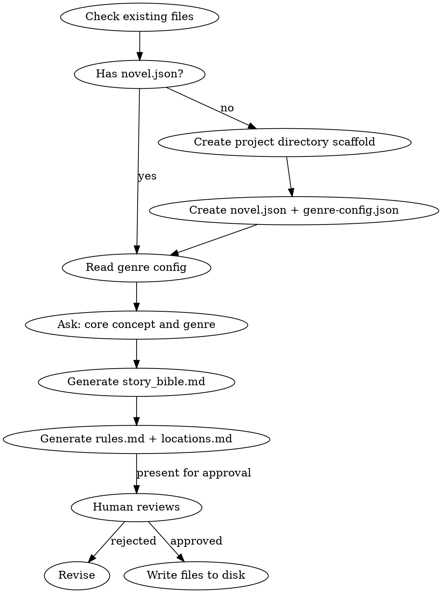

<!-- AUTO-CHECK-START -->

## auto-check (generated -- do not edit)

<!-- AUTO-CHECK-END -->

<!-- AUTO-GENERATED from frontmatter — do not edit -->

## 数据契约

- **Reads:** novel.json
- **Writes:** novel.json, genre-config.json, world/story_bible.md, world/rules.md, world/locations.md, truth/*.md
- **Updates:** none

<!-- END AUTO-GENERATED -->

# 世界观构建

HARD-GATE: 在世界观未完成并获得人类合作者批准前，不得进入角色设计或故事框架阶段。

## 流程



## 铁律

1. **NO BULLET-POINT WORLDS** — 世界观以散文形式输出，不是表格、不是 schema、不是条目化 bullet。每个设定段落是一段连贯的叙述。
2. **前台故事 + 后台故事** — story_bible.md 必须包含两条线：读者看到的前台冲突，和贯穿全书的后台暗线。
3. **世界铁律写在 rules.md** — 世界级硬性规则（物理法则、社会禁忌、时代禁忌）独立存放，writer 和 auditor 直接引用。
4. **去重原则** — 同一事实只出现在一个文件中。genre/core_concept/themes 只在 `novel.json` 定义。
5. **力量体系归 power_system.md** — 等级划分、进阶规则、力量上限、能力边界由 `shenbi-power-system` skill 维护至 `world/power_system.md`，不写入 rules.md。rules.md 只存放与具体力量体系无关的世界级硬律。
6. **项目目录初始化** — 如果小说项目目录不存在，worldbuilding 必须先创建完整目录结构（参见设计规范 Section 4）。

## 输出格式

写以下文件到小说项目目录：

| 文件 | 内容 |
|------|------|
| `novel.json` | 标题、题材、语言、状态 |
| `genre-config.json` | **初始 stub**（仅含题材分类、语言、基本审计维度激活）。完整的疲劳词列表、章节类型、禁忌词由 `shenbi-genre-config` skill 细化。worldbuilding 创建 stub，genre-config skill 负责细化。 |
| `world/story_bible.md` | 世界观圣经（散文，4段式） |
| `world/rules.md` | 世界铁律（最多10条） |
| `world/locations.md` | 初始地点图谱（3-5个核心地点） |
| `truth/` (初始化) | 创建以下 **全部 11 个** truth files 的空模板。每个文件的 YAML frontmatter 必须包含 `type`（truth）、`category`（state 或 character）、`status`（initialized）三个字段，body 标记为待填充。body header 用 `> 此文件由 state-settling 首次运行时填充实际数据。`：  **state 类**：`current_state.md`（当前世界状态）、`chapter_summaries.md`（逐章摘要）、`particle_ledger.md`（资源账本）、`subplot_board.md`（支线进度板）、`audit_drift.md`（审计纠偏）、`volume_summaries.md`（卷摘要归档）、`pending_hooks.md`（伏笔池）、`drift_guidance.md`（纠偏指导）  **character 类**：`character_matrix.md`（角色交互矩阵）、`emotional_arcs.md`（角色情感弧线）  **intent 类**：`author_intent.md`（作者长期意图）、`current_focus.md`（当前关注点）  **注意**：遗漏任何一个 truth file 的初始化会导致后续 skill（state-settling、foreshadowing-plant 等）写入失败。 |

### story_bible.md 结构

```markdown
# 世界观圣经

> genre/core_concept/themes 存储在 `novel.json`，不在此处重复

## 第一段：天地法则
[世界运行的基本规则，力量体系的来源]

## 第二段：社会格局
[势力分布、阶层结构、权力拓扑]

## 第三段：历史纵深
[关键历史事件，塑造当前格局的过去]

## 第四段：暗流涌动
[表面平静下涌动的矛盾，为后续冲突埋种子]
```

## 铁律

7. **truth files 必须全部初始化** — spec §4 定义的 11+ 个 truth files 必须在 worldbuilding 阶段全部创建为空模板。遗漏任何一个 = 后续 skill 写入失败 = 状态漂移。

## Anti-Rationalization

| Excuse | Reality |
|--------|---------|
| "世界观只需要简单几条规则" | 薄世界观 = 30章后无素材可用，writer 不断重复 |
| "先写故事，世界观后面补" | 没有世界观约束，writer 每章都在发明新规则 |
| "规则太多会限制创作" | 好的约束激发创意，没有约束导致随意 |
| "读者不关心世界观" | 网文读者对设定矛盾极其敏感，会逐章对比 |
| "我直接用通用的玄幻设定" | 同质化设定 = 没有记忆点 = 读者弃书 |

## 询问流程

1. 你的小说标题是什么？
2. 核心概念一句话概括？（"如果 ___ 发生了会怎样？"）
3. 题材方向？（玄幻/仙侠/都市/科幻/历史/...）
4. 有参考作品吗？（提供对标，不是模仿）
5. 世界观的"暗"是什么？（表面平静下最大的矛盾）

每个问题等待人类合作者回答后再问下一个。获得足够信息后生成输出，呈交审批。
