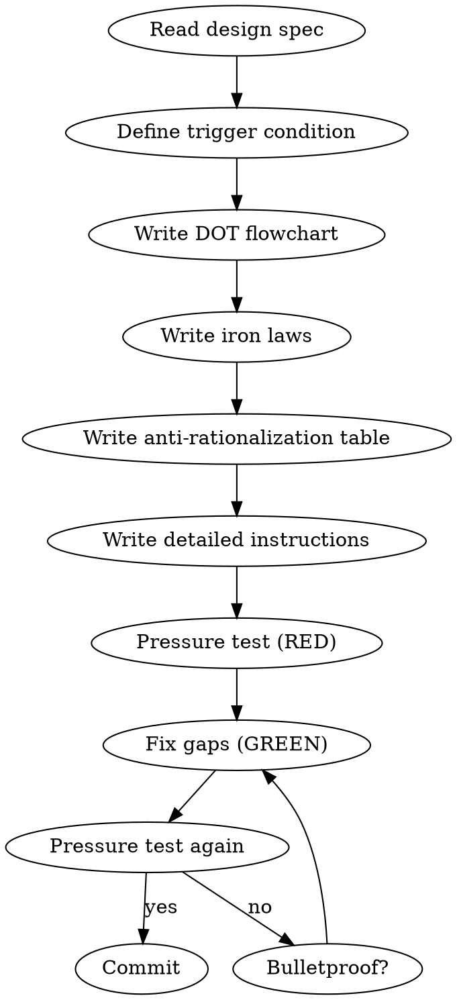

<!-- AUTO-CHECK-START -->

## auto-check (generated -- do not edit)

<!-- AUTO-CHECK-END -->


# 编写 Shenbi 技能

YOU MUST follow this skill when creating or modifying any `skills/shenbi-*/SKILL.md` file.

## 技能设计流程



## Frontmatter 规则

```yaml
---
name: skill-name          # 仅字母、数字、连字符
description: Use when ...  # 只描述触发条件，≤500字符
---
```

> **消歧括号例外**：description 可以包含**边界消歧括号**（如 `(流水账 detection, ...)`、`(≠ shenbi-review-X)`），用于说明与相邻 skill 的区别。这是触发条件的一部分（帮助 agent 判断"是不是该用本 skill 而非另一个"），不属于"流程摘要"陷阱。禁止的是流程步骤摘要，不是消歧信息。

### 描述陷阱

description 如果包含流程摘要，agent 会只读描述而跳过技能主体。

| Thought | Reality |
|---------|---------|
| "Brief description helps the agent" | Agent skips the full skill if description answers "what does it do" |
| "I should explain the workflow here" | Description = trigger condition only. Workflow goes in the body. |

## 技能必须包含的元素

### 1. DOT 流程图

关键技能必须用 DOT 定义权威流程。叙述文本作为补充，不是权威来源。

### 2. 铁律

关键规则使用绝对语言，不使用"通常"、"建议"、"推荐"：

```
NO WORLD RULES WITHOUT CHECKING EXISTING TRUTH FILES FIRST
```

### 3. 反理性化表格

每个纪律性技能列举 AI 的偷懒借口及反驳：

| Excuse | Reality |
|--------|---------|
| "This chapter doesn't need foreshadowing" | Simple chapters are the best time to plant hooks |
| "Readers won't notice" | Web novel readers have exceptional memory for details |

### 4. 红旗检查表

自我检查触发器：

```markdown
## Red Flags — Stop and Check

- [ ] Did I skip reading truth files before writing?
- [ ] Did I proceed without human approval at a gate?
- [ ] Did I assume something instead of asking?
```

## 说服心理学

使用以下原则（基于 Meincke et al. 2025, N=28,000）：

| 原则 | 应用 |
|------|------|
| **Authority** | "YOU MUST"、"No exceptions" |
| **Commitment** | TodoWrite 追踪、要求公开声明 |
| **Scarcity** | "Before proceeding"、"IMMEDIATELY after" |
| **Social Proof** | "Every chapter"、"X without Y = failure" |
| **Unity** | "your human partner"、"we're creating together" |

**不使用** Liking（导致谄媚）和 Reciprocity（感觉操控）。

## 压力测试方法论

### RED 阶段

1. 选择一个该技能应覆盖的场景
2. 不加载技能，让 agent 面对场景
3. 记录 agent 的 rationalization（偷懒借口）
4. 这些 rationalization 就是技能必须堵住的漏洞

### GREEN 阶段

1. 将记录的 rationalization 转化为反理性化表格条目
2. 编写最小技能内容来应对那些特定的 rationalization
3. 重新运行场景，验证行为改善

### REFACTOR 阶段

1. 发现新的 rationalization 漏洞
2. 补充反制措施
3. 重复直到 bulletproof

## 领域特有理性化模式

以下是小说写作领域的常见理性化借口，每个纪律性技能必须覆盖相关的条目：

| 借口 | 现实 |
|------|------|
| "这章太简单了，不需要伏笔" | 简单章节恰好是埋伏笔的最佳时机 |
| "读者不会注意到这个小矛盾" | 网文读者会逐章追更，记忆力极强 |
| "先写完再检查一致性" | 等写到20章再回来修，改动的代价是10倍 |
| "这个角色不需要这么复杂" | 配角降智是网文最大毒点之一 |
| "爽点不需要铺垫，直接给" | 没有压制的爆发是白开水 |
| "这章字数不够，加段描写凑一下" | 无功能的水文比字数不足更致命 |
| "前面已经提过了，读者记得" | 5章前的细节读者记不住，需要自然提醒 |
| "文风不重要，故事好就行" | AI味一重，平台检测直接降权 |
| "主角不能在这里失败" | 无挫折的成功 = 无张力的流水账 |
| "这条伏笔太久了，算了放弃" | 放弃伏笔 = 违背读者信任，Chase Power 债务暴增 |
