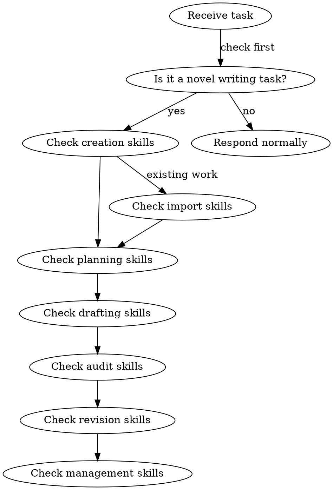

# Using Shenbi

YOU MUST check for applicable shenbi skills before responding to your human partner — even before asking clarifying questions.

## 1% Rule

If there is a 1% chance that a shenbi skill could apply to the current task, you MUST check it. Checking costs seconds; skipping costs chapters.

## Skill Check Order

## Skill Trigger Map

| Your human partner says... | Load skill |
|---------------------------|------------|
| "我要写一本小说" / "帮我建世界观" / "创建小说" | shenbi-worldbuilding |
| "设计角色" / "角色卡" / "人物" | shenbi-character-design |
| "故事框架" / "大纲" / "整体架构" | shenbi-story-architecture |
| "写下一章" / "章节规划" / "下一章写什么" | shenbi-chapter-planning |
| "组装上下文" / "准备写作素材" / "收集上下文" | shenbi-context-composing |
| "帮我写这章" / "起草" / "写正文" | shenbi-chapter-drafting |
| "结算" / "更新状态" / "提取变化" | shenbi-state-settling |
| "字数调整" / "扩写" / "压缩" / "字数不够" | shenbi-length-normalizing |
| "检查这章" / "审计" / "审查" | shenbi-review-anti-ai (default) + activated audit skills |
| "修改这章" / "修订" / "这段有问题" | shenbi-chapter-revision |
| "润色" / "打磨" / "文字" | shenbi-style-polishing |
| "去AI味" / "反检测" | shenbi-anti-detect |
| "建地点" / "场景设计" | shenbi-location-builder |
| "力量体系" / "修炼等级" | shenbi-power-system |
| "势力" / "门派" / "组织" | shenbi-faction-builder |
| "关系" / "角色关系" | shenbi-relationship-map |
| "节奏" / "张弛" | shenbi-pacing-design |
| "线索" / "主线支线" | shenbi-plot-thread-weaver |
| "伏笔" / "埋线" / "hook" | shenbi-foreshadowing-plant |
| "伏笔追踪" / "hook状态" | shenbi-foreshadowing-track |
| "伏笔兑现" / "收线" | shenbi-foreshadowing-resolve |
| "导入" / "分析已有作品" | shenbi-import-analysis |
| "文风" / "风格学习" | shenbi-style-learning |
| "提取角色" / "反推角色" | shenbi-character-extraction |
| "提取世界" / "反推世界" | shenbi-world-extraction |
| "原作导入" / "同人原作" | shenbi-canon-import |
| "短篇" | shenbi-short-outline |
| "批量写短篇" / "短篇写作" | shenbi-short-drafting |
| "短篇包装" / "短篇上架" | shenbi-short-packaging |
| "续写" | shenbi-sequel-writing |
| "平台趋势" / "市场" | shenbi-market-radar |
| "改题材配置" / "疲劳词" | shenbi-genre-config |
| "同步状态" / "重新提取" | shenbi-truth-sync |
| "回滚" / "快照" | shenbi-snapshot-manage |
| "卷完成" / "卷总结" | shenbi-volume-consolidation |
| "基础设定审核" / "设定打分" | shenbi-foundation-review |
| "纠偏" / "下一章注意" | shenbi-drift-guidance |
| "作者意图" / "长期目标" | shenbi-intent-management |
| "章节模式" / "模式检测" | shenbi-chapter-pattern |
| "写技能" / "创建技能" / "修改技能" | shenbi-writing-skills |
| "卷纲" / "分卷规划" / "卷结构" | shenbi-volume-outlining |
| novel-related request that matches nothing above | Check full skill list in design spec Section 8 |

## Red Flags — Stop and Check

| Thought | Reality |
|---------|---------|
| "This is just a simple question about the novel" | Questions are tasks. Check for skills. |
| "I know what they want" | Knowing the concept ≠ using the right skill. |
| "I'll just start writing" | Writing without planning violates the HARD-GATE. |
| "The skill seems overkill for this" | The 1% rule applies. No exceptions. |
| "I'll check skills after asking clarifying questions" | Skill check comes BEFORE clarifying questions. |

## HARD-GATE: No Drafting Without Foundation

NEVER write chapter content without:

1. A completed novel project directory (Section 4 of design spec)
2. At minimum: `novel.json`, `outline/story_frame.md`, `characters/protagonist.md`
3. A chapter plan (`plans/chapter-N-plan.md`) for the target chapter

If your human partner asks to write before these exist, load the appropriate creation/planning skills first.

## Novel Project Directory

When working with a novel project, the directory structure is defined in `docs/specs/2026-06-08-shenbi-design.md` Section 4. Verify the structure exists before proceeding with any skill.

## Audit Activation

Default audits (always run): review-anti-ai, review-continuity, review-character, review-sensitivity

> All 4 default audits are now implemented (Phase 1 + Phase 2 + Phase 4a). For conditional audits, see design spec Section 7.4 and the Phase 4b skill set (review-pacing, review-foreshadowing, review-world-rules, review-dialogue, review-motivation, review-pov, review-texture, review-reader-pull, review-memo-compliance, review-highpoint, review-long-span, review-era, review-fanfic, review-spinoff).

Additional audits activate based on `genre-config.json` in the novel project. See design spec Section 7.4 for activation rules.
