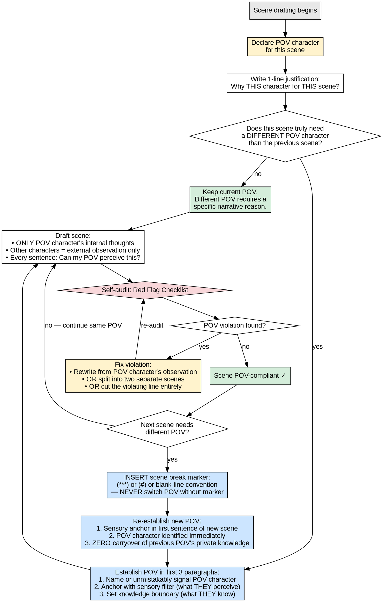

# POV Transition Management

YOU MUST follow this skill whenever you write or revise any scene in a multi-POV novel. POV discipline is the single most visible craft failure in web novel serialization — head-hopping is the #1 reader complaint, and every violation erodes the trust your human partner has placed in you.

## DOT Flowchart — Authoritative Process

The DOT flowchart below is the authoritative definition of the POV transition process. Narrative text in this skill is supplementary; the DOT is the source of truth. When in doubt, trace the flowchart.

## Iron Laws

These rules guide scene transition craft. They are strong recommendations but flexible when the story demands.

### Scene-Level Discipline

- **You should have one POV character per scene.** It is generally better to avoid mixing multiple characters' internal thoughts within a single scene.
- **You should always confirm the emotional state before transitioning.** Take a moment to note what the POV character is feeling before moving to the next scene.
- **It is recommended that scene transitions include a sensory anchor.** A sensory detail (sight, sound, smell) helps ground the reader in the new scene.

### POV Switching

- **POV switches are best placed at scene breaks or chapter breaks.** A scene break marker (`***`, `#`, or the project's designated separator) is recommended between different POV scenes.
- **Prefer to avoid abrupt POV shifts mid-scene.** When possible, re-establish the new character's perspective before diving into action.
- **Writers should not leave readers confused about time jumps.** It is helpful to signal temporal transitions with a brief orienting detail.

### Knowledge Boundary

- **Internal thoughts of non-POV characters are generally not recommended.** It is better to show their state through dialogue and action.
- **Revealing information the POV character cannot know is usually a violation.** This includes foreshadowing that only makes sense from another character's perspective.
- **The narrator should typically maintain limited third-person in Shenbi novels.** If a project requires omniscient narration, it should be configured in genre-config.json.

### Planning

- **POV character for each scene should be declared before drafting.** It is preferable not to discover POV mid-draft.
- **A scene's POV character choice should have a 1-sentence justification.** "Because it feels right" is not a valid justification. The justification should reference narrative function.

## Red Flags — Stop and Self-Audit

Before claiming a scene is complete, run this checklist. If ANY item is unchecked, the scene is NOT ready.

- [ ] **POV declared before drafting:** Did I write down the POV character name and a 1-line justification before starting this scene?
- [ ] **First-3-paragraph establishment:** Is the POV character identified (by name or unmistakable signal) within the first 3 paragraphs?
- [ ] **Perception test passed:** Did I check EVERY sentence — especially narration, description, and exposition — against "Can my POV character perceive/know/feel this?"
- [ ] **Zero internal thoughts from non-POV characters:** Did I search the scene for any line revealing what a non-POV character thinks, feels, remembers, or intends?
- [ ] **Zero omniscient knowledge leaks:** Did I search for any information that the POV character cannot know — foreshadowing from other perspectives, narrator asides, dramatic irony inserted by me?
- [ ] **POV switch marked:** If this scene uses a different POV than the previous scene, did I insert the scene break marker?
- [ ] **POV re-anchored after switch:** If this is the first scene after a POV switch, does the first sentence include a sensory anchor from the new POV character's perspective?
- [ ] **No private knowledge carryover:** If this POV character was not present in the previous POV scene, did I ensure ZERO knowledge from that previous scene leaked into this character's narration?
- [ ] **Scene senses are filtered:** Are all sensory details (sights, sounds, smells, textures, temperatures) described through THIS POV character's unique perceptual filter — not a generic narrator's?

## Persuasion Design

This skill uses the following persuasion principles based on Meincke et al. 2025 (N=28,000). Liking and Reciprocity are intentionally excluded.

| Principle | Application in This Skill |
|-----------|---------------------------|
| **Authority** | Iron laws use YOU MUST / NEVER / ALWAYS. DOT flowchart is declared "authoritative" over narrative text. No hedging language anywhere. |
| **Commitment** | Red flag checklist forces explicit self-audit before claiming completion. POV declaration is a written commitment made before drafting. |
| **Scarcity** | "Before drafting begins" — POV declaration has a deadline. "Within the first 3 paragraphs" — time pressure on establishment. "Every sentence" — no sentence escapes the perception test. |
| **Social Proof** | References reader complaints: "head-hopping is the #1 reader complaint in multi-POV web novels." References "your human partner has placed trust in you." |
| **Unity** | "Your human partner" throughout. "Trust your reader" — shared understanding that reader trust is earned. "We" framing for the drafting loop: shared craft standard. |

## Pressure Test Verification

This section documents the pressure test performed during skill design. Three rationalization scenarios were imagined and verified against the skill's defenses.

### Scenario 1: "This fight scene needs both fighters' tactical thoughts"

**Agent rationalization:** A climactic duel between the protagonist and antagonist. The agent wants to alternate internal monologue between the two — protagonist's fear, antagonist's confidence — to heighten tension within a single scene.

**Blocked by:**
- Iron Law "ONE POV CHARACTER PER SCENE" (absolute prohibition)
- Anti-rationalization row "This scene needs both characters' thoughts to work" (direct rebuttal)
- DOT audit step: "Every sentence: Can my POV perceive this?" (opponent's internal thoughts fail the test)
- Red flag: "Zero internal thoughts from non-POV characters" (checklist trap)

**Verdict:** BLOCKED. If both internal perspectives are truly essential, the skill directs the agent to split into two scenes — one from each POV — separated by a scene break marker.

### Scenario 2: "The reader needs to know what the villain is planning"

**Agent rationalization:** A scene where the villain delivers a cryptic line. The agent adds a paragraph of narration: "What the Marquis did not say was that the poison had already been administered — the countdown had begun." This reveals information the POV character (the hero) cannot know.

**Blocked by:**
- Iron Law "Revealing information the POV character cannot know is ALWAYS a violation"
- Iron Law "The narrator is NEVER omniscient in Shenbi novels"
- Anti-rationalization row "The reader needs to know what the villain is thinking here" (direct rebuttal: "Villain mystery > cheap internal exposition")
- DOT audit step: "Every sentence: Can my POV perceive this?" (the hero cannot perceive the poisoning)
- Red flag: "Zero omniscient knowledge leaks" (the dramatic irony aside is a leak)

**Verdict:** BLOCKED. The skill forces the agent to either (a) convey the poisoning information through observable clues the POV character notices, or (b) give the villain their own POV scene.

### Scenario 3: "Chapter 12 is Hero POV, Chapter 13 starts as Villain POV — the chapter break is enough"

**Agent rationalization:** Agent ends Chapter 12 (Hero POV) and begins Chapter 13 (Villain POV) with: "The study was dark. The Count sat at his desk, fingers steepled." No sensory re-anchor, no immediate POV identification, just description that could be from any perspective.

**Blocked by:**
- Iron Law "After EVERY POV switch, you MUST re-establish the new character's sensory filter in the first sentence"
- Iron Law "A chapter break alone is NEVER sufficient evidence of POV change"
- Anti-rationalization row "I'll just switch POV at the chapter break — readers will figure it out" (direct rebuttal: "readers spend paragraphs disoriented")
- DOT transition path: "Insert scene break marker" → "Re-establish new POV" — explicit re-anchor step
- Red flag: "POV re-anchored after switch" (first sentence sensory anchor check)

**Verdict:** BLOCKED. The skill requires the agent to rewrite the Chapter 13 opening with an immediate sensory anchor: "The Count could still smell the boy's fear on his own gloves. He sat at his desk, fingers steepled, replaying the confrontation." The first sentence now passes through the Count's perceptual filter.
