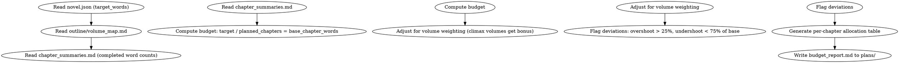

# 字数预算

管理小说跨章节/跨卷的字数分配，确保整书字数接近 `novel.json` 的 `target_words`。

## 流程



## 数据契约

- **Reads:** `novel.json`, `outline/volume_map.md`, `truth/chapter_summaries.md`, `chapters/*.md`
- **Writes:** `plans/word_budget.md`
- **Updates:** 无——预算为参考文件，不修改其他文件

## 铁律

1. **预算非枷锁**——字数预算是目标参考，不是硬性约束。章节内容质量永远优先于字数符合预算
2. **卷终校准**——每卷完成后必须重新计算预算，因为实际字数必然偏离计划
3. **高潮溢价**——每卷高潮章节允许 150% 预算浮动，日常过渡章节建议不低于 75%
4. **偏差只记不罚**——标注偏差但不要求删减/追加；由人类合作者决定是否调整后续预算

## 计算模型

### 基础参数

| 参数 | 来源 | 说明 |
|------|------|------|
| T | novel.json.target_words | 全书目标总字数 |
| V | volume_map.md | 卷数 |
| C_per_V | volume_map.md | 每卷计划章节数 |
| W_accum | chapter_summaries.md | 已完稿章节累计字数 |
| C_done | chapter_summaries.md | 已完成章节数 |
| C_remain | C_planned - C_done | 剩余章节数 |

### 预算公式

```
base_per_chapter = T / C_planned
climax_bonus = base_per_chapter * 0.5  (高潮章额外配额)
transition_min = base_per_chapter * 0.75  (过渡章最低配额)

remaining_budget = T - W_accum
suggested_per_remaining = remaining_budget / C_remain
```

### 偏差阈值

| 偏差 | 定义 | 操作 |
|------|------|------|
| 正常 | 0.75x ~ 1.25x base | 无操作 |
| 偏少 | < 0.75x base | 标注——建议人类检查该章信息密度是否不足 |
| 偏多 | > 1.5x base | 标注——建议人类检查该章是否有冗余或是否应拆分为两章 |

## 输出格式

写入 `plans/word_budget.md`：

```markdown
# 字数预算报告

**生成时间**: YYYY-MM-DD
**全书目标**: T 字
**计划章节**: C 章
**基准/章**: B 字
**已完成**: D 章 / W_acc 字 (进度 P%)
**剩余预算**: T - W_acc 字 / C_remain 章
**建议字数/剩余章**: S 字

---

## 逐卷分配

| 卷 | 计划章数 | 建议字/章 | 卷总字数 | 备注 |
|----|---------|----------|---------|------|
| 第1卷 | N1 | B1 | N1×B1 | 开局卷——信息密度高 |
| 第2卷 | N2 | B2 | N2×B2 | 发展卷——节奏可略放缓 |
| ... | ... | ... | ... | ... |

## 已完成章节偏差

| 章节 | 实际字数 | 基准 | 偏差% | 标记 |
|------|---------|------|-------|------|
| 1 | W1 | B | (W1/B-1)*100% | 正常/偏少/偏多 |
| 2 | W2 | B | ... | ... |

## 偏差分析

- 累计偏差: (W_accum - B×C_done) 字
- 偏差率: ((W_accum - B×C_done) / (B×C_done)) * 100%
- 对剩余章节的影响: 剩余预算 / 基准的比率 = 需/不需调整

## 卷级校准建议

[每卷结束后更新的建议——是否需要在后续卷中补偿累积偏差]

## 待人类确认

- [ ] 是否需要调整后续卷/章的计划字数？
- [ ] 是否有章节需要拆分/合并？
```

## 汇总

```markdown
## 字数预算汇总

**写入文件**: `plans/word_budget.md`
**全书目标**: T 字
**累计进度**: D/C 章 (P%)

### 预算健康度

- 正常: X 章
- 偏少: Y 章
- 偏多: Z 章

### 预测

按当前平均字数 X/章，预计全书完成字数: Y
偏离目标: Z 字 (偏离率 P%)

### 待人类确认

- [ ] 预测字数是否需要调整？
- [ ] 是否需要调整后续章数或每章字数？
```

## Anti-Rationalization

| Excuse | Reality |
|--------|---------|
| "字数不重要，只管写就行" | 目标字数存在是因为平台/出版有字数窗口。完全忽视目标 = 写完发现短了1/3或长了2倍 |
| "预算只要设一个目标就够了" | 目标不跟踪 = 写完5章发现已占用50%预算但进度只有15% = 后期必须大幅压缩 |
| "每章字数人工看就行" | 5章可以人工看。30章需要系统跟踪。50章人工看 = 必然遗漏 |
