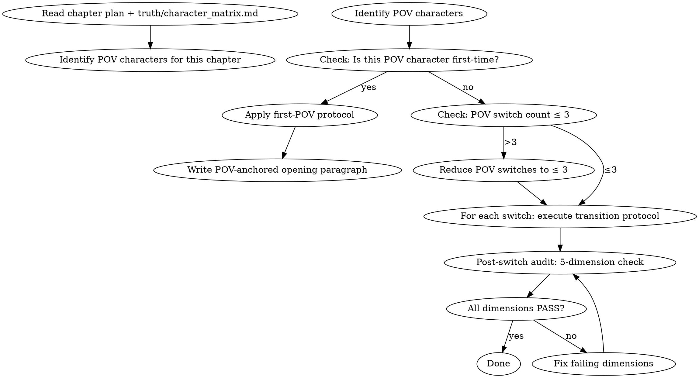

# POV 切换管理

管理多主角视角小说的 POV 切换规则、读者认知负担、视角一致性。

## 流程



## 数据契约

- **Reads:** `truth/character_matrix.md`, chapter plan, current chapter draft
- **Writes:** none
- **Updates:** `truth/character_matrix.md` (POV state per chapter)

## 铁律

1. **单章 POV 切换上限为 3 次** — 超过 3 次切换 = 读者认知负担崩溃，MUST 合并或删除视角
2. **首次 POV 角色 MUST 在切换段落首句标注角色名** — 读者 MUST 在 3 秒内知道"谁在说话/谁在看"，禁止靠上下文猜测
3. **POV 切换 MUST 伴随场景锚点** — 每个 POV 段落首句 MUST 包含时间或空间锚点（地点/动作/感官细节），禁止纯心理活动开篇
4. **切换前段落 MUST 为前一 POV 收束** — POV 切换前，前一视角段落 MUST 有明确的感官或行动收束，禁止悬在半句切换
5. **同场景多 POV 必须区分知识状态** — 两个角色在同一场景时，各自的 POV 段落 MUST 只展示该角色已知/可感知的信息，禁止信息泄露
6. **NEVER 在对话中段切换 POV** — 一轮对话必须在一个 POV 内开始并结束，禁止"甲说→切换→乙的心理活动→切换→乙回答"
7. **NEVER 在动作/战斗高潮中切换 POV** — 战斗高潮场景的 POV 切换会打断读者沉浸感，MUST 在一个 POV 内完成关键动作序列
8. **每章 POV 角色名单 MUST 写入 chapter memo 的 PRE_WRITE_CHECK** — 缺少 POV 清单的章节 memo 视为不合格

## POV 切换协议

### 硬切换（场景/时间跳跃）

适用：新章节、时间跳过、地理位置跳跃。

```
[前一 POV 收束句：感官/行动/状态变化]
<空行>
[新 POV 首句：角色名 + 时间锚点/空间锚点 + 感官细节]
```

示例格式：
```
林烽把手里的矿石放回推车。矿道深处传来铁镐的回声。
<空行>
王虎蹲在营房门口，看着天边泛起的鱼肚白。离总攻还有两个钟头。
```

### 软切换（同场景不同视角）

适用：两个角色在同一场景中，需要分别展示两者的心理状态。

```
[角色A POV 收束：行动或对角色B的外部观察]
<空行>
[角色B POV 首句：角色B名 + 对同一事件的反应/感官]
```

### 首次 POV 协议

新角色首次切入 POV 时，MUST 包含以下 3 个要素（顺序不限）：
1. 角色全名
2. 当前物理位置
3. 一个独属于该角色的感官细节（证明视角已切换）

示例：
```
宋姐站在卡兰城钟楼的阴影里。她的左肩旧伤在阴天里隐隐发酸——这个细节王虎不知道，林烽也不知道。只有她自己知道。
```

## 切换质量审计（5 维度）

每次 POV 切换后 MUST 检查：

| 维度 | 检查项 | 不合格条件 |
|------|--------|----------|
| 身份锚定 | 切换后首 50 字内明确 POV 角色 | 读者需要回溯确认"这是谁的视角" |
| 知识边界 | POV 段落只包含该角色已知信息 | 角色A的POV中出现只有角色B知道的信息 |
| 感官连续 | POV 内有至少 1 个该角色的独特感官细节 | 纯叙述/纯心理活动无感官锚点 |
| 状态同步 | POV 切换不丢失前一视角的状态变化 | 前一POV结束时的动作/情绪在切换后消失 |
| 认知负担 | 本章 POV 角色数 ≤ 3，切换次数 ≤ 3 | 超过上限 |

## 红旗检查表

- [ ] 本章 POV 角色数是否超过 3 个？如果超过，哪些可以合并？
- [ ] 是否有首次出现的 POV 角色？是否执行了首次 POV 协议？
- [ ] 切换时是否在对话中段？是否在动作高潮中？
- [ ] 每个 POV 段落首句是否包含时间/空间锚点？
- [ ] 同场景多 POV 是否出现了知识泄露？
- [ ] chapter memo 的 PRE_WRITE_CHECK 是否记录了 POV 角色清单？

## Anti-Rationalization

| Excuse | Reality |
|--------|---------|
| "这段需要展示两个角色的心理，切换一下没关系" | 对话中段切换 POV = 读者必须停下来重建"谁在说话"，打断阅读流畅度的代价远超信息增量 |
| "不写角色名读者也能猜到是谁" | "能猜到" ≠ "不需要标注"。标注角色名的成本是 2-3 个字，不标注的代价是读者可能误解整个段落的立场 |
| "战斗场景切 POV 更刺激，能展示战场的多个角度" | 战斗高潮的沉浸感来自单一视角的紧张累积。切换 POV = 重置紧张累积 = 读者出戏 |
| "这个配角的内心活动很重要，必须单独给一段 POV" | 配角的内心可以通过主角的外部观察（表情、动作、对话）间接传达。配角 POV 只在该配角有独立于主角的故事线时才成立 |
| "章节里 POV 多了显得叙事丰富" | 超过 3 个 POV = 每个视角都没时间展开 = 所有角色都变薄。少即是多 |
| "软切换不需要收束句，直接切过去就行" | 没收束的 POV 切换 = 前一视角被"丢弃"而非"完成"。读者会感到未完成的不适，即使说不清为什么 |
| "这个角色第一次出场，读者应该能通过上下文认出他" | 首次接触的读者对该角色零认知。3秒内不给名字 = 读者开始分心猜测 = 错过后续内容 |

## 压力测试记录

### 场景 1：三主角同时在作战会议室

**未加载技能的 agent 行为**：在三个角色之间来回切换 POV，每个段落展示一个角色的内心活动，不标注角色名，认为"读者能通过思维内容分辨"。

**Rationalization**："三个人的心理都很重要，必须都展示。读者聪明，能从上下文猜到是谁。"

**加载技能后的修正**：选择会议的主导者（林烽）作为 POV 角色，通过林烽的外部观察（王虎手指敲桌面的频率、宋姐沉默的时长）间接传达另外两人的状态。切换只发生一次——从林烽的 POV 切到宋姐听到某个关键情报时的特写（执行软切换协议）。

### 场景 2：新角色在战斗中首次出场

**未加载技能的 agent 行为**：新角色从天而降参与战斗，在动作高潮中切到新角色 POV 展示其战斗风格和背景。

**Rationalization**："新角色需要展示实力，战斗中切视角最能体现他的厉害。"

**加载技能后的修正**：战斗保持原有 POV（林烽）。新角色的出场通过林烽的外部观察呈现——林烽看到一个陌生的身影以不寻常的方式击倒敌人。战斗结束后，下个场景切换 POV 到新角色（执行首次 POV 协议：角色名+位置+独特感官细节）。

### 场景 3：需要同时展示反派视角

**未加载技能的 agent 行为**：在主角团讨论战略的段落中，插入一段反派的 POV 展示他们在准备陷阱，认为"反派视角能增加悬念"。

**Rationalization**："读者需要知道反派在干什么，光展示主角视角信息不对称会不公平。"

**加载技能后的修正**：反派 POV 必须独立成节——不是插入段落，而是在主角团视角完整结束后，通过硬切换（场景跳跃）独立展示。反派的 POV 段落必须执行知识边界检查——反派不知道主角团的计划，反之亦然。信息不对称不是"不公平"，而是悬念的核心机制。

### 场景 4（边界）：四个 POV 都被认为"必须保留"

**未加载技能的 agent 行为**：接受 4 个 POV，认为每个都不可或缺。

**Rationalization**："这个场景太复杂了，4 个视角都删不掉。规则是规则，但特殊情况可以例外。"

**加载技能后的修正**：4 选 3——强制剪枝。判断标准：删除一个 POV 后，丢失的信息是否可以通过保留的 3 个 POV 中的外部观察间接传达？如果能传达，删除。如果不能传达，检查该信息是否在这一章必须传达——是否可能推迟到下一章？
